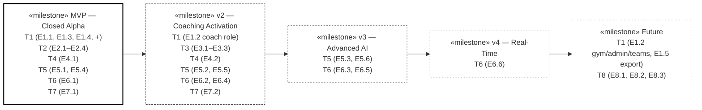
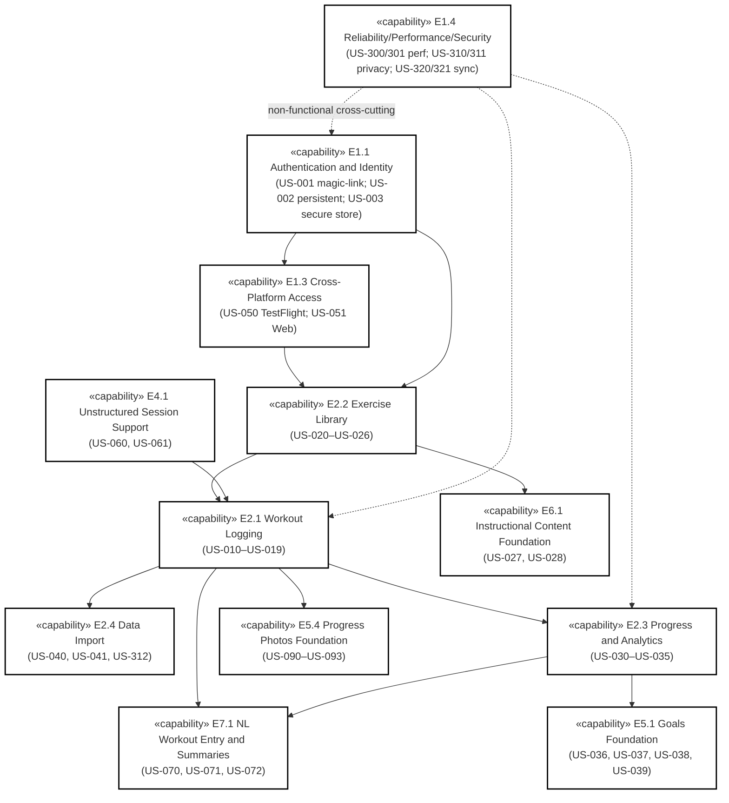

# CV — Capability Viewpoint

## Purpose

The Capability Viewpoint expresses **what the system must be able to do**, decomposed from strategic themes through major capabilities (epics) to ship-able units (features) and validation units (user stories). For Lifting Tracker, the decomposition lives canonically in `themes-epics-features_v0.2.0.md` (8 themes / 31 epics / 109 features) and `user-stories_v0.2.0.md` (114 stories). CV restates that hierarchy in DoDAF form so the rest of the architecture views can pin to capability identifiers without re-deriving them.

CV also surfaces the architectural anchors per theme — D-numbers from `architecture_v0.4.0.md` — so the path from capability to decision to data model to interface is one-step traversable.

Per D28 fit-for-purpose: the full feature roster is 109 entries. CV-capabilities does not enumerate every feature inline (that would duplicate `themes-epics-features_v0.2.0.md` without earning its place). Instead, the mindmap shows themes and epics with feature counts; the table below lists epics with their architectural anchors and phase. Readers needing feature-level detail land in `themes-epics-features_v0.2.0.md`; readers needing story text land in `user-stories_v0.2.0.md`.

## Theme → Epic hierarchical flowchart

Mermaid mindmap was considered for this view; the flowchart form below was chosen instead because feature-count annotations and SysML stereotypes render more reliably in `flowchart` syntax than in `mindmap` (which has restrictions on punctuation in node identifiers and on parens nested inside the root shape).

```mermaid
flowchart LR
    classDef root fill:#fff,stroke:#000,stroke-width:3px
    classDef theme fill:#fff,stroke:#000,stroke-width:2px
    classDef epic fill:#f9f9f9,stroke:#666

    ROOT["«requirement» Lifting Tracker capability set<br/>8 themes / 31 epics / 109 features / 114 stories"]:::root

    T1["«requirement» T1 — Platform Foundation"]:::theme
    T2["«requirement» T2 — Core Athlete Experience"]:::theme
    T3["«requirement» T3 — Coaching Platform (v2)"]:::theme
    T4["«requirement» T4 — Training Structure"]:::theme
    T5["«requirement» T5 — Goals and Progress"]:::theme
    T6["«requirement» T6 — Form and Content"]:::theme
    T7["«requirement» T7 — Intelligence"]:::theme
    T8["«requirement» T8 — Extended Platforms"]:::theme

    E1_1["E1.1 Authentication and Identity — 3F"]:::epic
    E1_2["E1.2 Role-Based Access and Hierarchy — 5F"]:::epic
    E1_3["E1.3 Cross-Platform Access — 2F"]:::epic
    E1_4["E1.4 Reliability, Performance, Security — 6F"]:::epic
    E1_5["E1.5 Data Portability and Governance — 5F"]:::epic

    E2_1["E2.1 Workout Logging — 10F"]:::epic
    E2_2["E2.2 Exercise Library — 7F"]:::epic
    E2_3["E2.3 Progress and Analytics — 6F"]:::epic
    E2_4["E2.4 Data Import — 3F"]:::epic

    E3_1["E3.1 Client Management — 4F"]:::epic
    E3_2["E3.2 Workout Assignment — 4F"]:::epic
    E3_3["E3.3 Coach as Athlete — 2F"]:::epic

    E4_1["E4.1 Unstructured Session Support — 2F"]:::epic
    E4_2["E4.2 Programs, Routines, Classes — 5F"]:::epic

    E5_1["E5.1 Goals Foundation — 4F"]:::epic
    E5_2["E5.2 Goals Expansion — 3F"]:::epic
    E5_3["E5.3 AI-Assisted Goals — 3F"]:::epic
    E5_4["E5.4 Progress Photos Foundation — 4F"]:::epic
    E5_5["E5.5 Progress Photos Enhanced — 2F"]:::epic
    E5_6["E5.6 AI Photo Analysis — 2F"]:::epic

    E6_1["E6.1 Instructional Content Foundation — 2F"]:::epic
    E6_2["E6.2 Coach-Produced Content — 3F"]:::epic
    E6_3["E6.3 AI-Generated Content — 4F"]:::epic
    E6_4["E6.4 Form — Capture and Review — 4F"]:::epic
    E6_5["E6.5 Form — Measurements and Feedback — 3F"]:::epic
    E6_6["E6.6 Form — Real-Time — 1F"]:::epic

    E7_1["E7.1 NL Workout Entry and Summaries — 3F"]:::epic
    E7_2["E7.2 AI-Assisted Coaching — 2F"]:::epic

    E8_1["E8.1 Apple Watch — 3F"]:::epic
    E8_2["E8.2 Smart Glasses and Voice Devices — 1F"]:::epic
    E8_3["E8.3 Android and Wear OS — 1F"]:::epic

    ROOT --> T1 & T2 & T3 & T4 & T5 & T6 & T7 & T8

    T1 --> E1_1 & E1_2 & E1_3 & E1_4 & E1_5
    T2 --> E2_1 & E2_2 & E2_3 & E2_4
    T3 --> E3_1 & E3_2 & E3_3
    T4 --> E4_1 & E4_2
    T5 --> E5_1 & E5_2 & E5_3 & E5_4 & E5_5 & E5_6
    T6 --> E6_1 & E6_2 & E6_3 & E6_4 & E6_5 & E6_6
    T7 --> E7_1 & E7_2
    T8 --> E8_1 & E8_2 & E8_3
```

## Phase rollup

## Theme detail with architectural anchors

| Theme | Description | Architectural anchors | Epic count | Feature count | MVP epics | Post-MVP epics |
|---|---|---|---|---|---|---|
| **T1** Platform Foundation | Identity, access, deployment, infrastructure that every other theme depends on. | D3, D4, D6, D7, D8, D9, D11 | 5 | 17 | E1.1, E1.3, E1.4 (partial), E1.5 (partial) | E1.2 (coach/gym/admin/teams), E1.5 export |
| **T2** Core Athlete Experience | Log, view, analyze, import. The MVP heart. | D1, D2, D4, D5, D12, D14, D15, D16, D17, D18 | 4 | 23 | E2.1, E2.2, E2.3, E2.4 (all) | none |
| **T3** Coaching Platform | Manage clients, assign work, review progress. v2. | D3, D10, D11 | 3 | 10 | none | E3.1, E3.2, E3.3 |
| **T4** Training Structure | Programs → Types → Routines/Classes → Sessions. | D12, D13 | 2 | 7 | E4.1 | E4.2 |
| **T5** Goals and Progress | Goals first-class; visual progress; AI-assisted goal work. | D21, D22, D19 | 6 | 17 | E5.1, E5.4 | E5.2, E5.3, E5.5, E5.6 |
| **T6** Form and Content | Instructional content + form analysis. Learning loop. | D23, D24, D15 | 6 | 17 | E6.1 | E6.2, E6.3, E6.4, E6.5, E6.6 |
| **T7** Intelligence | AI/LLM via Reasoner Duality across all themes. | D19 | 2 | 5 | E7.1 | E7.2 (and AI features grouped under domain themes) |
| **T8** Extended Platforms | Wearables, glasses, voice, Android. | D20 | 3 | 5 | none | E8.1, E8.2, E8.3 |

## MVP capability slice (what alpha actually ships)

The MVP is the alpha-facing capability surface. The diagram below shows MVP epics and their dependencies — what must be in place before each unlocks.

## Capability-to-decision traceability

The Capability Viewpoint is the entry point into the architecture for product-side reviewers. The reverse direction — decision-to-capability — is documented in `themes-epics-features_v0.2.0.md` per-theme "Architectural anchors" lines. The combined effect: any capability has a path to its architectural decisions; any decision has a path to the capabilities that justify it.

When a capability is added, the maintenance protocol is:

1. Add a story in `user-stories_v0.2.0.md` (the canonical story catalog).
2. Roll the story up to a feature in `themes-epics-features_v0.2.0.md` (assign or create the appropriate F-number under an existing epic, or open a new epic with rationale).
3. If the addition needs a new architectural decision, raise a D-number ADR in `docs/adrs/`.
4. Update CV-capabilities only if the theme/epic structure changed (new theme, new epic, retired epic). New features alone do not bump CV — they are tracked in `themes-epics-features_v0.2.0.md` directly.

## Fit-for-purpose notes

CV omits the full 109-feature roster. That decision is conscious: features are tracked, named, and counted in `themes-epics-features_v0.2.0.md`; replicating the list inline here would create a synchronization burden and offer no decision support that the canonical doc doesn't already provide. The mindmap shows themes and epics with feature counts so readers can size each branch at a glance.

CV omits the per-story acceptance criteria. Acceptance criteria belong in `user-stories_v0.2.0.md` and in the engineering-task layer, not in the capability view.

CV does not show MoSCoW or RICE prioritization. The MVP / v2 / v3 / v4 / Future labels carry the prioritization signal at this scale; finer-grained priority belongs in `roadmap_v0.4.0.md` and `kanban-sprint-<id>.md`.

The DoDAF 2.02 CV taxonomy includes CV-1 through CV-7 (capability vision, taxonomy, phasing, dependencies, transition, mappings to operational activities, mapping to services). This view collapses CV-1, CV-2, CV-3, and CV-4 into a single capability viewpoint. When a specific CV sub-view (e.g., CV-5 transition or CV-6 capability-to-operational mapping) becomes load-bearing for a decision, it gets its own file. Premature file fragmentation is its own form of waste.

## Cross-references

**Architectural decisions:** D1 (entry + analysis), D2 (per-set), D3 (RBAC), D4 (cloud source of truth), D5 (exercise library), D6 (auth), D7 (alpha audience), D8 (Expo + Supabase), D9 (business model), D10 (Ethan as Coach), D11 (trajectory), D12 (ontological schema), D13 (training hierarchy), D14 (per-implement weight), D15 (limb config), D16 (rest), D17 (set grouping), D18 (import notation), D19 (Reasoner Duality), D20 (wearables separate), D21 (Goals first-class), D22 (progress photos privacy), D23 (form analysis), D24 (instructional content).

**User stories:** Sampled in the MVP capability slice. Full catalog: `user-stories_v0.2.0.md` (US-001 through ~US-330; 114 unique stories plus 3 cross-referenced).

**Sprint of last revision:** Sprint 0b Day 1 (2026-04-24).

**Other DoDAF views referenced:** AV-1 (orientation), AV-2 §11 (theme definitions, §12 story-prefix convention), SV-1 (the components that realize these capabilities), SV-6 (data exchanges driven by capabilities), DIV-2 (data tables that capabilities operate on).

---

© 2026 Eric Riutort. All rights reserved.
