# SvcV-1 — Services Context Description

## Purpose

SvcV-1 identifies the **services** in the architecture — distinct from in-process operations — and traces who provides each one, who consumes it, on what protocol, and how it relates to the operational activities in OV-5c. Where SV-1 catalogs every component and port, SvcV-1 narrows to the subset that crosses a service boundary (the consumer-provider contract is independently versioned, deployed, and operable). The view exists because XRSize4 ALL is committing — per D27 and the MCP-first cross-cutting principle — to a service-shaped surface where every sub-system exposes capability through a stable, agent-consumable contract.

The diagram uses SysML's `«service»` stereotype for service nodes and labeled edges for the consumer-provider relationship. Where Mermaid cannot express SysML's full service-port and service-contract notation (operations on the port, item flows typed by interface), the supporting tables carry the contract detail by row.

Per D28 fit-for-purpose: services that exist but are not yet exposed (`lifting-tracker-mcp` post-athlete-MVP, `fuseki-mcp` Sprint 3+) are modeled with their planned shape so that pre-decisions about their interfaces are visible. Services whose contract is unknowable today (Workato MCP wrappers, A2A adoption per D27) are listed in the catalog with `Sprint of standup: TBD` rather than guessed.

## Service categorization

Five service categories anchor the view:

- **Data services** — persistence and query of authoritative state.
- **Identity and access services** — auth, RBAC, token issuance.
- **Observability services** — telemetry ingest and storage.
- **AI / reasoning services** — Tier 1 + Tier 2 inference surfaces.
- **Governance services** — document-cm and downstream config-management surfaces.
- **Distribution services** — app store, hosting, CDN.

A service may span more than one category (`SupabasePostgres` is data + system-of-record; `EdgeFunctions` is AI + governance because of the Tier 2 LLM proxy and the `ai_interactions` audit row). The category column on each catalog row picks the dominant one; secondary categories are noted.

## Composite-principle status

Every service is scored against the portfolio's composite principle (paraphrased from `xrsize4all_concept_v0.2.0.md` and Hosting posture cross-cut): **self-hostable / open-standard wire format / agent-friendly / no AI-native lock-in friction**. Three statuses:

- **Pass** — self-hostable, open wire format, agent-consumable, no AI-native friction.
- **Mixed** — self-hostable but with vendor lock-in vector that requires explicit migration plan, OR fully self-hostable but currently consumed via vendor SDK.
- **Vendor-required** — service inherently requires a specific vendor (Apple App Store, Apple ASR). Tracked as accepted vendor-risk surface.

## Services context diagram

```mermaid
flowchart TB
    classDef external fill:#fff,stroke:#999,stroke-dasharray:2 4
    classDef portfolio fill:#fff,stroke:#000,stroke-width:2px
    classDef svc fill:#f7f7f7,stroke:#333
    classDef agent fill:#fff,stroke:#444,stroke-width:2px
    classDef cli fill:#fff,stroke:#666,stroke-dasharray:4 2

    %% =========================================
    %% Consumers
    %% =========================================
    subgraph Consumers["«consumers»"]
        direction LR
        UI["«block» MobileClient<br/>(Expo iOS + Web)"]:::portfolio
        EDF["«block» EdgeFunctions<br/>(Deno runtime)"]:::portfolio
        AGENT["«actor» AI Agent host<br/>(Claude Code, Cursor, Codex CLI)"]:::agent
        HUMAN["«actor» Human via CLI<br/>(Eric — cm.* via cli/cm.py)"]:::cli
    end

    %% =========================================
    %% Data + identity services (Supabase, self-hosted on Railway)
    %% =========================================
    subgraph DataIdentity["«services» Data + Identity (self-hosted on Railway)"]
        direction TB
        S_PG["«service» SupabasePostgres<br/>(PostgREST + Postgres wire)<br/>category: Data / System-of-record"]:::svc
        S_AUTH["«service» SupabaseAuth (GoTrue)<br/>category: Identity"]:::svc
        S_RT["«service» SupabaseRealtime<br/>(Phoenix Channels over WSS)<br/>category: Data / Push"]:::svc
        S_STO["«service» SupabaseStorage<br/>(S3-compatible REST)<br/>category: Data / Media"]:::svc
        S_EDF["«service» Supabase Edge Functions<br/>(Deno fetch handlers)<br/>category: AI / Governance"]:::svc
    end

    %% =========================================
    %% Observability service
    %% =========================================
    subgraph Observability["«services» Observability (self-hosted on Railway)"]
        S_HDX["«service» HyperDX OSS<br/>(OTLP-HTTP + OTLP-gRPC)<br/>category: Observability"]:::svc
    end

    %% =========================================
    %% MCP service layer
    %% =========================================
    subgraph MCPLayer["«services» MCP servers (MCP-first principle, D27)"]
        direction TB
        S_FS["«service» filesystem-mcp<br/>(installed Sprint 0b/0c)<br/>category: Governance"]:::svc
        S_GIT["«service» git-mcp<br/>(installed Sprint 0b/0c)<br/>category: Governance"]:::svc
        S_BRV["«service» brave-search-mcp<br/>(installed Sprint 0b/0c)<br/>category: Research"]:::svc
        S_FCR["«service» firecrawl-mcp<br/>(installed Sprint 0b/0c)<br/>category: Research"]:::svc
        S_SBM["«service» supabase-mcp<br/>(installed Sprint 0c)<br/>category: Data / Admin"]:::svc
        S_CM["«service» document-cm MCP<br/>(BUILD; Sprint 0b Day 2+)<br/>category: Governance"]:::svc
        S_LTM["«service» lifting-tracker-mcp<br/>(BUILD; Sprint 0c+)<br/>category: Domain"]:::svc
        S_CAI["«service» concept-agent-invoker-mcp<br/>(HOLD per D27 separation)<br/>category: Agent interop"]:::svc
        S_R4M["«service» reach4all-research-mcp<br/>(future)<br/>category: Research"]:::svc
        S_REG["«service» xrsize4all-sub-system-registry-mcp<br/>(Phase 2+)<br/>category: Governance"]:::svc
        S_FUS["«service» fuseki-mcp<br/>(planned Sprint 3+)<br/>category: Semantic / Data"]:::svc
    end

    %% =========================================
    %% External (vendor-required) services
    %% =========================================
    subgraph External["«external services» (vendor-required)"]
        direction LR
        S_LLM["«external service» Claude API (Anthropic)<br/>D19 Tier 2<br/>category: AI"]:::external
        S_APP["«external service» Apple App Store<br/>(distribution + IAP)<br/>category: Distribution"]:::external
        S_ASR["«external service» Apple on-device ASR<br/>(D20 voice features)<br/>category: AI / Input"]:::external
        S_RAIL["«external service» Railway hosting<br/>(commitment is to Docker)<br/>category: Distribution / Infra"]:::external
    end

    %% =========================================
    %% Edges — consumers → services
    %% =========================================
    UI -- "PostgREST / WSS" --> S_PG
    UI -- "GoTrue REST" --> S_AUTH
    UI -- "WSS subscribe" --> S_RT
    UI -- "S3-compatible REST" --> S_STO
    UI -- "HTTPS JSON" --> S_EDF
    UI -- "OTLP-HTTP" --> S_HDX
    UI -- "on-device API" --> S_ASR
    UI -- "AppStorePort" --> S_APP

    EDF -- "Postgres wire (5432)" --> S_PG
    EDF -- "HTTPS JSON (Anthropic API)" --> S_LLM
    EDF -- "OTLP-HTTP/gRPC" --> S_HDX

    AGENT -- "MCP stdio (JSON-RPC)" --> S_FS
    AGENT -- "MCP stdio" --> S_GIT
    AGENT -- "MCP stdio" --> S_BRV
    AGENT -- "MCP stdio" --> S_FCR
    AGENT -- "MCP stdio" --> S_SBM
    AGENT -- "MCP stdio" --> S_CM
    AGENT -- "MCP stdio" --> S_LTM
    AGENT -- "MCP stdio (HOLD)" --> S_CAI
    AGENT -- "MCP stdio (future)" --> S_R4M
    AGENT -- "MCP stdio (Phase 2+)" --> S_REG
    AGENT -- "MCP stdio (Sprint 3+)" --> S_FUS

    HUMAN -- "CLI shell argv" --> S_CM
    HUMAN -- "CLI shell argv" --> S_LTM

    %% =========================================
    %% Inter-service dependencies
    %% =========================================
    S_AUTH -- "session storage<br/>(Postgres wire)" --> S_PG
    S_RT -- "WAL stream<br/>(Postgres wire)" --> S_PG
    S_STO -- "object metadata<br/>(Postgres wire)" --> S_PG
    S_EDF -- "reads/writes<br/>ai_interactions" --> S_PG
    S_SBM -- "admin (PostgREST + wire)" --> S_PG
    S_LTM -- "domain queries<br/>(PostgREST + wire)" --> S_PG
    S_CM -- "manifest + scorekeeper<br/>(filesystem + future PG)" --> S_PG
    S_FUS -- "SPARQL 1.1" --> FUSEKI[("«block» Apache Jena Fuseki<br/>(Sprint 3+ or Phase 2)")]
    S_HDX -- "ClickHouse wire" --> CH[("«block» ClickHouse (internal)")]

    %% Hosting envelope
    S_RAIL -. "hosts (Docker)" .-> S_PG
    S_RAIL -. "hosts" .-> S_AUTH
    S_RAIL -. "hosts" .-> S_RT
    S_RAIL -. "hosts" .-> S_STO
    S_RAIL -. "hosts" .-> S_EDF
    S_RAIL -. "hosts" .-> S_HDX
    S_RAIL -. "hosts" .-> S_CM
    S_RAIL -. "hosts" .-> S_LTM
    S_RAIL -. "hosts" .-> S_FUS
```

## Service catalog

| Service | Provider / location | Consumer(s) | Protocol / wire format | Primary operations exposed | Composite principle | Sprint of standup |
|---|---|---|---|---|---|---|
| **SupabasePostgres** | Supabase OSS on Railway | MobileClient (via PostgREST + WSS), EdgeFunctions (wire), supabase-mcp, lifting-tracker-mcp | PostgREST over HTTPS (JSON); Postgres wire (5432) | CRUD on every domain table; RLS-enforced reads; SQL via wire for admin | Pass — self-hostable, open Postgres protocol, RLS is open standard | MVP (Sprint 0b) |
| **SupabaseAuth (GoTrue)** | Supabase OSS on Railway | MobileClient | GoTrue REST over HTTPS; JWT issuance | `signInWithOtp`, `signInWithIdToken` (post-MVP), `refreshSession`, `signOut` | Pass — self-hostable; OIDC/OAuth open; JWT is RFC 7519 | MVP (Sprint 0b) |
| **SupabaseRealtime** | Supabase OSS on Railway | MobileClient | Phoenix Channels over WSS (JSON frames) | `subscribe(channel)`, `broadcast` | Mixed — self-hostable; wire format owned by Supabase Realtime, subject to release cadence (R-PT-04 watch) | MVP (Sprint 0b) |
| **SupabaseStorage** | Supabase OSS on Railway | MobileClient | S3-compatible REST over HTTPS; signed URLs | `upload`, `download`, `signedUrl`, `delete` | Pass — S3-compatible is open de facto standard; rclone migration path exists | MVP (Sprint 0b) |
| **Supabase Edge Functions** | Supabase OSS on Railway (Deno runtime) | MobileClient | HTTPS JSON; bespoke contracts documented in OpenAPI | `/ai/parse-workout`, `/ai/summary`, `/import/historic-log`, `/admin/*` | Pass — Deno is open; contracts are bespoke and versioned in repo | MVP (Sprint 0b) |
| **HyperDX OSS** | HyperDX OSS on Railway (ClickHouse backend) | MobileClient, EdgeFunctions, every service | OTLP-HTTP / OTLP-gRPC | `traces`, `metrics`, `logs` ingest per OTel semantic conventions | Mixed — OTel is fully open; HyperDX itself watched per R-TV-03 (relicense risk); SigNoz is named fallback | MVP (Sprint 0b) |
| **filesystem-mcp** | Anthropic reference MCP server, local install | AI Agent hosts (Claude Code, Cursor, Codex CLI) | MCP stdio (JSON-RPC) | `read_file`, `write_file`, `list_directory`, `search_files` | Pass — MCP open spec; reference server | Sprint 0b/0c (install) |
| **git-mcp** | Reference MCP server, local install | AI Agent hosts | MCP stdio | `git_log`, `git_diff`, `git_status`, `git_show` | Pass | Sprint 0b/0c (install) |
| **brave-search-mcp** | Brave reference MCP server, local install | AI Agent hosts | MCP stdio over HTTPS-backed search | `web_search`, `local_search` | Mixed — MCP open; upstream Brave Search API is vendor-keyed | Sprint 0b/0c (install) |
| **firecrawl-mcp** | Firecrawl reference MCP server, local install | AI Agent hosts | MCP stdio over HTTPS-backed crawl | `scrape`, `crawl`, `extract` | Mixed — MCP open; upstream Firecrawl SaaS is vendor-keyed | Sprint 0b/0c (install) |
| **supabase-mcp** | Supabase reference MCP server, local install | AI Agent hosts (admin / migration sessions) | MCP stdio | `query`, `apply_migration`, `list_tables`, `get_logs` | Pass — paired with self-hosted Supabase | Sprint 0c (install) |
| **document-cm MCP** | BUILD — XRSize4 ALL portfolio (lib/ shared with cli/cm.py) | AI Agent hosts; Human via CLI | MCP stdio + CLI shell argv (dual surface) | `cm.update`, `cm.approve`, `cm.record`, `cm.verify`, `cm.status`, `cm.history` | Pass — fully self-hosted; open MCP wire; lib/ shared so CLI and MCP cannot drift | Sprint 0b Day 2+ (BUILD) |
| **lifting-tracker-mcp** | BUILD — Lifting Tracker repo | AI Agent hosts; future automated coach assistants | MCP stdio | `query_sessions`, `log_session`, `get_coach_hierarchy`, `assign_program`, `get_athlete_progress` | Pass — paired with self-hosted Supabase; RLS-aware | Sprint 0c+ (post athlete-MVP, BUILD) |
| **concept-agent-invoker-mcp** | HOLD — pre-commits per D27 MCP-as-agent-interop separation | AI Agent hosts (deferred) | MCP stdio (planned) | TBD — agent invocation surface | TBD; standup deferred until D27 protocol is decided (A2A vs AAIF vs custom) | HOLD |
| **reach4all-research-mcp** | Future BUILD — Reach4All repo | AI Agent hosts | MCP stdio (planned) | `search_findings`, `get_landscape`, `get_vendor_analysis` | Pass — paired with self-hosted research repo | Future |
| **xrsize4all-sub-system-registry-mcp** | Future BUILD — portfolio level | AI Agent hosts | MCP stdio (planned) | `list_subsystems`, `get_subsystem_metadata`, `get_capability_map` | Pass | Phase 2+ |
| **fuseki-mcp** | Future BUILD — wraps Apache Jena Fuseki | AI Agent hosts; never directly from MobileClient | MCP stdio (proxies SPARQL 1.1) | `sparql_query`, `sparql_update` (gated), `ontology_inspect` | Pass — Fuseki is Apache 2.0; SPARQL 1.1 is W3C open | Sprint 3+ or Phase 2 |
| **Claude API (Anthropic)** | Vendor (Anthropic) | EdgeFunctions only — never MobileClient direct | Anthropic Messages API over HTTPS JSON | `messages.create` (Tier 2 inference per D19) | Vendor-required — accepted; Edge Function is the only egress so swapping providers is bounded | MVP (Sprint 0b — when AI features ship) |
| **Apple App Store / TestFlight** | Vendor (Apple) | MobileClient build pipeline (EAS Build) | Apple submission API | App binary submission, TestFlight distribution, future IAP per D9 | Vendor-required — required for iOS distribution; no alternative | MVP (Sprint 0b alpha distribution) |
| **Apple on-device ASR** | Vendor (Apple) | MobileClient | iOS speech framework (in-process) | Speech-to-text for voice workout entry | Vendor-required — accepted vendor on iOS; Android target uses Android SpeechRecognizer at parity | When D20 voice features ship |
| **Railway hosting** | Vendor (Railway) | All self-hosted services in this catalog | Docker over Railway control plane | `deploy`, `scale`, `logs`, `env` | Mixed — commitment is to Docker, not to Railway; one-Dockerfile migration to Hetzner / Fly / self-hosted K8s if Railway terms shift (R-TV-05) | MVP (Sprint 0b) |

## Service contract summary (operations exposed per service)

The per-service operation list above is the consumer-facing API. Two contract patterns dominate:

**REST / wire-protocol services** (Postgres, Storage, Auth, Edge Functions, HyperDX) expose a stable transport-level API. Versioning is on the resource path (PostgREST schema-aware, Storage object-keyed, Edge Functions explicit `/v1/...` prefix when v2 lands). Backward compatibility is owned by the provider; consumers depend on the open wire format rather than on a vendor SDK shape.

**MCP services** (every entry in the MCP layer) expose a tool catalog through MCP's `tools/list` and `tools/call`. Each tool has a JSON Schema for its arguments and a structured result shape. The contract is the union of `(tool name, schema)` pairs; adding tools is non-breaking, removing or shape-changing tools is breaking and requires consumer-side update. The MCP-first principle (cross-cut in `architecture_v0.4.0.md`) commits the portfolio to expose every governance and domain surface as MCP tools so any agent host can consume the surface without bespoke integration.

**External / vendor services** (Claude API, Apple Store, ASR, Railway) carry the vendor's contract. Versioning and breaking-change policy are vendor-owned and tracked as risk surface in `risks_v0.1.0.md`.

## Provider-consumer dependency notes

**Mobile client never reaches a database directly.** Every read goes through `TanStackQuery` (which may answer from local SQLite via Drizzle) or `SyncAdapter`; every write is queued by the sync adapter. This is why `SupabasePostgres` shows the MobileClient as a consumer over PostgREST + WSS — but the consumer-side path is the sync adapter and the realtime subscriber, not direct queries.

**MobileClient never holds an LLM API key.** The only path to `Claude API (Anthropic)` is through `Supabase Edge Functions`. This is what makes the Authority Rule (D19) mechanically enforceable — the audit row in `ai_interactions` is written **by the edge function**, before the response returns to the client.

**MobileClient never reaches Fuseki directly.** The Three-layer data architecture cross-cut routes any semantic query through `fuseki-mcp` (Sprint 3+). The mobile client does not import a SPARQL library at any phase.

**document-cm is the only MCP service consumed by both AI agents and a human CLI.** Per source-doc-cm-design.md §6.6, the `lib/` is shared between `cli/cm.py` (Eric, terminal) and `mcp/server.py` (Claude through MCP). The dual surface is what keeps the CLI and the MCP from drifting — they cannot, because both call the same library functions.

**Railway is a hosting envelope, not a service per se.** Modeled as an external service because it is vendor-provided and consumed via a vendor control plane, but the architectural commitment is to Docker (the wire format Railway happens to consume). Migration path is one Dockerfile to Hetzner / Fly / self-hosted Kubernetes if Railway's terms shift adversely.

## Mermaid expressivity gaps

Mermaid's flowchart approximates SysML SvcV but cannot express:

- **Service interface contracts as ports** with operation signatures rendered on the port symbol — captured in the Service catalog table's "Primary operations exposed" column instead.
- **Item flows on edges typed by an interface block** — captured by the "Protocol / wire format" column and by SV-6's row-by-row payload catalog.
- **Service composition (nested service hierarchy)** — Supabase is a composition of Postgres + Auth + Realtime + Storage + Edge Functions, modeled here as separate `«service»` nodes inside a single subgraph rather than as a SysML composite block. The subgraph fence captures the composition without forcing each consumer-edge to be redrawn against the composite.
- **Allocation arrows** mapping each service to the operational activity (in OV-5c) it supports — captured by the cross-reference list at the bottom of this view.

Where these gaps mattered for SvcV-1's purpose (identifying services and their consumer-provider relationships), the catalog table compensates. Where they did not (decoration-level SysML notation that adds no decision support at MVP scale), they are not faked.

## Cross-references

**Architectural decisions:** D4 (cloud source of truth — `SupabasePostgres` is the canonical service), D8 (Expo + Supabase + offline-first stack — every Supabase service in the catalog), D19 (Reasoner Duality + Authority Rule — `Supabase Edge Functions` is the AI / Governance service), D20 (watch as separate target; Apple ASR is the on-device ASR service), D22 (encrypted media — `SupabaseStorage`), D24 (external content embeds — not a service per se), D25 (source-document CM — `document-cm MCP`), D26 (TypeScript across boundaries — every service consumed via typed contracts), D27 (multi-agent interop first-class — entire MCP layer in the diagram). Cross-cutting principles: MCP-first (the entire MCP layer), Three-layer data (`SupabasePostgres` + `pgvector` future + `fuseki-mcp` → Fuseki), Hosting posture (Railway as Docker envelope; commitment is to Docker), Observability (`HyperDX OSS`).

**User stories:** US-001 (`SupabaseAuth`), US-013 + US-014 (offline path consumes `SupabasePostgres` via PostgREST + the sync adapter), US-040 (`SupabaseStorage` for history-import upload, `Supabase Edge Functions` for parse), US-070 (`Supabase Edge Functions` + `Claude API` Tier 2 — Sequence 3 in OV-5c), US-090 (encrypted progress photos via `SupabaseStorage`), US-300 (load performance — instrumented via `HyperDX OSS`), US-310 (TLS on every service), US-313 (AI transparency — `ai_interactions` audit row written by `Supabase Edge Functions`).

**Sprint of last revision:** Sprint 0b Day 1 (2026-04-24).

**Other DoDAF views referenced:** AV-2 §1 (D-number glossary), AV-2 §2 (sub-systems — many services map onto sub-systems), AV-2 §10 (risks — `R-TV-03` HyperDX relicense, `R-TV-05` Railway terms, `R-PT-04` MCP version churn, `R-CI-01` document-cm append-only ledger), CV-capabilities (which capabilities each service realizes), OV-1 (the operational graphic — services appear in the infrastructure layer there), OV-5c (the temporal sequences these services participate in — Sequence 1 walks the data services; Sequence 3 walks the AI service path; Sequence 4 walks the document-cm MCP service), SV-1 (the components and ports underneath each service contract), SV-6 (the row-by-row data exchanges across these services), DIV-2 (the data each data-service persists), StdV-1 (every protocol named in the catalog table — MCP 1.0, PostgREST, OTLP, OAuth 2.0, JWT, S3-compatible REST, SPARQL 1.1, Apple Submission API, JSON-RPC 2.0).

---

© 2026 Eric Riutort. All rights reserved.
