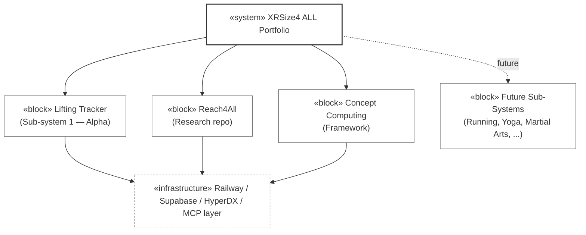

# AV-1 — Overview and Summary Information

## Purpose

Charter-level snapshot of the XRSize4 ALL portfolio and its first sub-system, the Lifting Tracker. AV-1 is the entry point for any reader new to the architecture. It states what the portfolio is, what the Lifting Tracker is within that portfolio, who the alpha audience is, and which other DoDAF views deepen each topic. It does not decide anything; it orients.

Per D28 fit-for-purpose authority, this view stays brief. Detailed architecture, decisions, and infrastructure live downstream — AV-1 points there.

## Portfolio summary

**XRSize4 ALL** is a system of systems for fitness, training, coaching, and community. It spans people, process, and technology. Its name decomposes as **XR** (extended reality — wearables, glasses, sensors), **Size** (physical training, body, strength, form), and **4 ALL** (inclusive by design across discipline, level, background). XRSize4 ALL is commercial in orientation and is operated as a brand under a company; individual sub-systems may evolve into distinct products over time.

**Lifting Tracker** is the first sub-system to ship. It is a coach-client workout tracking application with hierarchical role-based access (Athlete → Coach → Gym → Super Admin). MVP ships the athlete experience; coach and admin views follow iteratively in v2 and beyond.

**Reach4All** is the portfolio-level research repository, standing up Sprint 0b. It holds landscape scans, vendor analyses, book findings, tool assessments, and pattern reviews shared across all sub-systems. Native-tools-only — git, no Notion, no Obsidian.

**Concept (Concept Computing)** is the architectural framework underlying the portfolio. It contributes the four-tier document hierarchy (REFERENCE → COMPANION → MASTER → OPERATIONAL), the 16-agent Python suite, and the Reasoner Duality pattern adopted as D19.

## Alpha scope and audience

Closed alpha, 4–6 named users: Eric (super admin), Ethan (coach), Ethan's client(s), and a small number of independent athletes. Invite-only via magic-link email. No self-serve signup, no public access. The alpha validates the data model and athlete UX before expanding to coach features, billing, and the broader sub-system catalog.

## Context diagram

## Reading order for new contributors

1. This file (AV-1) — orientation.
2. `docs/xrsize4all_concept_v0.2.0.md` — platform concept, three dimensions (people, process, technology), sub-system catalog.
3. `docs/lift-track-architecture_v0.4.0.md` — Lifting Tracker decisions D1–D27 and cross-cutting principles.
4. `docs/dodaf/lift-track-dodaf-OV-1-concept-graphic_v0.1.0.md` — operational concept graphic with infrastructure layer.
5. `docs/dodaf/lift-track-dodaf-CV-capabilities_v0.1.0.md` — capability decomposition (8 themes → 31 epics → 109 features).
6. `docs/dodaf/lift-track-dodaf-AV-2-dictionary_v0.2.0.md` — vocabulary of record.
7. Remaining DoDAF views as the question warrants.

## Cross-references

**Architectural decisions:** D1 (entry + analysis), D3 (RBAC hierarchy), D7 (closed alpha), D8 (Expo + Supabase), D11 (personal tool → business), D27 (multi-agent interop first-class), D28 (fit-for-purpose DoDAF view authority).

**User stories:** US-001 (magic-link invite), US-050 (TestFlight iPhone app), US-051 (web dashboard) — the alpha entry points.

**Sprint of last revision:** Sprint 0b Day 1 (2026-04-24).

**Other DoDAF views referenced:** OV-1, CV-capabilities, AV-2, all remaining views in the initial set.

---

© 2026 Eric Riutort. All rights reserved.
