# DIV-2 — Logical Data Model

## Purpose

DIV-2 is the entity-relationship picture of the Lifting Tracker schema as defined in `lift-track-architecture_v0.4.0.md` §"Data model" (D1–D24 contributions). It exists so reviewers can see the shape of the data without reading the column-level prose, and so SV-6 has a target for its row destinations. The schema is **complete from day one** per D12 — every table exists in MVP even if the UI doesn't expose it. This view shows everything in the schema; the absent dimension is which tables MVP UI actually reaches (covered by CV-capabilities and the roadmap, not here).

DIV-2 is the **logical** data model. Physical specifics (indexes, partitioning, RLS policy texts, exact column types beyond logical kind) are deferred to the migration files that implement it. When migrations land, DIV-2 should be reconciled against them and bumped if structure differs.

## ER diagram (Mermaid erDiagram, SysML cardinalities)

```mermaid
erDiagram
    USERS ||--o{ COACH_RELATIONSHIPS : "coach (0..*)"
    USERS ||--o{ COACH_RELATIONSHIPS : "athlete (0..*)"
    USERS ||--o{ EXERCISE_PROGRAMS : "creates (0..*)"
    USERS ||--o{ EXERCISE_PROGRAMS : "assigned to (0..1)"
    USERS ||--o{ ROUTINES : "creates (0..*)"
    USERS ||--o{ EXERCISES : "creates custom (0..*)"
    USERS ||--o{ EXERCISE_ALIASES : "scopes (0..1)"
    USERS ||--o{ SESSIONS : "logs (0..*)"
    USERS ||--o{ SESSIONS : "assigned by coach (0..1)"
    USERS ||--o{ BODY_WEIGHTS : "records (0..*)"
    USERS ||--o{ ASSIGNED_SESSIONS : "creates (legacy) (0..*)"
    USERS ||--o{ GOALS : "owns (0..*)"
    USERS ||--o{ GOALS : "assigned by coach (0..1)"
    USERS ||--o{ PROGRESS_PHOTOS : "captures (0..*)"
    USERS ||--o{ AI_INTERACTIONS : "triggers (0..*)"
    USERS ||--o{ AI_GENERATED_CONTENT : "creator (0..*)"
    USERS ||--o{ BIOMETRIC_SAMPLES : "produces (0..*)"

    EXERCISE_TYPES ||--o{ ROUTINES : "categorizes (0..*)"
    EXERCISE_TYPES ||--o{ CLASSES : "categorizes (0..*)"
    EXERCISE_TYPES ||--o{ SESSIONS : "categorizes (0..1)"

    EXERCISE_PROGRAMS ||--o{ PROGRAM_COMPONENTS : "composes (0..*)"
    EXERCISE_PROGRAMS ||--o{ SESSIONS : "scheduled in (0..1)"
    PROGRAM_COMPONENTS }o--o| ROUTINES : "of type routine (0..1)"
    PROGRAM_COMPONENTS }o--o| CLASSES : "of type class (0..1)"

    ROUTINES ||--o{ ROUTINE_EXERCISES : "contains (0..*)"
    ROUTINES ||--o{ SESSIONS : "templates (0..1)"
    ROUTINE_EXERCISES }o--|| EXERCISES : "references (1..1)"

    CLASSES ||--o{ SESSIONS : "instantiated as (0..1)"

    EXERCISE_FAMILIES ||--o{ EXERCISES : "groups variations (0..*)"
    EXERCISES ||--o{ EXERCISE_ALIASES : "named by (0..*)"
    EXERCISES ||--o{ ROUTINE_EXERCISES : "planned in (0..*)"
    EXERCISES ||--o{ SESSION_EXERCISES : "performed in (0..*)"
    EXERCISES ||--o{ ASSIGNED_SESSION_EXERCISES : "assigned in (0..*)"
    EXERCISES ||--o{ EXERCISE_CONTENT : "demonstrated by (0..*)"
    EXERCISE_FAMILIES ||--o{ EXERCISE_CONTENT : "demonstrated by (0..*)"
    EXERCISES ||--o{ SET_VIDEOS : "performed in (0..*)"
    EXERCISE_FAMILIES ||--o{ SET_VIDEOS : "performed in (0..*)"
    EXERCISES ||--o{ GOALS : "linked from (0..*)"
    EXERCISE_FAMILIES ||--o{ GOALS : "linked from (0..*)"

    SESSIONS ||--o{ SESSION_EXERCISES : "contains (0..*)"
    SESSIONS ||--o{ GOAL_PROGRESS_SNAPSHOTS : "feeds (0..*)"

    SESSION_EXERCISES ||--o{ SETS : "contains (0..*)"
    SESSION_EXERCISES }o--o| ROUTINE_EXERCISES : "links back to (0..1)"

    SETS ||--o{ SET_VIDEOS : "captured in (0..*)"

    BODY_WEIGHTS ||--o{ PROGRESS_PHOTOS : "linked from (0..*)"
    BODY_WEIGHTS ||--o{ GOAL_PROGRESS_SNAPSHOTS : "linked from (0..*)"

    GOALS ||--o{ GOAL_MILESTONES : "decomposes into (0..*)"
    GOALS ||--o{ GOAL_PROGRESS_SNAPSHOTS : "tracks (0..*)"
    GOALS ||--o{ PROGRESS_PHOTOS : "linked from (0..*)"

    PROGRESS_PHOTOS ||--o{ PROGRESS_PHOTO_SHARES : "shared via (0..*)"

    SET_VIDEOS ||--|| SET_VIDEO_ANALYSES : "analyzed by (0..1)"
    SET_VIDEOS ||--o{ SET_VIDEO_ANNOTATIONS : "annotated by coach (0..*)"

    ASSIGNED_SESSIONS ||--o{ ASSIGNED_SESSION_EXERCISES : "contains (0..*)"

    AI_INTERACTIONS }o--o{ AI_GENERATED_CONTENT : "produces (0..*)"

    USERS {
        bigint id PK
        text email
        text name
        timestamp created_at
        smallint role "1=athlete, 2=coach, 3=gym, 4=super_admin"
        text tier "free default; pro/business future"
    }

    COACH_RELATIONSHIPS {
        bigint coach_user_id FK
        bigint athlete_user_id FK
        timestamp started_at
        timestamp ended_at
        text status
    }

    EXERCISE_PROGRAMS {
        bigint id PK
        text name
        text description
        bigint created_by_user_id FK
        bigint assigned_to_user_id FK "nullable; null = template"
        boolean is_template
        text goal
        date start_date
        date end_date "nullable"
        text notes
        timestamp created_at
    }

    EXERCISE_TYPES {
        bigint id PK
        text name "Weightlifting, Kung Fu, Running, etc."
        text description
        text set_schema_type "reps_weight, time_rounds, distance_pace, duration_hold"
    }

    ROUTINES {
        bigint id PK
        bigint exercise_type_id FK
        text name
        bigint created_by_user_id FK
        text notes
        timestamp created_at
    }

    ROUTINE_EXERCISES {
        bigint id PK
        bigint routine_id FK
        bigint exercise_id FK
        int order_index
        jsonb target_metrics_json
    }

    CLASSES {
        bigint id PK
        text name
        bigint exercise_type_id FK
        text instructor_name
        text venue_name
        text venue_address
        text recurring_schedule
        int duration_minutes
        text notes
        timestamp created_at
    }

    PROGRAM_COMPONENTS {
        bigint id PK
        bigint program_id FK
        text component_type "routine | class"
        bigint routine_id FK "nullable"
        bigint class_id FK "nullable"
        text schedule_rule
        int order_within_week
    }

    EXERCISE_FAMILIES {
        bigint id PK
        text name
        text primary_muscle
        text movement_pattern
        text notes
    }

    EXERCISES {
        bigint id PK
        bigint family_id FK "nullable"
        text name
        text canonical_name
        text category
        text equipment "barbell, dumbbell, machine, etc."
        text upper_limb_config "together, apart_simultaneous, apart_alternating, single, none"
        text lower_limb_config "together, apart_simultaneous, apart_alternating, single, none"
        bigint created_by_user_id FK "NULL for seeded canonical"
        boolean is_public
    }

    EXERCISE_ALIASES {
        bigint exercise_id FK
        text alias
        bigint user_id FK "nullable; null = global"
    }

    SESSIONS {
        bigint id PK
        bigint user_id FK
        date date
        time start_time "nullable"
        time end_time "nullable"
        text location
        text notes
        int default_rest_seconds "nullable"
        bigint exercise_type_id FK "nullable"
        bigint program_id FK "nullable"
        bigint routine_id FK "nullable"
        bigint class_id FK "nullable"
        bigint assigned_by_coach_id FK "nullable"
        bigint assigned_session_id FK "legacy column; superseded by routine_id"
    }

    SESSION_EXERCISES {
        bigint id PK
        bigint session_id FK
        bigint exercise_id FK
        int order_index
        text notes
        int default_rest_seconds "nullable"
        bigint routine_exercise_id FK "nullable"
    }

    SETS {
        bigint id PK
        bigint session_exercise_id FK
        int order_index
        numeric weight_entered
        int reps
        int rest_seconds "nullable; falls through cascade"
        smallint rpe "nullable"
        int group_id "nullable; same group_id = back-to-back"
        text side "nullable; left/right when limb_config=single"
        boolean is_bad_form
        boolean is_forced_rep
        text notes
    }

    BODY_WEIGHTS {
        bigint id PK
        bigint user_id FK
        date date
        numeric weight_lbs
        text location
        text notes
    }

    ASSIGNED_SESSIONS {
        bigint id PK
        bigint coach_user_id FK
        text name
        text notes
        timestamp created_at
    }

    ASSIGNED_SESSION_EXERCISES {
        bigint id PK
        bigint assigned_session_id FK
        bigint exercise_id FK
        jsonb target_sets_json
    }

    GOALS {
        bigint id PK
        bigint user_id FK
        text category "body_composition, strength, endurance, skill, habit, health, aesthetic, other"
        text title
        text description
        text metric_type "body_weight, body_fat_pct, 1rm, rep_max, time, distance, session_count, streak, custom"
        text metric_unit
        numeric current_value "nullable; computed or user-entered"
        numeric target_value
        numeric starting_value "nullable"
        date starting_date
        date target_date "nullable"
        bigint linked_exercise_id FK "nullable"
        bigint linked_exercise_family_id FK "nullable"
        text status "active, achieved, abandoned, paused"
        timestamp achieved_at "nullable"
        bigint assigned_by_coach_id FK "nullable"
        text notes
        timestamp created_at
        timestamp updated_at
    }

    GOAL_MILESTONES {
        bigint id PK
        bigint goal_id FK
        text milestone_name
        numeric target_value
        date target_date "nullable"
        timestamp achieved_at "nullable"
        int order_index
    }

    GOAL_PROGRESS_SNAPSHOTS {
        bigint id PK
        bigint goal_id FK
        timestamp recorded_at
        numeric value
        text source "manual, auto, computed"
        bigint session_id FK "nullable"
        bigint body_weight_id FK "nullable"
        text notes
    }

    PROGRESS_PHOTOS {
        bigint id PK
        bigint user_id FK
        date taken_on
        timestamp captured_at
        text media_url "encrypted storage reference"
        text thumbnail_url
        text pose_tag "nullable; front/side/back/custom"
        bigint body_weight_id FK "nullable"
        bigint goal_id FK "nullable"
        text visibility "private, shared_with_coach"
        text notes
        timestamp created_at
    }

    PROGRESS_PHOTO_SHARES {
        bigint photo_id FK
        bigint shared_with_user_id FK
        timestamp granted_at
        timestamp revoked_at "nullable"
    }

    SET_VIDEOS {
        bigint id PK
        bigint set_id FK
        bigint exercise_id FK
        bigint exercise_family_id FK
        text media_url "encrypted storage reference"
        int duration_seconds
        timestamp captured_at
        boolean retain_raw
        timestamp created_at
    }

    SET_VIDEO_ANALYSES {
        bigint id PK
        bigint set_video_id FK
        jsonb analysis_json "joint angles over time, ROM, tempo, symmetry; Tier 1"
        text tier2_narrative "LLM-generated feedback per D19"
        jsonb confidence_indicators_json
        timestamp analyzed_at
        text analysis_model_version
    }

    SET_VIDEO_ANNOTATIONS {
        bigint id PK
        bigint set_video_id FK
        bigint author_user_id FK "coach"
        int timestamp_seconds
        text annotation_text
        timestamp created_at
    }

    EXERCISE_CONTENT {
        bigint id PK
        bigint exercise_id FK "nullable; may attach at family level"
        bigint exercise_family_id FK "nullable"
        text content_role "primary_demo, setup, common_mistakes, progression, regression, variation, cueing"
        text media_type "video, image, text, audio, external_link"
        text media_url "nullable"
        text external_url "nullable; for MVP YouTube link"
        text text_body "nullable"
        text source "coach_produced, platform_curated, ai_generated"
        bigint creator_user_id FK "nullable"
        text language
        boolean is_primary
        text visibility "private, clients_only, public"
        text difficulty_level "beginner, intermediate, advanced"
        int duration_seconds "nullable"
        timestamp created_at
    }

    AI_INTERACTIONS {
        bigint id PK
        bigint user_id FK
        text interaction_type "nl_workout_parse, session_summary, alias_suggestion, anomaly_flag, etc."
        jsonb input_raw "always populated; raw input"
        text input_mode "voice, sensor, typed, prompt, api"
        text output_episode_type "WorkoutEpisode, SummaryEpisode, FeedbackEpisode, other"
        jsonb output_episode "typed per output_episode_type"
        jsonb reasoning_trace "nullable; LLM parsing trace"
        uuid thread_id "episode grouping"
        text memory_scope
        text memory_type "working, long_term_semantic, long_term_episodic, procedural"
        text prompt_text "legacy / display"
        text response_text "legacy / display"
        bigint[] referenced_session_ids
        jsonb referenced_entity_ids_json
        jsonb tier1_facts_json "deterministic findings fed to Tier 2"
        text model_identifier
        int tokens_used
        numeric cost_usd
        timestamp created_at
        smallint user_rating "nullable; thumbs up/down"
        text user_feedback_text "nullable"
    }

    AI_GENERATED_CONTENT {
        bigint id PK
        bigint creator_user_id FK
        text content_type "exercise_demo, program_draft, workout_draft, summary, insight, message_draft"
        jsonb content_json
        text source_prompt_text
        jsonb tier1_facts_referenced_json
        text tier2_model_identifier
        text reviewed_status "draft, accepted, edited, rejected"
        timestamp reviewed_at "nullable"
        timestamp created_at
    }

    BIOMETRIC_SAMPLES {
        bigint id PK
        bigint user_id FK
        text metric_type "heart_rate, hrv, sleep_duration, sleep_stage, steps, calories_active, vo2_max, spo2, body_temp, etc."
        numeric value
        text value_unit
        timestamp sample_start_at
        timestamp sample_end_at "for interval metrics"
        text source_device "Apple Watch, Garmin, Whoop, etc."
        jsonb source_metadata_json
        timestamp created_at
    }
```

## Cardinality and SysML notes

Cardinalities use the standard SysML notation `0..1`, `0..*`, `1..1`, `1..*`. Mermaid's erDiagram crow's-foot is mapped to SysML as follows:

- `||--o{` (one-to-many, optional on the many side) → SysML `1..1` to `0..*`.
- `||--||` (one-to-one, mandatory both sides) → SysML `1..1` to `1..1`.
- `}o--o|` (many-to-one, optional on both) → SysML `0..*` to `0..1`.
- `}o--|{` (many-to-one, mandatory) → SysML `0..*` to `1..*`.

**Composition vs aggregation.** SysML distinguishes composition (filled diamond ◆ — child cannot exist without parent) from aggregation (open diamond ◇ — child can exist independently). Mermaid erDiagram does not render the diamond; the distinction is in the prose:

- **Compositions** (parent owns child lifetime): SESSIONS → SESSION_EXERCISES → SETS; AI_INTERACTIONS produces AI_GENERATED_CONTENT (audit row owns content); GOALS → GOAL_MILESTONES; SET_VIDEOS → SET_VIDEO_ANALYSES.
- **Aggregations** (child can outlive parent): EXERCISE_FAMILIES groups EXERCISES (an exercise is meaningful without a family); EXERCISE_PROGRAMS composes PROGRAM_COMPONENTS that reference ROUTINES / CLASSES (the routine outlives any one program).

**Nullable foreign keys are the rule per D12.** Every relationship from a higher level (Program / Routine / Class / Exercise Type) down to Session is nullable — a session can exist without a Program, without a Routine, without a Class. The diagram shows `(0..1)` on those edges to make the optionality explicit.

**Per-implement weight (D14) is implicit in the schema.** `sets.weight_entered` is the per-implement value the user typed; total volume is computed at analytics time from `exercises.upper_limb_config` + `lower_limb_config` (D15). The DIV-2 view does not pre-compute `weight_total`; that is a derived attribute, not a stored entity.

**Set grouping (D17).** `sets.group_id` is a nullable integer. Sets within an exercise sharing the same `group_id` are performed back-to-back (supersets, drop sets, cluster sets, rest-pause). The integer is a per-exercise identifier, not a global key — there is no `set_groups` table because the grouping carries no metadata of its own that exceeds the integer.

**Three-level rest defaulting (D16).** `sets.rest_seconds` (nullable) → `session_exercises.default_rest_seconds` (nullable) → `sessions.default_rest_seconds` (nullable). The cascade is application-layer logic, not a constraint; the schema only enforces nullability.

**`assigned_sessions` / `assigned_session_exercises` are legacy.** Per D13 + the lift-track-architecture_v0.4.0.md note, `routines` is the canonical table going forward. `assigned_sessions` is preserved during migration; it does not appear in new code. Listed in DIV-2 because the schema row is still authoritative until migration completes.

**`ai_interactions` schema is hybrid (per source-doc-cm §4.9 + §6.8).** `input_raw` is always populated (audit fidelity); `output_episode` is the typed structured output keyed on `output_episode_type`. The legacy columns `prompt_text` and `response_text` are retained for display compatibility during migration.

**`biometric_samples` is a placeholder.** Population depends on the platform Biometrics sub-system per `xrsize4all_concept_v0.2.0.md`. The table exists in the schema from day one (per D12 schema-completeness) but is not written to by Lifting Tracker MVP code.

## Fit-for-purpose notes

DIV-2 catalogues all tables in the lift-track-architecture_v0.4.0.md data model. It does not catalogue:

- **Postgres extensions** (pgvector, pg_trgm if used, uuid-ossp). Those are physical concerns; they belong in the migration files and StdV-1.
- **Auth schema tables** (`auth.users`, `auth.sessions`, `auth.identities`). Supabase manages these; they appear as a `«block»` in SV-1 (SupabaseAuth) and rows in SV-6 (auth section), but their internal schema is owned by Supabase and is not Lifting Tracker's concern at the logical level.
- **Indexes, partitioning, replication topology**. Physical model concerns; deferred to migration files.
- **RLS policy texts.** Mentioned in SV-6 (the policy enforces who sees what) but the policy text is a code artifact, not a logical model element.

The diagram is intentionally large because the schema is wide. Mermaid renders it but reviewers may want to view it at full width on a desktop screen rather than mobile. Splitting DIV-2 into multiple sub-views (e.g., DIV-2a Training core, DIV-2b Goals/Photos, DIV-2c AI/Biometrics) is a fit-for-purpose decision deferred to when the single view becomes harder to read than three.

## Cross-references

**Architectural decisions:** D2 (per-set granularity → SETS), D5 (exercise library → EXERCISES + EXERCISE_ALIASES), D12 (ontological schema → all nullable parent FKs), D13 (training hierarchy → EXERCISE_PROGRAMS / EXERCISE_TYPES / ROUTINES / CLASSES / PROGRAM_COMPONENTS), D14 (per-implement weight → `sets.weight_entered`), D15 (limb configuration → `exercises.upper_limb_config` + `lower_limb_config`; EXERCISE_FAMILIES grouping), D16 (rest defaulting cascade → three nullable columns), D17 (set grouping → `sets.group_id`), D18 (import notation → row count per shorthand), D19 (Reasoner Duality → AI_INTERACTIONS hybrid schema + AI_GENERATED_CONTENT review status), D21 (Goals first-class → GOALS + GOAL_MILESTONES + GOAL_PROGRESS_SNAPSHOTS), D22 (progress photos privacy → PROGRESS_PHOTOS visibility + encrypted media_url + PROGRESS_PHOTO_SHARES), D23 (form analysis layered → SET_VIDEOS + SET_VIDEO_ANALYSES + SET_VIDEO_ANNOTATIONS), D24 (instructional content sources → EXERCISE_CONTENT.source enum), D27 (multi-agent interop — AI_INTERACTIONS.thread_id supports cross-agent episode grouping). Cross-cutting: schema-completeness from day one (every table exists; UI exposure follows iteratively).

**User stories:** US-010 / US-011 (sessions + sets schema), US-016 (BODY_WEIGHTS), US-021 / US-024 (custom exercises with limb config), US-023 (EXERCISE_ALIASES), US-025 (EXERCISE_FAMILIES), US-036 / US-037 / US-038 / US-039 (GOALS), US-040 / US-041 (import populates SESSIONS, SESSION_EXERCISES, SETS with group_id), US-070 / US-071 / US-072 (AI_INTERACTIONS rows), US-090–US-095 (PROGRESS_PHOTOS + PROGRESS_PHOTO_SHARES), US-100a–US-100d (SET_VIDEOS + SET_VIDEO_ANNOTATIONS), US-130 / US-131 / US-132 (PROGRAM_COMPONENTS + ROUTINES + CLASSES), US-150 / US-151 / US-152 (SET_VIDEO_ANALYSES).

**Sprint of last revision:** Sprint 0b Day 1 (2026-04-24). Initial population from lift-track-architecture_v0.4.0.md v0.4.0 data model section.

**Other DoDAF views referenced:** AV-2 §1 (D-numbers anchoring schema), SV-1 (the components that read/write these tables), SV-6 (the rows that move data between components and these tables), CV-capabilities (which capability operates on which table), StdV-1 (Postgres standard, pgvector standard, JSON-Schema for jsonb columns).

---

© 2026 Eric Riutort. All rights reserved.
