# OV-1 — High-Level Operational Concept Graphic

## Purpose

OV-1 is the picture every audience walks away from. It shows what the XRSize4 ALL portfolio is composed of, where the Lifting Tracker sits inside it, and the infrastructure layer that all sub-systems share. OV-1 does not show data flows in detail (that is SV-6), nor interface contracts (SV-1), nor the data model (DIV-2) — it shows **who participates, what is built, and where it runs.**

Per D28 fit-for-purpose, this view is dominated by a single large diagram. Prose is kept to the orienting commentary the diagram cannot carry.

## Concept graphic

```mermaid
flowchart TB
    classDef portfolio fill:#fff,stroke:#000,stroke-width:3px,color:#000
    classDef subsys fill:#fff,stroke:#333,stroke-width:2px
    classDef people fill:#fff,stroke:#666,stroke-dasharray:4 2
    classDef infra fill:#f7f7f7,stroke:#666
    classDef external fill:#fff,stroke:#999,stroke-dasharray:2 4

    %% =========================================
    %% Portfolio umbrella
    %% =========================================
    subgraph Portfolio["«system» XRSize4 ALL Portfolio"]
        direction TB

        %% --- Sub-systems layer ---
        subgraph SubSystems["Active sub-systems"]
            direction LR
            LT["«block» Lifting Tracker<br/>Coach-client weightlifting<br/>Status: Alpha (Sprint 0b)"]:::subsys
            R4A["«block» Reach4All<br/>Portfolio research<br/>Status: Sprint 0b standup"]:::subsys
            CC["«block» Concept Computing<br/>Architectural framework<br/>16-agent suite, 4-tier hierarchy"]:::subsys
        end

        %% --- People dimension ---
        subgraph People["«participants» People"]
            direction LR
            ATH["«actor» Athlete<br/>(base role)"]:::people
            COA["«actor» Coach / Instructor"]:::people
            GYM["«actor» Gym / Gym Owner"]:::people
            ADM["«actor» Super Admin<br/>(Eric)"]:::people
            AIA["«actor» AI Agent<br/>(D19 Authority Rule)"]:::people
        end

        %% --- Future sub-systems ---
        subgraph Future["Deferred sub-systems"]
            direction LR
            RUN["«block» Running"]:::subsys
            MA["«block» Martial Arts"]:::subsys
            YOGA["«block» Yoga"]:::subsys
            CYC["«block» Cycling"]:::subsys
            ETC["«block» ... (climbing, swimming, group fitness)"]:::subsys
        end
    end

    %% =========================================
    %% Infrastructure layer
    %% =========================================
    subgraph Infra["«infrastructure» Self-hosted infrastructure (Railway)"]
        direction TB

        subgraph DataLayer["«block» Three-layer data architecture"]
            direction LR
            PG["«block» Supabase Postgres<br/>(transactional;<br/>source of truth, D4)"]:::infra
            PGV["«block» pgvector<br/>(vector; Sprint 2+)"]:::infra
            FUS["«block» Apache Jena Fuseki<br/>(semantic / OWL;<br/>Sprint 3+ or Phase 2)"]:::infra
        end

        subgraph Services["«block» Self-hosted services"]
            direction LR
            SBA["«block» Supabase Auth<br/>(magic-link MVP)"]:::infra
            SBR["«block» Supabase Realtime"]:::infra
            SBS["«block» Supabase Storage<br/>(encrypted media)"]:::infra
            EDF["«block» Supabase<br/>Edge Functions"]:::infra
            HDX["«block» HyperDX OSS<br/>(observability;<br/>ClickHouse backend)"]:::infra
        end

        subgraph MCPLayer["«block» MCP server layer (MCP-first sub-system strategy)"]
            direction LR
            MCPDOC["«service» document-cm<br/>(first MCP server)"]:::infra
            MCPLT["«service» lifting-tracker-mcp<br/>(planned post-MVP)"]:::infra
            MCPFS["«service» fuseki-mcp<br/>(Sprint 3+)"]:::infra
            MCPEXT["«service» Workato / external<br/>MCP servers (future)"]:::infra
        end
    end

    %% =========================================
    %% External services
    %% =========================================
    subgraph External["External services"]
        direction LR
        LLM["«external» Frontier LLM API<br/>(Anthropic / OpenAI; D19 Tier 2)"]:::external
        APPLE["«external» Apple Services<br/>(TestFlight, Sign in with Apple,<br/>HealthKit, watchOS — D20)"]:::external
        STR["«external» Stripe<br/>(post-alpha; D9)"]:::external
        EXTV["«external» External video hosts<br/>(YouTube — MVP per D24)"]:::external
    end

    %% =========================================
    %% Client surfaces
    %% =========================================
    subgraph Clients["«client surfaces»"]
        direction LR
        IOS["«block» Expo iOS app<br/>(TestFlight)"]:::subsys
        WEB["«block» Expo Web dashboard<br/>(Vercel)"]:::subsys
        WATCH["«block» Apple Watch<br/>(post-MVP, D20)"]:::subsys
    end

    %% =========================================
    %% Relationships
    %% =========================================
    Portfolio --> Infra
    LT --> IOS
    LT --> WEB
    LT -.post-MVP.-> WATCH
    LT --> PG
    LT --> SBA
    LT --> SBR
    LT --> SBS
    LT --> EDF
    LT --> HDX
    LT -.Sprint 2+.-> PGV
    LT -.Sprint 3+ via MCP.-> FUS
    LT --> MCPLT

    R4A --> MCPDOC
    CC --> MCPDOC

    EDF --> LLM
    EDF --> AIA
    AIA -. governs .-> LT
    IOS --> APPLE
    WATCH --> APPLE
    LT -.post-alpha.-> STR
    LT --> EXTV

    ATH --> IOS
    ATH --> WEB
    COA --> IOS
    COA --> WEB
    GYM -.future.-> WEB
    ADM --> WEB

    MCPDOC --> PG
    MCPLT --> PG
    MCPFS --> FUS
```

## What the diagram says

**Portfolio shape.** XRSize4 ALL is the umbrella system. Three sub-systems are active in this revision: Lifting Tracker (alpha-stage product), Reach4All (research repo), Concept Computing (architectural framework providing the 4-tier hierarchy and 16-agent suite). Future training sub-systems (Running, Martial Arts, Yoga, Cycling, and the rest) are visible in the diagram so reviewers see the placeholder, but they are not in scope for the current sprint.

**People dimension.** Per `xrsize4all_concept_v0.2.0.md`, eleven roles participate in the system; OV-1 surfaces the five most-load-bearing for the alpha (Athlete, Coach, Gym, Super Admin, AI Agent). Other roles (Class Instructor, Client, Training Partner, Gym Member, Content Creator, Community Moderator) are documented in AV-2 §8 and surfaced in views where they actually drive structure.

**AI Agent as participant, not implementation detail.** D19 frames the AI Agent as a first-class participant under the Authority Rule. The diagram shows it inside the People dimension, with a governing dashed edge back to the Lifting Tracker — the agent observes, suggests, and (within narrow bounds) automates, but does not decide consequential matters.

**Infrastructure stance.** Everything self-hosted runs on Railway as Docker containers. The commitment is to Docker, not to Railway — migration to Hetzner / Fly / self-hosted Kubernetes is a one-Dockerfile move if Railway's terms shift adversely (R-TV-05). Three-layer data architecture is shown explicitly: Postgres is canonical source of truth (D4); pgvector co-located in the same Postgres for semantic search activation in Sprint 2+; Fuseki as a separate service for ontology reasoning in Sprint 3+ or Phase 2. The mobile client never reaches Fuseki directly — it reaches it only through `fuseki-mcp`.

**MCP-first sub-system strategy made visible.** Each XRSize4 ALL sub-system ships an MCP server before further UI investment. `document-cm` is the first one (governs source documents portfolio-wide). `lifting-tracker-mcp` is planned for the sprint after the athlete MVP ships, exposing tools like `query_sessions`, `log_session`, `get_coach_hierarchy`, `assign_program`. The pattern from `lift-track-architecture_v0.4.0.md` cross-cutting principles is operationally visible here.

**External services kept separate.** Frontier LLM API, Apple platform services, Stripe (post-alpha), and external video hosts are external — each one a vendor-risk surface tracked in `lift-track-risks_v0.1.0.md`. The diagram shows them outside the portfolio boundary so the dependency direction is unambiguous.

**Client surfaces.** Single Expo codebase produces three targets: iOS (TestFlight, alpha), Web (Vercel, alpha), Apple Watch (separate native target post-MVP per D20). Android is in the Future column.

## Fit-for-purpose notes

The earlier in-conversation portfolio diagram included the conversation-archive folder structure and the docs taxonomy. Those are formalized in CONVENTIONS_v0.2.2.md §4–§5 and do not earn their place in OV-1; they belong in a separate operational view if and when one is needed. The OV-1 here keeps the diagram focused on "what runs" and "who participates," leaving "where docs live" to CONVENTIONS_v0.2.2.md.

The Apple Watch surface is shown despite being out of MVP scope because D20 explicitly names it as the post-MVP target. Hiding it here would mislead readers about the platform commitment.

## Cross-references

**Architectural decisions:** D3 (RBAC roles), D4 (cloud source of truth), D8 (Expo + Supabase), D9 (Stripe deferred), D19 (AI Agent + Authority Rule), D20 (watch as separate target), D24 (external video MVP), D27 (multi-agent interop first-class). Cross-cutting principles: MCP-first, Three-layer data, Hosting posture, Observability.

**User stories:** US-001 (magic-link), US-013 (offline gym logging), US-014 (auto-sync on reconnect), US-050 (TestFlight iPhone), US-051 (web dashboard), US-070 (NL workout entry; Tier 2 surface), US-080–US-082 (watch features deferred per D20).

**Sprint of last revision:** Sprint 0b Day 1 (2026-04-24).

**Other DoDAF views referenced:** AV-1 (small portfolio diagram), AV-2 (term definitions for blocks shown), SV-1 (component-level interface description), SV-6 (data exchanges between components), StdV-1 (MCP, OTel, Postgres standards in play).

---

© 2026 Eric Riutort. All rights reserved.
