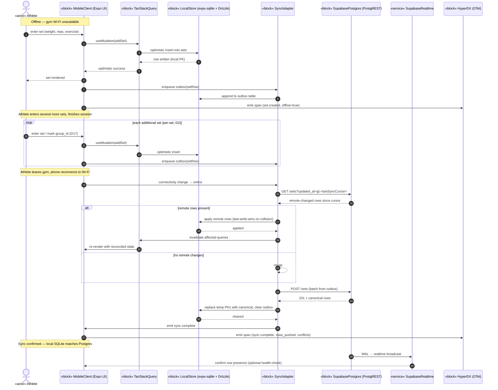
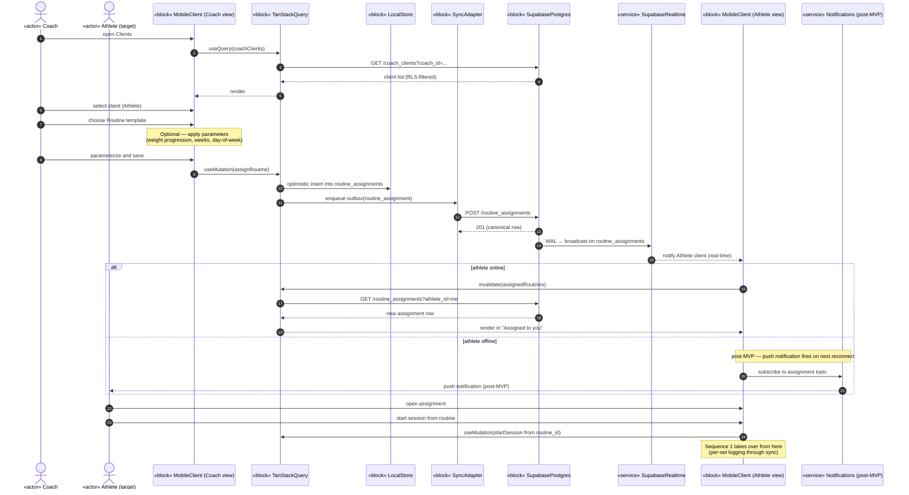
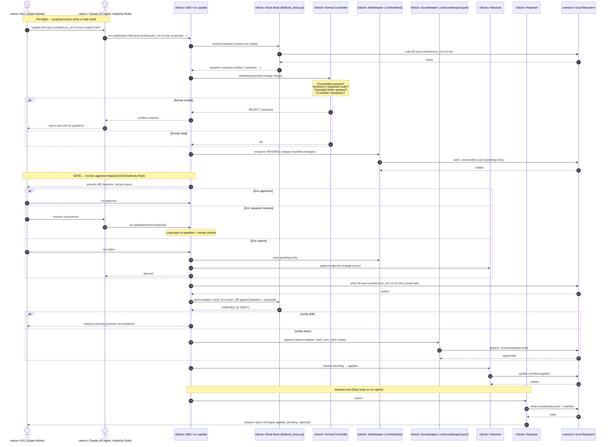

# OV-5c — Operational Activity Sequence

## Purpose

OV-5c shows **time-ordered behavior**: which actor or component does what, when, in response to which trigger, and with which decision points along the way. Where OV-5a (folded into the platform-level view) decomposes activities into a hierarchy, OV-5c traces the live sequence of those activities through the operational nodes that perform them.

For Lifting Tracker MVP, four sequences are load-bearing enough to model in detail:

1. **Athlete logs a workout** with an offline→online round trip (the spine of the alpha experience per D8).
2. **Coach assigns a routine** to an athlete (the v2 coaching surface, modeled now so the schema and sync paths remain honest about what the coach actor will do).
3. **D19 Reasoner Duality** end-to-end — voice/NL entry through Tier 2 LLM through Tier 1 deterministic validation through Authority Rule confirmation.
4. **WF-003 GATE flow** (document-cm) — the governance sequence that produces every change to architecture-class docs in this directory.

Other operational sequences (history import, magic-link auth, photo upload, sync conflict resolution detail) are referenced where they appear at the edges of these four; they do not earn their own sequence diagram at this revision.

Per D28 fit-for-purpose: this view shows sequences, not activity decomposition. The activity catalog itself lives in CV-capabilities and `lift-track-themes-epics-features_v0.2.0.md`. OV-5c picks the activities whose timing and conditional logic actually matter.

## Sequence 1 — Athlete logs a workout (offline → online sync)

**Trigger:** Athlete starts a set on phone in a gym with no connectivity.
**Actor (D3 RBAC):** Athlete (base role).
**Stories:** US-013 (offline gym logging), US-014 (auto-sync on reconnect), US-320 (sync durability), US-321 (conflict resolution).
**Decisions involved:** D2 (per-set granularity), D4 (cloud source of truth), D8 (Expo + Supabase + offline-first sync stack), D17 (set grouping).



**Operational notes.** The athlete never waits on the network at log time — every write hits SQLite first (D8 Sprint 0a revision). The conflict-resolution branch is intentionally trivial in MVP: last-write-wins is acceptable while the alpha is single-actor-per-row (an athlete edits their own sets; a coach does not yet edit the athlete's sets directly). Multi-actor writes (Sprint 2+ when coach can comment/annotate) require revisiting this branch — flagged for re-modeling at that point.

**Failure paths not modeled inline.** PostgREST 4xx (RLS denial, schema mismatch) routes the row to a `outbox.dead_letter` table for manual reconciliation. PostgREST 5xx triggers exponential backoff up to a cap, then surfaces a UI banner. Both paths are SV-6 row 1.x territory; the sequence here is the happy path.

---

## Sequence 2 — Coach assigns a routine to athlete

**Trigger:** Coach selects a client and decides to push a routine.
**Actor (D3 RBAC):** Coach (inherits Athlete; D3 + D10).
**Stories:** US-100-series (coach client management — v2), US-110-series (workout assignment — v2). Modeled here even though the coach UI ships v2, because the schema must support it from day one (D12).
**Decisions involved:** D3 (RBAC), D10 (Coach inherits Athlete), D12 (ontological schema — assignments link Routine→Session via nullable FKs), D13 (training hierarchy).



**Operational notes.** D12's ontological schema makes this clean: the coach creates a `routine_assignment` row; that row carries a nullable FK back to the routine template and a nullable FK to a future session_id. The athlete starting the session populates the session_id; the relationship between routine and session is never forced. Notifications are intentionally deferred — the alpha is invite-list scale, the coach can ping the athlete out of band. The notification surface is shown so v2 sequencing is visible without committing to it now.

**RLS-shaped path.** `coach_clients` RLS rule limits the coach's reads to clients they actually coach; `routine_assignments` RLS limits the athlete's reads to assignments where `athlete_id = auth.uid()`. The sequence relies on these two policies to be in place before v2 ships. They are not in scope today (no coach UI yet) — flagged in `lift-track-risks_v0.1.0.md` if the v2 work attempts to bypass them.

---

## Sequence 3 — D19 Reasoner Duality (voice → NL → typed draft → confirm)

**Trigger:** Athlete taps voice-entry and dictates "200 by 5 for 3 sets" mid-session.
**Actor (D3 RBAC):** Athlete (base role) + AI Agent (under Authority Rule).
**Stories:** US-070 (NL workout entry), US-313 (AI transparency). The Tier 2 concern log surface is referenced via `lift-track-source-document-cm_v0.3.0.md` §6.6 rather than a dedicated US-### in `lift-track-user-stories_v0.2.0.md`; if and when a user-facing Tier 2 concern review story is added, it can be pinned here in the same patch.
**Decisions involved:** D19 (Reasoner Duality + Authority Rule), D14 (per-implement weight; Tier 1 must validate), D15 (limb config), D26 (TypeScript across boundaries — typed-episode shape).

```mermaid
sequenceDiagram
    autonumber
    actor Athlete as «actor» Athlete
    participant UI as «block» MobileClient
    participant ASR as «service» Apple ASR (on-device)
    participant EDF as «block» Edge Function /ai/parse-workout
    participant T1 as «block» Tier 1 Reasoner (deterministic)
    participant LLM as «external» Frontier LLM (Tier 2)
    participant PG as «block» SupabasePostgres
    participant HDX as «block» HyperDX (OTel + GenAI conv.)

    Athlete->>UI: tap voice, dictate "200 by 5 for 3 sets"
    UI->>ASR: speech buffer
    ASR-->>UI: text "200 by 5 for 3 sets"
    UI->>EDF: POST /ai/parse-workout {text, session_ctx, exercise_ctx}

    EDF->>T1: build Tier 1 facts pack
    T1->>PG: SELECT recent sessions, current exercise context
    PG-->>T1: facts
    T1-->>EDF: facts pack (deterministic context)

    EDF->>LLM: prompt(text + facts pack + typed-episode schema)
    LLM-->>EDF: candidate WorkoutEpisode (typed JSON)

    EDF->>T1: validate(candidate)
    Note over T1: Plausibility checks:<br/>weight unit per D14 (per-implement),<br/>limb_config consistency per D15,<br/>plausible weight range vs history,<br/>set count, rep count
    alt validation passes
        T1-->>EDF: VALID
    else validation fails
        T1-->>EDF: REJECT (reasons[])
        EDF-->>UI: error draft + reasons
        UI-->>Athlete: surface reasons; allow manual correction
    end

    EDF->>PG: INSERT ai_interactions (input_raw, output_episode, reasoning_trace, t1_status)
    PG-->>EDF: ai_interaction_id
    EDF->>HDX: span(GenAI conv: model, tokens, cost, latency)

    EDF-->>UI: typed draft (status=DRAFT) + ai_interaction_id

    UI-->>Athlete: render as DRAFT — explicit "Confirm to log" button

    alt athlete confirms
        Athlete->>UI: tap Confirm
        UI->>PG: INSERT sets (3 rows, group_id null) <br/>linked to ai_interaction_id
        PG-->>UI: rows written
        UI->>PG: UPDATE ai_interactions SET reviewed_status='accepted'
        UI->>HDX: span(ai.accept, time_to_accept_ms)
    else athlete edits before confirm
        Athlete->>UI: edit set values
        UI->>PG: INSERT sets (with edits)
        UI->>PG: UPDATE ai_interactions SET reviewed_status='accepted_edited'
        UI->>HDX: span(ai.edit, edit_distance, time_to_accept_ms)
    else athlete rejects
        Athlete->>UI: tap Discard
        UI->>PG: UPDATE ai_interactions SET reviewed_status='rejected'
        UI->>HDX: span(ai.reject)
    end

    Note over UI,HDX: Authority Rule (D19) holds:<br/>no athlete-data write occurs without explicit confirmation.
```

**Operational notes.** The Tier 1 → Tier 2 → Tier 1 → Athlete order is the Authority Rule made mechanical. The Edge Function never returns a `WorkoutEpisode` that has not been Tier-1-validated, and the UI never persists athlete-data rows from an AI source without an explicit confirmation tap. The `ai_interactions` row is written **before** the response returns to the client — this is what makes the audit trail honest even if the user kills the app before confirming. The Tier 2 concern log (per D19 / source-doc-cm §6.6) is enriched on the `ai_interactions` row by the `time_to_accept_ms` and `edit_distance` signals; the skill side stores the same shape in `.cm/tier2-concerns.json`.

**Why the sequence is in OV-5c.** This is the most architecturally consequential sequence in the system. If this flow is wrong, D19 is just a slogan. The diagram makes the temporal ordering explicit so any review of the AI surface starts here.

---

## Sequence 4 — WF-003 GATE (document-cm change to an architecture-class doc)

**Trigger:** A session proposes an edit to `docs/lift-track-architecture_v0.4.0.md` (or any architecture-class doc).
**Actor (D3 RBAC):** Eric (Super Admin authority over governance) + Claude (under Authority Rule) + the document-cm script suite.
**Stories:** Cross-references lift-track-source-document-cm_v0.3.0.md WF-003. Not in `lift-track-user-stories_v0.2.0.md` because document-cm is a portfolio governance concern, not a Lifting Tracker user-facing feature.
**Decisions involved:** D25 (source-document CM), D27 (multi-agent interop — MCP server adapter), and the cross-cutting principles "MCP-first" and "calibrated rigor."



**Operational notes.** Step 4 (GATE — human approval) is the load-bearing decision point. Every architecture-class write traverses this sequence; no exceptions. The append-only scorekeeper with a `prev_hash` chain (per source-doc-cm §6.7) is what makes the sequence tamper-evident at solo scale — sigstore/cosign is the future upgrade path (R-CI-01 territory). The verify-after-write step closes the content-drop defense loop named in lift-track-source-document-cm_v0.3.0.md §5.7 Defense 4: every edit reads back and re-diffs to confirm landing.

**Why this lives here.** WF-003 is a governance sequence, not an athlete-facing one. It earns a slot in OV-5c because every other DoDAF view in this directory was produced **through** it — the sequence is the meta-process that produces the architecture. Modeling it in OV-5c makes the meta-process auditable and gives reviewers a single picture for "how does an architecture change actually happen here."

---

## Sequences referenced but not modeled inline

These sequences exist and are load-bearing, but their structure is either trivial or already captured well in another view. Modeling them as full sequence diagrams would duplicate without earning the duplication.

- **History import (US-040, US-041).** One-shot, off-the-critical-path. Atomic file upload to `SupabaseStorage` → Edge Function parse → `INSERT … sessions/exercises/sets` per D18 expansion rules → `ai_interactions` row for the parser run. Captured in SV-6 §3 (storage rows) + §4 (AI rows).
- **Magic-link auth (US-001).** Standard GoTrue flow; no Lifting-Tracker-specific deviation. Captured in SV-6 §2 row-by-row.
- **Sync conflict resolution detail.** MVP is `last-write-wins`, branch shown inline in Sequence 1. Multi-actor sync (Sprint 2+) requires re-modeling and earns its own OV-5c sequence at that point.
- **Progress photo upload (US-090–US-093).** Encrypt-then-upload sequence per D22. Three steps; SV-6 §3 carries the row detail.

When any of these grows a non-trivial decision point or a new actor, it gets promoted into a full OV-5c sequence at that revision.

## Cross-references

**Architectural decisions:** D2 (per-set granularity — Sequence 1), D3 (RBAC — every sequence), D4 (cloud source of truth — Sequence 1), D8 (Expo + Supabase + offline-first stack — Sequence 1), D10 (coach inherits athlete — Sequence 2), D12 (ontological schema — Sequence 2), D13 (training hierarchy — Sequence 2), D14 (per-implement weight — Tier 1 validation in Sequence 3), D15 (limb config — Tier 1 validation in Sequence 3), D17 (set grouping — Sequence 1), D19 (Reasoner Duality + Authority Rule — Sequences 3 + 4), D25 (source-document CM — Sequence 4), D26 (TypeScript across boundaries — Sequence 3), D27 (MCP-first, multi-agent interop — Sequence 4 cm.* tools). Cross-cutting principles: Three-layer data, MCP-first, Observability (every sequence emits OTel spans).

**User stories:** US-013 (offline gym logging — Sequence 1), US-014 (auto-sync — Sequence 1), US-070 (NL workout entry — Sequence 3), US-313 (AI transparency — Sequence 3), US-320 (sync durability — Sequence 1), US-321 (sync conflict — Sequence 1). v2 stories US-100-series and US-110-series for Sequence 2 (modeled now, ship later). The Tier 2 concern log feature surface is referenced from Sequence 3 via `lift-track-source-document-cm_v0.3.0.md` §6.6 rather than a dedicated US-###; defect X-01 (cross-reference matrix v0.1.1) closed by removing the prior unbacked US-073 citation here.

**Sprint of last revision:** Sprint 0b Day 1 (2026-04-24).

**Other DoDAF views referenced:** AV-1 (orientation), AV-2 §1 (D-number glossary), AV-2 §3 (workflow IDs — WF-003 in Sequence 4), CV-capabilities (which capabilities each sequence realizes), OV-1 (the operational graphic these sequences animate), SV-1 (the components named in every sequence), SV-6 (the row-by-row exchange catalog these sequences walk through), SvcV-1 (the services Sequences 1, 3, 4 traverse — Postgres, Edge Functions, document-cm MCP), DIV-2 (the tables Sequences 1–3 read and write), StdV-1 (the standards the wire formats commit to — PostgREST, MCP, OTel, JWT).

---

© 2026 Eric Riutort. All rights reserved.
