# SV-1 — Systems Interface Description

## Purpose

SV-1 enumerates the technical components of the Lifting Tracker sub-system (and its hooks into XRSize4 ALL portfolio infrastructure) and the interfaces between them. It is the structural counterpart to OV-1's operational graphic — where OV-1 shows what runs and who participates, SV-1 shows what each component **exposes**, what it **consumes**, and on what **port** the contract is published.

SysML stereotypes are used inside the diagrams (`«block»`, `«interface»`, `«port»`, `«service»`). Mermaid's classDiagram supports stereotypes via the `<<stereotype>>` notation in node labels and via the relationship arrows; where Mermaid genuinely cannot render a SysML construct (delegation port symbols, item flows on ports), the supporting prose calls out the SysML notation explicitly.

The interface **catalog** (every flow, format, direction, protocol) lives in SV-6. SV-1's role is structural: which components exist, which boundaries they cross, and which ports define those boundaries. SV-6 is the row-by-row matrix.

## Component diagram (block + interface, classDiagram form)

```mermaid
classDiagram
    direction TB

    class MobileClient {
        <<«block» Expo client>>
        +iOS (TestFlight)
        +Web (Vercel)
        +offline-first (D8)
        --
        port: SupabaseAPIPort
        port: SupabaseRealtimePort
        port: SupabaseStoragePort
        port: HyperDXOTLPPort
        port: AppleServicesPort
        port: ExternalVideoPort
    }

    class LocalStore {
        <<«block» expo-sqlite + Drizzle>>
        +schema: mirror of Postgres
        +pattern: single-user-per-device
        --
        port: TanStackQueryHook
    }

    class SyncAdapter {
        <<«block» Custom Supabase sync adapter>>
        +pattern: BYO
        +conflict: last-write-wins
        --
        port: LocalStorePort
        port: SupabasePostgrestPort
    }

    class TanStackQuery {
        <<«block» server-state cache>>
        +optimistic updates
        +background refetch
        --
        port: SupabasePortREST
    }

    class SupabasePostgres {
        <<«block» Supabase Postgres (D4)>>
        +source of truth
        +pgvector (Sprint 2+)
        +RLS policies
        --
        port: PostgrestRESTPort
        port: PostgresWirePort (5432)
        port: RealtimeWebSocketPort
    }

    class SupabaseAuth {
        <<«service» auth>>
        +magic-link (MVP)
        +OAuth Apple/Google (post-MVP)
        --
        port: GoTrueRESTPort
    }

    class SupabaseStorage {
        <<«service» storage>>
        +encrypted media at rest (D22)
        +signed URLs
        --
        port: StorageRESTPort
    }

    class SupabaseRealtime {
        <<«service» realtime>>
        +Postgres changes
        +broadcast
        --
        port: RealtimeWebSocketPort
    }

    class EdgeFunctions {
        <<«block» Supabase Edge Functions>>
        +Deno runtime
        +Tier 2 LLM proxying (D19)
        +AI orchestration
        --
        port: EdgeRESTPort
        port: LLMUpstreamPort
    }

    class LLMAPI {
        <<«external» Frontier LLM API>>
        +Anthropic / OpenAI
        +Tier 2 only (D19)
        --
        port: HTTPSJSONPort
    }

    class HyperDX {
        <<«block» HyperDX OSS>>
        +ClickHouse backend
        +OTel-native ingestion
        +SigNoz fallback
        --
        port: OTLPHTTPPort
        port: OTLPGRPCPort
    }

    class Railway {
        <<«block» Railway hosting>>
        +Docker containers
        +managed Postgres/Redis
        +reverse proxy
        --
        port: ContainerOrchestrationPort
    }

    class DocumentCM {
        <<«service» document-cm MCP server>>
        +tools: cm.update / approve / record / verify / status / history
        +shared lib/ over CLI + MCP adapters
        --
        port: MCPStdioPort
        port: CLIShellPort
    }

    class LiftingTrackerMCP {
        <<«service» lifting-tracker-mcp (planned)>>
        +tools: query_sessions / log_session / get_coach_hierarchy / assign_program
        +ships post athlete-MVP
        --
        port: MCPStdioPort
    }

    class FusekiMCP {
        <<«service» fuseki-mcp (Sprint 3+)>>
        +tools: SPARQL query proxy
        +ontology reasoning gate
        --
        port: MCPStdioPort
    }

    class Fuseki {
        <<«block» Apache Jena Fuseki>>
        +RDF triples + OWL reasoning
        +Sprint 3+ or Phase 2
        --
        port: SPARQLHTTPPort
    }

    class AppleServices {
        <<«external» Apple platform>>
        +TestFlight
        +Sign in with Apple (post-MVP)
        +HealthKit (deferred)
        +watchOS (D20, separate target)
        --
        port: AppStorePort
        port: HealthKitPort
    }

    class ExternalVideo {
        <<«external» YouTube etc>>
        +instructional links per D24 MVP
        --
        port: VideoEmbedPort
    }

    %% --- Mobile client edges (composition: filled diamond `*--`) ---
    MobileClient *-- LocalStore : composition (1..1)
    MobileClient *-- TanStackQuery : composition (1..1)
    MobileClient *-- SyncAdapter : composition (1..1)
    MobileClient ..> SupabaseAuth : uses (auth flow)
    MobileClient ..> SupabaseRealtime : uses (subscribe)
    MobileClient ..> SupabaseStorage : uses (media upload/download)
    MobileClient ..> EdgeFunctions : uses (AI requests)
    MobileClient ..> HyperDX : exports (telemetry)
    MobileClient ..> AppleServices : uses (platform APIs)
    MobileClient ..> ExternalVideo : embeds (links per D24)

    %% --- Sync edges ---
    LocalStore --> SyncAdapter : queue/apply
    SyncAdapter ..> SupabasePostgres : push/pull
    TanStackQuery ..> SupabasePostgres : query/mutate

    %% --- Backend dependencies ---
    EdgeFunctions ..> LLMAPI : Tier 2 LLM call
    EdgeFunctions ..> SupabasePostgres : reads/writes ai_interactions
    SupabaseAuth --> SupabasePostgres : session storage
    SupabaseStorage --> SupabasePostgres : object metadata
    SupabaseRealtime --> SupabasePostgres : WAL stream

    %% --- Hosting ---
    Railway *-- SupabasePostgres : hosts
    Railway *-- SupabaseAuth : hosts
    Railway *-- SupabaseStorage : hosts
    Railway *-- SupabaseRealtime : hosts
    Railway *-- EdgeFunctions : hosts
    Railway *-- HyperDX : hosts
    Railway *-- DocumentCM : hosts
    Railway *-- LiftingTrackerMCP : hosts
    Railway *-- FusekiMCP : hosts
    Railway *-- Fuseki : hosts

    %% --- MCP edges ---
    DocumentCM ..> SupabasePostgres : reads doc metadata (future)
    LiftingTrackerMCP ..> SupabasePostgres : reads/writes domain
    FusekiMCP ..> Fuseki : SPARQL proxy
    MobileClient ..> LiftingTrackerMCP : MCP tool calls (future agent surface)
```

## Component catalog

| Component | Stereotype | Owner / location | Status | Multiplicity |
|---|---|---|---|---|
| MobileClient (Expo iOS + Web) | «block» | Lifting Tracker app code | MVP | 1 per device |
| LocalStore (expo-sqlite + Drizzle) | «block» | Inside MobileClient | MVP | 1 per device |
| SyncAdapter (custom Supabase BYO) | «block» | Inside MobileClient | MVP | 1 per device |
| TanStackQuery | «block» | Inside MobileClient | MVP | 1 per device |
| SupabasePostgres (with pgvector) | «block» | Railway-hosted | MVP | 1 per environment |
| SupabaseAuth (GoTrue) | «service» | Railway-hosted | MVP | 1 per environment |
| SupabaseStorage | «service» | Railway-hosted | MVP | 1 per environment |
| SupabaseRealtime | «service» | Railway-hosted | MVP | 1 per environment |
| EdgeFunctions (Deno) | «block» | Railway-hosted | MVP | many per environment |
| HyperDX OSS | «block» | Railway-hosted | MVP | 1 per environment |
| LLM API (Anthropic / OpenAI) | «external» | Vendor-hosted | MVP (Tier 2 surface) | 1+ providers |
| AppleServices (TestFlight, etc.) | «external» | Vendor-hosted | MVP | 1 |
| ExternalVideo (YouTube, etc.) | «external» | Vendor-hosted | MVP per D24 | 0..* per exercise |
| document-cm MCP server | «service» | Local skill + Railway | Sprint 0b | 1 per portfolio |
| lifting-tracker-mcp | «service» | Railway-hosted (planned) | Post athlete-MVP | 1 per environment |
| fuseki-mcp | «service» | Railway-hosted (planned) | Sprint 3+ | 1 per environment |
| Apache Jena Fuseki | «block» | Railway-hosted (planned) | Sprint 3+ or Phase 2 | 1 per portfolio |
| Railway | «block» | Vendor-hosted; Docker substrate | MVP | 1 (commitment is to Docker, not Railway) |

## Port catalog (interfaces by name)

| Port | Direction | Protocol / format | Provided by | Required by |
|---|---|---|---|---|
| `PostgrestRESTPort` | bidirectional | PostgREST over HTTPS; JSON | SupabasePostgres | TanStackQuery, SyncAdapter, LiftingTrackerMCP |
| `PostgresWirePort` (5432) | bidirectional | Postgres wire protocol | SupabasePostgres | EdgeFunctions, document-cm (future) |
| `RealtimeWebSocketPort` | server→client | WebSocket; JSON-RPC-ish frames | SupabaseRealtime | MobileClient |
| `GoTrueRESTPort` | bidirectional | HTTPS JSON; magic-link + JWT | SupabaseAuth | MobileClient |
| `StorageRESTPort` | bidirectional | HTTPS multipart + signed URLs | SupabaseStorage | MobileClient |
| `EdgeRESTPort` | client→edge | HTTPS JSON | EdgeFunctions | MobileClient |
| `LLMUpstreamPort` | client→vendor | HTTPS JSON (vendor-specific schemas) | LLMAPI | EdgeFunctions |
| `OTLPHTTPPort` | client→backend | OpenTelemetry over HTTP/protobuf | HyperDX | MobileClient, EdgeFunctions, all services |
| `OTLPGRPCPort` | client→backend | OpenTelemetry over gRPC | HyperDX | server-side services |
| `MCPStdioPort` | bidirectional | MCP over stdio (JSON-RPC) | document-cm, lifting-tracker-mcp, fuseki-mcp | Claude Code, Cursor, Codex CLI, future agent hosts |
| `CLIShellPort` | invocation | shell argv + stdout | document-cm `cli/cm.py` | human + CI |
| `SPARQLHTTPPort` | bidirectional | SPARQL 1.1 over HTTP | Fuseki | fuseki-mcp |
| `AppStorePort` | one-way (publish) | Apple submission API | AppleServices | MobileClient (build pipeline) |
| `HealthKitPort` | client→client | iOS HealthKit framework (deferred) | AppleServices | MobileClient (post-alpha) |
| `VideoEmbedPort` | embed-only | WebView / oEmbed | ExternalVideo | MobileClient |

## Key interface notes

**Sync path is the spine.** Per D8 revision (Sprint 0a), the offline-first stack is `expo-sqlite` + Drizzle + TanStack Query + custom Supabase sync adapter. The mobile client never reaches the database directly — every read goes through TanStack Query (which may answer from local SQLite via Drizzle), every write is queued by the sync adapter, and the adapter pushes to Supabase Postgres when connectivity allows. `last-write-wins` conflict resolution per Sprint 0a; revisit when multi-user coach-athlete collaboration lands (Sprint 2+).

**MCP is the agent-facing contract.** Every governance capability in document-cm (and every domain capability in the future lifting-tracker-mcp) is exposed as an MCP tool. The CLI and MCP adapters share a single `lib/` so they cannot drift (per lift-track-source-document-cm_v0.3.0.md §6.6). The `console.log → stderr` guard on the MCP stdio server is non-negotiable — any library that prints to stdout corrupts JSON-RPC.

**EdgeFunctions are the only path to the LLM API.** The mobile client never holds an LLM API key. All Tier 2 LLM calls go through Edge Functions, which proxy the request, attach the `ai_interactions` audit row, and return the typed response per the §4.9 hybrid `ai_interactions` schema. This is what makes the Authority Rule (D19) mechanically enforceable rather than a polite request.

**Fuseki is reachable only through `fuseki-mcp`.** Per the Three-layer data architecture cross-cutting principle, the mobile client does not import a SPARQL library. When ontology reasoning becomes a workload (Sprint 3+ or Phase 2), it is consumed via MCP tools that wrap Fuseki. This keeps the mobile client's direct dependencies minimal and keeps the semantic layer a portfolio-level service rather than a per-sub-system one.

**Telemetry is OTel-native.** HyperDX is the backend-of-choice; SigNoz is the fallback if ClickHouse Inc. relicenses HyperDX (R-TV-03). Either backend ingests OpenTelemetry over OTLP-HTTP or OTLP-gRPC. The mobile client uses `@hyperdx/otel-react-native` (with the named refactor path to raw `@opentelemetry/sdk-trace-web` per R-TV-04 if the SDK is abandoned).

**Apple platform is partitioned.** TestFlight publishing, Sign in with Apple, HealthKit, and watchOS each present a different surface to the mobile client (and to the future watch app). Sign in with Apple is required by Apple Guideline 4.8 once any other third-party sign-in is added (post-MVP). HealthKit is deferred to the platform Biometrics sub-system. The watch app per D20 is a separate native target — `«block» AppleWatch` would appear in a v2 SV-1 revision but is not modeled here as it is not part of the MVP code-base.

## Mermaid expressivity gaps

Mermaid's classDiagram does not render SysML's:

- **Delegation ports** (port-to-port forwarding) — described in prose where they exist; e.g., `MobileClient`'s `SupabaseAPIPort` delegates to `TanStackQuery`'s `SupabasePortREST` and `SyncAdapter`'s `SupabasePostgrestPort`.
- **Item flows** typed by data type on a connector — these are catalogued in SV-6 by row.
- **Standard property compartments** (`«flowProperty»`, etc.) — port descriptions in the catalog table carry this information.
- **Allocation arrows** (capability ↔ component) — captured by the cross-reference list at the bottom of CV-capabilities (which capability anchors which decision, which decision constrains which component).

Where these gaps mattered for SV-1's purpose (component identity + interface naming), the supporting tables compensate. Where they don't matter (decoration-level SysML notation that adds no decision support at MVP scale), they are not faked.

## Cross-references

**Architectural decisions:** D4 (cloud source of truth), D8 (Expo + Supabase + sync stack revision), D17 (set grouping — schema concern echoed by sync), D19 (Reasoner Duality + Authority Rule — Edge Function isolation), D20 (watch as separate target — not in MVP SV-1), D22 (encrypted-at-rest media — Supabase Storage), D24 (external video — ExternalVideo external block), D26 (TypeScript across boundaries), D27 (multi-agent interop first-class — MCP server proliferation). Cross-cutting principles: MCP-first, Three-layer data, Hosting posture, Observability.

**User stories:** US-001 (magic-link → SupabaseAuth), US-013 (offline gym logging → LocalStore), US-014 (auto-sync → SyncAdapter), US-040 (history import → SupabaseStorage + SupabasePostgres), US-070 (NL workout entry → EdgeFunctions + LLMAPI), US-090 (progress photos → SupabaseStorage encrypted at rest), US-300 (load performance — affected by sync layer choice), US-310 (data encryption in transit — TLS on every port), US-313 (AI transparency → Edge Function audit row).

**Sprint of last revision:** Sprint 0b Day 1 (2026-04-24).

**Other DoDAF views referenced:** AV-2 §9 (component term definitions), OV-1 (operational graphic — same components in less detail), SV-6 (the data exchange matrix between these components), DIV-2 (the data the components exchange), StdV-1 (the standards the ports speak — MCP, OTel, PostgREST, SPARQL).

---

© 2026 Eric Riutort. All rights reserved.
