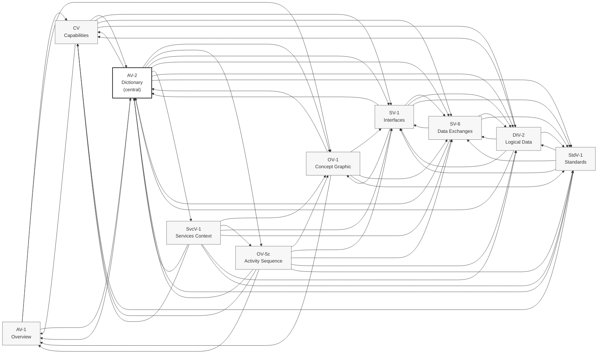

# DoDAF Cross-Reference Matrix — Lifting Tracker sub-system

## §1 Purpose

This matrix is the auditable record that the architectural decisions in `lift-track-architecture_v0.4.0.md`, the user stories in `lift-track-user-stories_v0.2.0.md`, and the DoDAF views in `docs/dodaf/` are mutually consistent. Its existence is mandated by `CONVENTIONS_v0.2.4.md` §11.6, which requires every DoDAF view file to link to (a) the D-decisions it informs, (b) the US-### user stories it covers, (c) the sibling DoDAF views it depends on, and (d) the sprint(s) it was produced or revised in — and to roll those per-file cross-references up into a portfolio-level matrix governed separately from the CONVENTIONS file.

Three properties this matrix is intended to surface:

1. **Forward traceability.** Pick any view and trace it back to the decisions and stories it supports.
2. **Inverse coverage.** Pick any D-decision or any US-### and see which views cover it. Gaps are visible.
3. **Dependency topology.** Pick any view and see which siblings it depends on. Cycles and orphans are visible.

**Scope caveat per Eric's Sprint 0c1 correction.** These views are LIFTING TRACKER sub-system level, not platform-level. The matrix scope is sub-system. A platform-level cross-reference matrix lands at the `xrsize4all` repo when that repo stands up (Sprint 0d2). Where a Lifting Tracker view actively cites a portfolio-scope concept (D25, D27, D28, the 16-agent suite, document-cm services), the citation appears here for inclusion-completeness; the canonical record for those concepts migrates to the platform-level matrix when standup occurs.

**Reference class.** This file is governed by `CONVENTIONS_v0.2.4.md` §2 as Reference content class with semver on structural revisions. Initial version is 0.1.0. Sprint 0c1 stretch deliverable.

### §1.1 Methodology

The matrix was compiled by reading each view file and extracting the four cross-reference axes from the explicit "Cross-references" section at the bottom (every view file carries one). Where a view's "Cross-references" line names a D-number or US-### only by series ("US-100-series", "100-series for Sequence 2"), the series is recorded as such and the individual story IDs are not pinned. Where a view's prose body cites a D-number that is absent from its "Cross-references" line (rare), the prose citation is recorded with a note. Where a view's "Sibling views referenced" line names views that the view itself does not reciprocally appear in, the asymmetry is recorded in §5's inbound-reference count.

Coverage strength signal in §3 uses three buckets:

- **Strongest** (8+ views) — decision is load-bearing across operational, technical, data, and standards layers; every view has a stake.
- **Strong** (5–7 views) — decision is load-bearing across two or three architectural layers (typically operational + technical, or data + technical).
- **Adequate** (3–4 views) — decision is concentrated in the data model, capability layer, or business-trajectory framing; surface area is narrower but coverage is sufficient for the decision's scope.

A "Weak" bucket (1–2 views) would signal a defect (decision exists but architecture is silent on it). No D-decision falls into Weak today; the matrix records this as a positive signal, not as evidence the framework is over-fitted.

### §1.2 What this matrix does NOT capture

Three intentional omissions, recorded so future maintainers don't add them by accident:

- **Implementation traceability.** This matrix does not link views to source code, migration files, test cases, or deployed artifacts. That linkage is `code-cm` discipline (deferred per `lift-track-source-document-cm_v0.3.0.md` §3.7). When `code-cm` ships, a separate code-side cross-reference may attach to this one.
- **Cross-portfolio (xrsize4all) views.** Platform-level DoDAF views (the eventual xrsize4all repo's AV-1, AV-2, CV, OV-2, OV-5, StdV-1) are out of scope for this sub-system matrix. The platform-level matrix lands at `xrsize4all` Sprint 0d2; this matrix becomes one of its constituent inputs at that point.
- **Per-feature (F-number) traceability.** `lift-track-themes-epics-features_v0.2.0.md` decomposes capabilities to 109 features. Per-feature view coverage is not enumerated here; the per-epic coverage in §3 (via CV's epic identifiers) is the load-bearing pin.

## §2 Per-view cross-reference

For each view in `docs/dodaf/`, this section enumerates the D-decisions cited, US-### stories covered, sibling views referenced, and sprint(s) of production and revision.

### AV-1 — Overview & Summary (`lift-track-dodaf-AV-1-overview_v0.1.0.md`)

**Purpose.** Charter-level orientation for new contributors. Names the portfolio (XRSize4 ALL), the Lifting Tracker sub-system inside it, the alpha audience, and the reading order through the rest of the architecture.

| Cross-reference axis | Entries |
|---|---|
| **D-decisions cited** | D1 (entry + analysis as first-class), D3 (RBAC hierarchy), D7 (closed alpha), D8 (Expo + Supabase), D11 (personal tool → business trajectory), D27 (multi-agent interop first-class), D28 (DoDAF + SysML fit-for-purpose authority) |
| **US-### stories covered** | US-001 (magic-link invite), US-050 (TestFlight iPhone app), US-051 (web dashboard) — the alpha entry points |
| **Sibling views referenced** | OV-1 (deeper concept graphic), CV-capabilities (capability decomposition), AV-2 (vocabulary), all remaining views in the initial set as the question warrants |
| **Sprint(s) produced/revised** | Produced Sprint 0b Day 1 (2026-04-24); frontmatter `updated: 2026-04-29` but prose still names "Sprint of last revision: Sprint 0b Day 1" — drift flagged in §6 |

### AV-2 — Integrated Dictionary (`lift-track-dodaf-AV-2-dictionary_v0.3.0.md`)

**Purpose.** Authoritative term registry for the sub-system. Nineteen sections covering D-decisions, domain concepts, capabilities, activities, sub-systems, workflows, agents, roles, components/ports, services, data entities, standards, principles, content classes, tiers, risks, story-prefix conventions, DoDAF views, and (v0.3.0) Sprint-0c2+ operational governance controls (four-control composition / destructive-op tier framework / approval matrix / override procedure).

| Cross-reference axis | Entries |
|---|---|
| **D-decisions cited** | D1–D28 (full catalog — every D-decision in scope plus portfolio-scope D25, D27, D28) |
| **US-### stories covered** | Prefix-level only (US-0XX athlete MVP, US-1XX coach + v2 expansion, US-2XX admin/gym/teams, US-3XX NFR-class). Individual story IDs deliberately not catalogued here per Section 17 — story IDs live in `lift-track-user-stories_v0.2.0.md` |
| **Sibling views referenced** | AV-1, CV-capabilities, OV-1, OV-5c, SV-1, SV-6, SvcV-1, DIV-2, StdV-1 — every other view (Section 18 catalogues them; the dictionary is the single shared lookup) |
| **Sprint(s) produced/revised** | v0.1.0 produced Sprint 0b Day 1 (2026-04-24); v0.2.0 inclusion-completeness pass Sprint 0c1 CC8 (2026-04-29) — CARP/CARPO type column added per row; four authoring rules applied (verb-object activities, no-and, synonym-collapse, bracketed-context-tag); domain concepts promoted to standalone rows. v0.3.0 additive enrichment Sprint 0c2 close (2026-04-30) — 28 new entries from Sprint 0c2 work and adjacent prep deliverables (0d/0d1/0d2/0e); NEW §19 Operational governance controls. Baselines at `dodaf/.baseline-lift-track-dodaf-AV-2-v0.1.0-20260429.md` |

### CV — Capability Viewpoint (`lift-track-dodaf-CV-capabilities_v0.1.0.md`)

**Purpose.** What the system must be able to do, decomposed from 8 themes through 31 epics to 109 features and 114 stories. Restates `lift-track-themes-epics-features_v0.2.0.md` and `lift-track-user-stories_v0.2.0.md` in DoDAF form so other views can pin to capability identifiers without re-deriving them.

| Cross-reference axis | Entries |
|---|---|
| **D-decisions cited** | D1 (entry + analysis), D2 (per-set), D3 (RBAC), D4 (cloud source of truth), D5 (exercise library), D6 (auth), D7 (alpha audience), D8 (Expo + Supabase), D9 (business model), D10 (Ethan as Coach), D11 (trajectory), D12 (ontological schema), D13 (training hierarchy), D14 (per-implement weight), D15 (limb config), D16 (rest), D17 (set grouping), D18 (import notation), D19 (Reasoner Duality), D20 (wearables separate), D21 (Goals first-class), D22 (progress photos), D23 (form analysis), D24 (instructional content) |
| **US-### stories covered** | All 114 stories at capability level (sampled in MVP capability slice flowchart): US-001–US-003 (auth), US-010–US-019 (logging), US-020–US-026 (library), US-027–US-028 (instructional), US-030–US-035 (analytics), US-036–US-039 (goals), US-040, US-041, US-312 (import), US-050, US-051 (cross-platform), US-060, US-061 (sessions), US-070–US-072 (NL/AI), US-090–US-093 (photos), US-300–US-301 (perf), US-310–US-311 (privacy), US-320–US-321 (reliability) |
| **Sibling views referenced** | AV-1 (orientation), AV-2 §11 + §12 (theme + story-prefix definitions), SV-1 (components realizing capabilities), SV-6 (data exchanges driven by capabilities), DIV-2 (tables capabilities operate on) |
| **Sprint(s) produced/revised** | Produced Sprint 0b Day 1 (2026-04-24). Not revised since |

### OV-1 — High-Level Operational Concept Graphic (`lift-track-dodaf-OV-1-concept-graphic_v0.1.0.md`)

**Purpose.** The single picture every audience walks away from. Shows portfolio composition, sub-system positioning, infrastructure layer, external services, and client surfaces — who participates, what is built, where it runs.

| Cross-reference axis | Entries |
|---|---|
| **D-decisions cited** | D3 (RBAC roles surfaced as actors), D4 (cloud source of truth — Postgres in DataLayer), D8 (Expo + Supabase — single codebase three targets), D9 (Stripe deferred — post-alpha external service), D19 (AI Agent + Authority Rule — first-class participant), D20 (watch as separate target — shown in Clients), D24 (external video — ExternalVideo external block), D27 (multi-agent interop first-class — MCP layer visible). Cross-cutting: MCP-first, Three-layer data, Hosting posture, Observability |
| **US-### stories covered** | US-001 (magic-link), US-013 (offline gym logging), US-014 (auto-sync on reconnect), US-050 (TestFlight iPhone), US-051 (web dashboard), US-070 (NL workout entry — Tier 2 surface), US-080–US-082 (watch features deferred per D20) |
| **Sibling views referenced** | AV-1 (small portfolio diagram), AV-2 (term definitions for blocks shown), SV-1 (component-level interface description), SV-6 (data exchanges between components), StdV-1 (MCP, OTel, Postgres standards in play) |
| **Sprint(s) produced/revised** | Produced Sprint 0b Day 1 (2026-04-24). Not revised since |

### OV-5c — Operational Activity Sequence (`lift-track-dodaf-OV-5c-activity-sequence_v0.1.0.md`)

**Purpose.** Time-ordered behavior. Four load-bearing sequences modeled in detail: athlete logs a workout (offline → online sync), coach assigns a routine, D19 Reasoner Duality end-to-end, WF-003 GATE on architecture-class doc edits.

| Cross-reference axis | Entries |
|---|---|
| **D-decisions cited** | D2 (per-set granularity — Sequence 1), D3 (RBAC — every sequence), D4 (cloud source of truth — Sequence 1), D8 (Expo + Supabase + offline-first stack — Sequence 1), D10 (coach inherits athlete — Sequence 2), D12 (ontological schema — Sequence 2), D13 (training hierarchy — Sequence 2), D14 (per-implement weight — Tier 1 validation Sequence 3), D15 (limb config — Tier 1 validation Sequence 3), D17 (set grouping — Sequence 1), D19 (Reasoner Duality + Authority Rule — Sequences 3 + 4), D25 (source-document CM — Sequence 4), D26 (TypeScript — Sequence 3 typed-episode shape), D27 (MCP-first — Sequence 4 cm.* tools). Cross-cutting: Three-layer data, MCP-first, Observability |
| **US-### stories covered** | US-013 (offline gym logging), US-014 (auto-sync), US-070 (NL workout entry), US-073 (Tier 2 concern log signals — DEFECT: US-073 not in `lift-track-user-stories_v0.2.0.md`; flagged §6), US-313 (AI transparency), US-320 (sync durability), US-321 (sync conflict). v2: US-100-series (coach client mgmt) and US-110-series (workout assignment) named at series level for Sequence 2 |
| **Sibling views referenced** | AV-1 (orientation), AV-2 §1 (D-number glossary), AV-2 §3 (workflow IDs — WF-003 in Sequence 4), CV-capabilities (which capabilities each sequence realizes), OV-1 (operational graphic these sequences animate), SV-1 (components named in every sequence), SV-6 (row-by-row exchange catalog the sequences walk), DIV-2 (tables Sequences 1–3 read/write), StdV-1 (PostgREST, MCP, OTel, JWT standards) |
| **Sprint(s) produced/revised** | Produced Sprint 0b Day 1 (2026-04-24). Not revised since. Promoted to status `accepted` |

### SV-1 — Systems Interface Description (`lift-track-dodaf-SV-1-interfaces_v0.1.0.md`)

**Purpose.** Component diagram, component catalog, port catalog. Where OV-1 shows "what runs," SV-1 shows what each component exposes and consumes and on what port the contract is published.

| Cross-reference axis | Entries |
|---|---|
| **D-decisions cited** | D4 (cloud source of truth), D8 (Expo + Supabase + Sprint 0a stack revision), D17 (set grouping — schema concern echoed by sync), D19 (Reasoner Duality + Authority Rule — Edge Function isolation), D20 (watch as separate target — not in MVP SV-1), D22 (encrypted-at-rest media — Supabase Storage), D24 (external video — ExternalVideo block), D26 (TypeScript across boundaries), D27 (multi-agent interop — MCP server proliferation). Cross-cutting: MCP-first, Three-layer data, Hosting posture, Observability |
| **US-### stories covered** | US-001 (magic-link → SupabaseAuth), US-013 (offline gym logging → LocalStore), US-014 (auto-sync → SyncAdapter), US-040 (history import → SupabaseStorage + Postgres), US-070 (NL workout entry → EdgeFunctions + LLMAPI), US-090 (progress photos → encrypted SupabaseStorage), US-300 (load performance — sync layer choice), US-310 (encryption in transit — TLS on every port), US-313 (AI transparency → Edge Function audit row) |
| **Sibling views referenced** | AV-2 §9 (component term definitions), OV-1 (same components in less detail), SV-6 (data exchange matrix between these components), DIV-2 (data the components exchange), StdV-1 (standards the ports speak — MCP, OTel, PostgREST, SPARQL) |
| **Sprint(s) produced/revised** | Produced Sprint 0b Day 1 (2026-04-24). Not revised since |

### SV-6 — Systems Data Exchange Matrix (`lift-track-dodaf-SV-6-data-exchanges_v0.1.0.md`)

**Purpose.** Row-by-row catalog of every data exchange that crosses a component boundary. Where SV-1 names the components and ports, SV-6 names the payload, format, direction, protocol, governing standard, and content class of each exchange.

| Cross-reference axis | Entries |
|---|---|
| **D-decisions cited** | D2 (per-set granularity drives sync row volume), D4 (cloud source of truth dictates sync direction), D6 (auth → magic-link rows), D8 (Sprint 0a sync stack drives sections 1 + 2), D17 (set grouping carried via group_id), D19 (Reasoner Duality dictates AI section structure), D20 (biometrics rows reserved per non-decisions), D22 (encrypted storage; sensitive content class), D23 (form analysis exchanges reserved for v2/v3), D24 (instructional content — coach/platform/AI source labeling), D26 (TypeScript across boundaries), D27 (MCP exchanges anchored to multi-agent interop). Cross-cutting: MCP-first (sections 6 + 7), Three-layer data (sections 1 + 6), Observability (section 5) |
| **US-### stories covered** | US-001 (magic-link rows), US-013 (offline path → sync push when online), US-014 (auto-sync rows in section 1), US-040, US-041 (history import → SupabaseStorage upload + multiple PostgREST inserts), US-070 (NL workout entry — entire AI section), US-071 (session summary — same path), US-072 (anomaly flagging — Tier 1 facts query), US-090–US-093 (progress photo rows in section 3), US-300 (sync performance — instrumented in section 5), US-310 (TLS on every row), US-311 (RLS on every PostgREST row), US-313 (AI transparency → ai_interactions audit row), US-320 (offline durability — outbox pattern), US-321 (sync conflict — last-write-wins) |
| **Sibling views referenced** | SV-1 (component + port catalog this matrix populates), DIV-2 (table-level data model), StdV-1 (every Standard column corresponds to a row in StdV-1), AV-2 §9 (component definitions), AV-2 §10 (risk IDs binding to interface choices) |
| **Sprint(s) produced/revised** | Produced Sprint 0b Day 1 (2026-04-24). Not revised since. STALE: cites `CONVENTIONS_v0.2.2.md §8` — current is `v0.2.4` (flagged §6) |

### SvcV-1 — Services Context Description (`lift-track-dodaf-SvcV-1-services-context_v0.1.0.md`)

**Purpose.** Identifies the services in the architecture (distinct from in-process operations), traces who provides each, who consumes it, on what protocol, and how it relates to OV-5c operational activities.

| Cross-reference axis | Entries |
|---|---|
| **D-decisions cited** | D4 (SupabasePostgres canonical service), D8 (Expo + Supabase + offline-first stack), D19 (Reasoner Duality + Authority Rule — Edge Functions as AI/Governance service), D20 (watch + Apple ASR on-device), D22 (encrypted media — SupabaseStorage), D24 (external content embeds), D25 (source-document CM — `document-cm MCP`), D26 (TypeScript across boundaries), D27 (multi-agent interop first-class — entire MCP layer). Cross-cutting: MCP-first (entire MCP layer), Three-layer data, Hosting posture, Observability |
| **US-### stories covered** | US-001 (`SupabaseAuth`), US-013 + US-014 (offline path consumes Postgres via PostgREST + sync adapter), US-040 (`SupabaseStorage` + Edge Functions for parse), US-070 (Edge Functions + Claude API Tier 2 — Sequence 3 in OV-5c), US-090 (encrypted progress photos), US-300 (load performance — instrumented via HyperDX), US-310 (TLS on every service), US-313 (AI transparency — `ai_interactions` audit row) |
| **Sibling views referenced** | AV-2 §1 (D-number glossary), AV-2 §2 (sub-systems), AV-2 §10 (risks), CV-capabilities (which capabilities each service realizes), OV-1 (services in infrastructure layer), OV-5c (sequences services participate in — 1, 3, 4), SV-1 (components and ports under each service contract), SV-6 (row-by-row exchanges across services), DIV-2 (data each data-service persists), StdV-1 (every protocol named in catalog table) |
| **Sprint(s) produced/revised** | Produced Sprint 0b Day 1 (2026-04-24). Not revised since. Status `accepted`. NOTE: SvcV-1 is referenced INTO by AV-2 only — no other view pins to SvcV-1; flagged §6 as one-sided dependency |

### DIV-2 — Logical Data Model (`lift-track-dodaf-DIV-2-logical-data_v0.1.0.md`)

**Purpose.** Entity-relationship picture of the schema as defined in `lift-track-architecture_v0.4.0.md` §"Data model." Schema is complete from day one per D12 — every table exists in MVP even if no UI exposes it.

| Cross-reference axis | Entries |
|---|---|
| **D-decisions cited** | D2 (per-set → SETS), D5 (exercise library → EXERCISES + EXERCISE_ALIASES), D12 (ontological schema → all nullable parent FKs), D13 (training hierarchy → EXERCISE_PROGRAMS / EXERCISE_TYPES / ROUTINES / CLASSES / PROGRAM_COMPONENTS), D14 (per-implement weight → `sets.weight_entered`), D15 (limb configuration → `exercises.upper_limb_config` + `lower_limb_config`; EXERCISE_FAMILIES), D16 (rest defaulting cascade), D17 (set grouping → `sets.group_id`), D18 (import notation → row count per shorthand), D19 (Reasoner Duality → AI_INTERACTIONS hybrid schema + AI_GENERATED_CONTENT review status), D21 (Goals first-class → GOALS + GOAL_MILESTONES + GOAL_PROGRESS_SNAPSHOTS), D22 (progress photos privacy → PROGRESS_PHOTOS visibility), D23 (form analysis layered → SET_VIDEOS + SET_VIDEO_ANALYSES + SET_VIDEO_ANNOTATIONS), D24 (instructional content sources → EXERCISE_CONTENT.source enum), D27 (multi-agent interop — AI_INTERACTIONS.thread_id supports cross-agent episode grouping) |
| **US-### stories covered** | US-010, US-011 (sessions + sets schema), US-016 (BODY_WEIGHTS), US-021, US-024 (custom exercises with limb config), US-023 (EXERCISE_ALIASES), US-025 (EXERCISE_FAMILIES), US-036, US-037, US-038, US-039 (GOALS), US-040, US-041 (import populates SESSIONS, SESSION_EXERCISES, SETS with group_id), US-070, US-071, US-072 (AI_INTERACTIONS rows), US-090, US-091, US-092, US-093, US-094, US-095 (PROGRESS_PHOTOS + PROGRESS_PHOTO_SHARES), US-100a, US-100b, US-100c, US-100d (SET_VIDEOS + SET_VIDEO_ANNOTATIONS), US-130, US-131, US-132 (PROGRAM_COMPONENTS + ROUTINES + CLASSES), US-150, US-151, US-152 (SET_VIDEO_ANALYSES) |
| **Sibling views referenced** | AV-2 §1 (D-numbers anchoring schema), SV-1 (components reading/writing tables), SV-6 (rows moving data between components and tables), CV-capabilities (which capability operates on which table), StdV-1 (Postgres, pgvector, JSON-Schema for jsonb columns) |
| **Sprint(s) produced/revised** | Produced Sprint 0b Day 1 (2026-04-24). Not revised since |

### StdV-1 — Standards Profile (`lift-track-dodaf-StdV-1-standards_v0.1.0.md`)

**Purpose.** Registry of standards (open, vendor, internal) the portfolio binds to. Three sections: external open standards, de facto / vendor standards, internal portfolio standards. Plus declined and watched lists.

| Cross-reference axis | Entries |
|---|---|
| **D-decisions cited** | D4 (Postgres), D6 (auth standards — magic-link, JWT, OAuth/OIDC), D8 (Expo + Supabase + Sprint 0a sync stack standards), D9 (StoreKit / SBP for billing post-alpha), D17 (group_id convention is internal standard), D19 (Reasoner Duality is foundational internal standard), D22 (TLS + encrypted storage), D26 (TypeScript + TC39 escape hatch), D27 (multi-agent interop watched standards), D28 (DoDAF + SysML iconography). Every internal standard in §3 maps to one or more cross-cutting principles |
| **US-### stories covered** | US-001 (magic-link), US-003 (Apple Keychain), US-013, US-014, US-320, US-321 (sync standards), US-050 (TestFlight + Apple submission), US-051 (Vercel + Web standards), US-070, US-071 (LLM API + GenAI semantic conventions), US-090, US-091, US-092, US-093, US-094, US-095 (encryption + signed URL), US-310 (TLS), US-311 (RLS), US-313 (AI transparency — internal hybrid `ai_interactions` standard) |
| **Sibling views referenced** | AV-2 §6 (architectural-principle definitions cross-listed in §3), SV-1 (components adopting standards in §1 + §2), SV-6 (rows pinning to Standard column entries), DIV-2 (schema adopting data-format standards), CV-capabilities (capabilities depending on these standards) |
| **Sprint(s) produced/revised** | Produced Sprint 0b Day 1 (2026-04-24). Not revised since. STALE: cites `CONVENTIONS_v0.2.2.md §6, §7, §11` — current is `v0.2.4` (flagged §6) |

## §3 D-decision → views mapping (inverse)

For each D-decision in `lift-track-architecture_v0.4.0.md` (and the portfolio-scope additions D25, D27, D28), the views that cite it. Surfaces gaps where a decision has no view coverage AND where a view references a D-number that does not exist.

| D# | Subject (one-line) | Views citing it | Coverage signal |
|---|---|---|---|
| D1 | Primary purpose: log entry + analysis equally first-class | AV-1, AV-2, CV | Adequate (charter / dictionary / capability layer) |
| D2 | Per-set granularity | AV-2, CV, OV-5c, SV-6, DIV-2 | Strong |
| D3 | Hierarchical RBAC, one app | AV-1, AV-2, CV, OV-1, OV-5c | Strong |
| D4 | Cloud DB sole source of truth | AV-2, CV, OV-1, OV-5c, SV-1, SV-6, SvcV-1, StdV-1 | Strong |
| D5 | Seeded extensible exercise library | AV-2, CV, DIV-2 | Adequate |
| D6 | Real auth from day one | AV-2, CV, SV-6, StdV-1 | Adequate |
| D7 | Closed 4–6 user alpha | AV-1, AV-2, CV | Adequate (no architectural surface beyond alpha gating) |
| D8 | Expo with Supabase, offline-first | AV-1, AV-2, CV, OV-1, OV-5c, SV-1, SV-6, SvcV-1, StdV-1 | Strongest (every view) |
| D9 | Free in alpha, subscription later | AV-2, CV, OV-1, StdV-1 | Adequate |
| D10 | Ethan as Coach | AV-2, CV, OV-5c | Adequate |
| D11 | Personal tool to business trajectory | AV-1, AV-2, CV | Adequate |
| D12 | Schema is ontological, not taxonomic | AV-2, CV, OV-5c, DIV-2 | Strong |
| D13 | Training hierarchy above Session | AV-2, CV, OV-5c, DIV-2 | Strong |
| D14 | Per-implement weight, not total | AV-2, CV, OV-5c, DIV-2 | Strong |
| D15 | Limb Configuration is exercise property | AV-2, CV, OV-5c, DIV-2 | Strong |
| D16 | Rest in integer seconds, three-level cascade | AV-2, CV, DIV-2 | Adequate |
| D17 | Set grouping via group_id | AV-2, CV, OV-5c, SV-1, SV-6, DIV-2, StdV-1 | Strong |
| D18 | Multi-weight notation expands on import | AV-2, CV, DIV-2 | Adequate |
| D19 | Reasoner Duality with Authority Rule | AV-2, CV, OV-1, OV-5c, SV-1, SV-6, SvcV-1, DIV-2, StdV-1 | Strongest |
| D20 | Watch and wearable apps separate targets | AV-2, CV, OV-1, SV-1, SV-6, SvcV-1 | Strong |
| D21 | Goals are first-class entities | AV-2, CV, DIV-2 | Adequate |
| D22 | Progress photos: private by default, sensitivity-aware | AV-2, CV, SV-1, SV-6, SvcV-1, DIV-2, StdV-1 | Strong |
| D23 | Form analysis from video, layered | AV-2, CV, SV-6, DIV-2 | Adequate |
| D24 | Instructional content from three sources | AV-2, CV, OV-1, SV-1, SV-6, SvcV-1, DIV-2 | Strong |
| D25 | Source-document CM (portfolio scope; ADR-only) | AV-2, OV-5c, SvcV-1 | Adequate (portfolio scope; no main-architecture entry by design) |
| D26 | Language: TypeScript with TC39 escape hatch | AV-2, OV-5c, SV-1, SV-6, SvcV-1, StdV-1 | Strong |
| D27 | Multi-agent interop is first-class | AV-1, AV-2, OV-1, OV-5c, SV-1, SV-6, SvcV-1, DIV-2, StdV-1 | Strongest |
| D28 | DoDAF with SysML iconography (fit-for-purpose) | AV-1, AV-2, CV (implicit fit-for-purpose), OV-5c, SV-1, SV-6, SvcV-1, DIV-2, StdV-1 | Strongest. NOTE: AV-2 §1 marks D28 as "ADR pending" but `docs/adrs/lift-track-D28-architectural-discipline-profile_v0.1.0.md` exists — stale citation flagged §6 |

**Gaps surfaced.** No D-decision in `lift-track-architecture_v0.4.0.md` is uncovered by at least one view. Coverage strength varies — D1, D5, D7, D9, D10, D11, D16, D18, D21, D23 sit at "adequate" depth (3–4 views); these are decisions whose surfaces are concentrated in the data model, capability layer, or business-trajectory framing rather than spread across interface and exchange views. No view references a D-number that does not exist.

**Note on numbering gap (D25).** `lift-track-architecture_v0.4.0.md` skips from D24 → D26. D25 is its own ADR file at `docs/adrs/lift-track-D25-source-document-cm_v0.1.0.md` (portfolio governance scope), not a decision in the main architecture document. This is the documented pattern for portfolio-scope decisions cited from sub-system-scope architecture; not a defect.

### §3.1 Cross-cutting principles → views mapping

The "Cross-cutting architectural principles" section of `lift-track-architecture_v0.4.0.md` names four principles that inform multiple decisions but do not sit as single D-numbers. They are cited frequently across the views and warrant their own inverse map.

| Principle | Views citing it | Coverage |
|---|---|---|
| **MCP-first sub-system strategy** | OV-1, OV-5c, SV-1, SV-6, SvcV-1, StdV-1, AV-2 §13 | Strong — every technical-interface view |
| **Three-layer data architecture** (transactional + vector + semantic) | OV-1, OV-5c, SV-1, SV-6, SvcV-1, StdV-1, AV-2 §13, DIV-2 (implicit) | Strong |
| **Hosting posture** (Docker on Railway; commitment to Docker) | OV-1, SV-1, SvcV-1, StdV-1, AV-2 §13 | Strong |
| **Observability** (HyperDX OSS, OTel-native, ClickHouse-backed) | OV-1, OV-5c, SV-1, SV-6, SvcV-1, StdV-1, AV-2 §13 | Strong |

All four cross-cutting principles enjoy strong coverage. The MCP-first principle drives the SvcV-1 catalog; Three-layer data drives the OV-1 infrastructure block and DIV-2's pgvector + Fuseki notes; Hosting posture is uniformly cited as the substitutability boundary; Observability appears as the OTel rows in SV-6 §5 and the HyperDX node in SV-1.

## §4 User-story → views mapping (inverse)

For each US-### in `lift-track-user-stories_v0.2.0.md` (and the unbacked US-073 OV-5c references), the views covering it. Surfaces gaps where a story has no view coverage at all.

### Phase 1 — MVP Athlete Experience

| US-### | One-line | Covering views |
|---|---|---|
| US-001 | Magic-link email invitation | AV-1, OV-1, SV-1, SV-6, SvcV-1, StdV-1 |
| US-002 | Persistent session on iPhone | (CV implicit; not directly cited in any view's cross-references) |
| US-003 | Auth token in SecureStore | SV-6, StdV-1 |
| US-010 | Log session with date/location/exercises | DIV-2 |
| US-011 | Add exercises with sets, reps, rest, RPE, group, notes | DIV-2 |
| US-012 | Paste free-text notes from iPhone Notes | (CV implicit; no view directly cites it) |
| US-013 | Log offline at gym | OV-1, OV-5c, SV-1, SV-6, SvcV-1, StdV-1 |
| US-014 | Auto-sync on reconnect | OV-1, OV-5c, SV-1, SV-6, SvcV-1, StdV-1 |
| US-015 | Edit / delete prior workout | (CV implicit; no view directly cites it) |
| US-016 | Record body weight | DIV-2 |
| US-017 | Three-level rest defaulting | (CV implicit via E2.1; cited only at decision level via D16) |
| US-018 | Mark sets as grouped | (CV implicit; D17 carries the schema concern) |
| US-019 | Limb-config-aware volume | (CV implicit; D15 carries it) |
| US-020 | Select exercises from canonical library | (CV implicit) |
| US-021 | Create custom exercises | DIV-2 |
| US-022 | Search/filter exercise library | (CV implicit) |
| US-023 | Exercise aliases | DIV-2 |
| US-024 | Limb-config-distinct variations | DIV-2 |
| US-025 | Exercise families | DIV-2 |
| US-026 | Per-implement vs total weight knowledge | (CV implicit) |
| US-027 | Exercise written description | (CV implicit; D24 carries) |
| US-028 | Optional external video link | (CV implicit; D24 carries) |
| US-030 | Overview dashboard | (CV implicit) |
| US-031 | History by date | (CV implicit) |
| US-032 | History by exercise | (CV implicit) |
| US-033 | Estimated 1RM trends | (CV implicit) |
| US-034 | Volume trends | (CV implicit) |
| US-035 | Body weight plotted with training | (CV implicit) |
| US-036 | Progress toward goals | DIV-2 |
| US-037 | Strength goal | DIV-2 |
| US-038 | Body weight goal | DIV-2 |
| US-039 | Auto-computed goal progress | DIV-2 |
| US-040 | Import combined_workout_log.txt | SV-1, SV-6, SvcV-1, DIV-2 |
| US-041 | Import handles all notation conventions | SV-6, DIV-2 |
| US-050 | TestFlight iPhone app | AV-1, OV-1, StdV-1 |
| US-051 | Web browser dashboard | AV-1, OV-1, StdV-1 |
| US-060 | Session not part of any Program/Routine/Class | (CV implicit via E4.1; D12 carries) |
| US-061 | Session optionally associated with Exercise Type | (CV implicit) |
| US-070 | NL workout entry | OV-1, OV-5c, SV-1, SV-6, SvcV-1, StdV-1, DIV-2 |
| US-071 | Plain-language weekly summary | SV-6, StdV-1, DIV-2 |
| US-072 | Flag clearly-wrong entries | SV-6, DIV-2 |
| US-090 | Upload progress photo | SV-1, SV-6, SvcV-1, StdV-1, DIV-2 |
| US-091 | Photo gallery by date | StdV-1, DIV-2 |
| US-092 | Side-by-side photo compare | StdV-1, DIV-2 |
| US-093 | Link photo to body weight | SV-6, StdV-1, DIV-2 |

### Phase 2 — Coach Experience (v2)

| US-### | One-line | Covering views |
|---|---|---|
| US-094 | Guided photo capture (v2) | StdV-1, DIV-2 |
| US-095 | Share photos with coach (v2) | StdV-1, DIV-2 |
| US-100 | Coach invites athletes (v2) | OV-5c (series-level reference) |
| US-101 | Coach client list (v2) | OV-5c (series-level reference) |
| US-102 | View client history (v2) | OV-5c (series-level reference) |
| US-103 | See client last-logged (v2) | OV-5c (series-level reference) |
| US-100a | Athlete records set video (v2) | DIV-2 |
| US-100b | Playback set video (v2) | DIV-2 |
| US-100c | Coach annotates videos async (v2) | DIV-2 |
| US-100d | Coach reply video (v2) | DIV-2 |
| US-110 | Create workout templates (v2) | OV-5c (series-level reference) |
| US-111 | Assign workout to client/date (v2) | OV-5c (series-level reference) |
| US-112 | Compare assigned vs actual (v2) | OV-5c (series-level reference) |
| US-113 | Reuse / modify templates (v2) | OV-5c (series-level reference) |
| US-120 | Coach logs own workouts (v2) | (No direct view coverage — implicit via D10) |
| US-121 | Coach training private from clients (v2) | (No direct view coverage) |
| US-130 | Multi-Type Exercise Program (v2) | DIV-2 |
| US-131 | Session attached to Routine or Class (v2) | DIV-2 |
| US-132 | Log Class attendance only (v2) | DIV-2 |
| US-133 | Coach creates Routine within Type (v2) | (No direct view coverage) |
| US-134 | Coach designs multi-Type Program (v2) | (No direct view coverage) |
| US-140 | AI weekly client summaries (v2) | (No direct view coverage) |
| US-141 | AI program generation drafts (v2) | (No direct view coverage) |
| US-142 | Coach-assigned goals (v2) | (No direct view coverage) |
| US-143 | Multiple goal categories (v2) | (No direct view coverage) |
| US-144 | Goal milestones (v2) | (No direct view coverage) |
| US-154 | Embedded demo videos (v2) | (No direct view coverage) |
| US-155 | Coach-produced demo videos (v2) | (No direct view coverage) |
| US-156 | Visibility controls on coach content (v2) | (No direct view coverage) |

### Phase 2.5 — Advanced AI (v3)

| US-### | One-line | Covering views |
|---|---|---|
| US-145 | AI vague-goal-to-measurable (v3) | (No direct view coverage) |
| US-146 | AI program suggestions aligned to goals (v3) | (No direct view coverage) |
| US-147 | AI competing-goal warning (v3) | (No direct view coverage) |
| US-148 | AI photo observational summaries (v3) | (No direct view coverage) |
| US-149 | AI body composition estimates (v3) | (No direct view coverage) |
| US-150 | Form measurements from video (v3) | DIV-2 |
| US-151 | NL form feedback (v3) | DIV-2 |
| US-152 | Form compare across weights/sessions (v3) | DIV-2 |
| US-153 | Real-time form feedback (v4) | (No direct view coverage) |
| US-157 | AI-generated demos (v3) | (No direct view coverage) |
| US-158 | Multiple content options (v3) | (No direct view coverage) |
| US-159 | Skill-level personalization (v3) | (No direct view coverage) |
| US-160 | AI-vs-human content labeling (v3) | (No direct view coverage) |

### Phase 3 — Admin / Gym / Teams (Future)

| US-### | One-line | Covering views |
|---|---|---|
| US-200 | Super admin user view | NONE (deferred) |
| US-201 | Super admin invite + initial role | NONE (deferred) |
| US-202 | Super admin role change | NONE (deferred) |
| US-203 | Super admin deactivate account | NONE (deferred) |
| US-204 | Super admin system analytics | NONE (deferred) |
| US-210 | Gym owner view all coaches/clients | NONE (deferred) |
| US-211 | Gym aggregate training stats | NONE (deferred) |
| US-212 | Gym branding | NONE (deferred) |
| US-220 | Cross-coach client visibility | NONE (deferred) |
| US-221 | Team admin manages cross-coach access | NONE (deferred) |

### Phase 4 — Wearables (Future)

| US-### | One-line | Covering views |
|---|---|---|
| US-080 | Watch rest timer | OV-1 |
| US-081 | Log set from watch | OV-1 |
| US-082 | Watch shows next exercise | OV-1 |
| US-083 | Voice via glasses/earbuds | (No direct view coverage) |
| US-084 | Wear OS / Android watch parity | (No direct view coverage) |

### Non-Functional

| US-### | One-line | Covering views |
|---|---|---|
| US-300 | App load < 3s | SV-1, SV-6, SvcV-1 |
| US-301 | Sync within 10s of reconnect | (CV implicit; not directly cited) |
| US-310 | Encryption in transit + at rest | SV-1, SV-6, SvcV-1, StdV-1 |
| US-311 | Coach sees only own clients | SV-6, StdV-1 |
| US-312 | Import preserves all semantic distinctions | (CV implicit; SV-6/DIV-2 carry the import path) |
| US-313 | AI disclosure + opt-out | OV-5c, SV-1, SV-6, SvcV-1, StdV-1 |
| US-314 | Strong encryption / easy delete for photos | (CV implicit; D22 + SV-6 carry) |
| US-315 | Video storage with analysis-only retention (v2) | (CV implicit; D23 carries) |
| US-320 | Offline-logged session never silently lost | OV-5c, SV-6, StdV-1 |
| US-321 | Sync conflicts handled gracefully | OV-5c, SV-6, StdV-1 |
| US-330 | Export all data to CSV (Future) | NONE |
| US-331 | Export full Postgres dump (Future) | NONE |

**Gaps surfaced.**

- **Future-scope stories without view coverage (expected).** US-200–US-204 (super admin), US-210–US-212 (gym), US-220–US-221 (teams), US-330–US-331 (data portability) are intentionally absent. These ship Future and the schema reserves room (`users.role`, `users.tier`) but no architectural view models them yet. Not a defect at MVP scale; flagged so the gap is auditable.
- **v2 / v3 stories with no direct view coverage.** US-120, US-121, US-133, US-134, US-140–US-147, US-148, US-149, US-153, US-154–US-160 — none are pinned by any view at story-ID level. Many are absorbed under series-level references in OV-5c ("US-100-series", "US-110-series") or implicitly by CV's MVP capability slice; the view-level pin doesn't exist. Either acceptable (these are not yet load-bearing for any architectural decision) or a coverage gap to address when v2/v3 sprints scope. Flagged §6.
- **MVP stories with only implicit CV coverage.** US-002, US-012, US-015, US-017–US-020, US-022, US-026–US-035, US-060, US-061, US-301, US-312, US-314 are absorbed at capability level (CV) but not pinned by any other view. CV is the catalog reference, so this is by design; coverage gap signal is mild but worth noting.
- **US-073 referenced but does not exist.** OV-5c Sequence 3 cross-references US-073 ("Tier 2 concern signals"). `lift-track-user-stories_v0.2.0.md` has US-070, US-071, US-072 then jumps to US-090 — there is no US-073. Either OV-5c needs revision to drop the reference OR `lift-track-user-stories_v0.2.0.md` needs to add US-073 covering the Tier 2 concern signal user surface. Defect flagged §6.
- **US-100a, US-100b, US-100c, US-100d use non-standard alphanumeric suffix.** These are Form Capture and Coach Review stories (v2) that exist in `lift-track-user-stories_v0.2.0.md` but use an alphanumeric suffix (`100a, 100b, 100c, 100d`) that breaks the otherwise strict numeric ID convention. They collide visually with the `US-100` coach-invitation story. Cosmetic defect; renaming to `US-104, US-105, US-106, US-107` would resolve. Flagged §6.

### §4.1 Coverage signal by phase

Roll-up of how many stories per phase have at least one direct view-level pin.

| Phase | Total stories | At least one direct view pin | CV-implicit-only | No coverage at all |
|---|---|---|---|---|
| MVP — Athlete Experience (US-001 through US-093) | ~45 | ~22 | ~23 | 0 |
| MVP — Non-Functional (US-300 through US-321) | 8 | 6 | 2 | 0 |
| Phase 2 — Coach Experience (v2; US-094, US-095, US-100–US-160) | ~30 | ~10 | series-level via OV-5c | several (see X-10) |
| Phase 2.5 — Advanced AI / Form (v3; US-145–US-160) | 13 | 3 | 0 | 10 (see X-10) |
| Phase 3 — Admin / Gym / Teams (Future; US-200–US-221) | 10 | 0 | 0 | 10 (see X-11) |
| Phase 4 — Wearables (Future; US-080–US-084) | 5 | 3 (OV-1) | 0 | 2 |
| Data Portability (Future; US-330–US-331) | 2 | 0 | 0 | 2 (see X-11) |

**Pattern.** MVP coverage is the strong slice — every MVP story is at minimum picked up by CV's MVP capability slice flowchart, with the load-bearing operational stories (US-013, US-014, US-070, US-090, US-310) pinned across multiple views. v2 / v3 / Future coverage tapers as expected — the architecture is sized for what ships now, with the schema and capability layer reserving room for what ships later. The Phase 3 admin/gym/teams gap is intentional and matches D11's "build the schema, defer the UI" stance.

## §5 View → view dependency graph (mermaid)

**Cycles observed.** The graph contains intentional cycles. Each cycle is an inter-view contextual mutual reference rather than a circular definition (no view's authority depends on a downstream view's). Examples:

- **AV-2 ↔ every view.** The dictionary references all views (Section 18); all views reference the dictionary. Acceptable: the dictionary is a shared lookup, not a logical dependency.
- **SV-1 ↔ SV-6.** Components-and-ports references the data-exchange catalog; the data-exchange catalog references the components-and-ports view. Acceptable: ports without exchanges are unjustified, and exchanges without ports are unanchored — they are co-defining at the technical-interface layer.
- **SV-1 ↔ DIV-2 ↔ SV-6.** The schema, the components, and the data exchanges form a triangle where each side names entities visible to the other two. Acceptable: this is the structural interface ↔ data-model reconciliation that DoDAF intends.
- **CV ↔ AV-2 ↔ DIV-2 ↔ SV-1 ↔ SV-6 ↔ StdV-1.** The whole "central five" plus dictionary form a strongly connected cluster. Acceptable at this scale; surfaces a maintenance load that increases when any one of these views revs.

**Orphans.** No view is unreferenced. Inbound counts:

| View | Inbound references from | Count |
|---|---|---|
| AV-1 | AV-2, CV, OV-1, OV-5c | 4 |
| AV-2 | every other view | 9 |
| CV | AV-1, AV-2, OV-5c, SvcV-1, DIV-2, StdV-1 | 6 |
| OV-1 | AV-1, AV-2, OV-5c, SV-1, SvcV-1 | 5 |
| OV-5c | AV-2, SvcV-1 | 2 |
| SV-1 | AV-2, CV, OV-1, OV-5c, SV-6, SvcV-1, DIV-2, StdV-1 | 8 |
| SV-6 | AV-2, CV, OV-1, OV-5c, SV-1, SvcV-1, DIV-2, StdV-1 | 8 |
| SvcV-1 | AV-2, OV-5c, SV-1, SV-6 (reciprocal pins added in Sprint 0c2 cleanup per X-09) | 4 |
| DIV-2 | AV-2, CV, OV-5c, SV-1, SV-6, SvcV-1, StdV-1 | 7 |
| StdV-1 | AV-2, OV-1, OV-5c, SV-1, SV-6, SvcV-1, DIV-2, CV | 8 |

**SvcV-1 reciprocal pins** (added Sprint 0c2 cleanup per X-09). At v0.1.0 of this matrix SvcV-1 was inbound-referenced only by AV-2's Section 18, flagged as a partial orphan. The Sprint 0c2 cleanup added reciprocal "Other DoDAF views referenced: SvcV-1" entries to OV-5c, SV-1, and SV-6 (the three co-pertinent technical-layer views). Inbound count is now 4. SvcV-1 is no longer one-sided; it is the service-level rollup of the component-level interfaces SV-1 catalogues, the sequence-traversed services OV-5c walks, and the protocols SV-6 carries.

## §6 Defects surfaced

The cross-reference work uncovered the following inconsistencies. Surfacing them here — even when they are minor — is required by the reproducibility-needs-honesty norm.

The Sprint 0c2 cleanup pass (2026-04-30) addressed eight of the twelve defects in-place against the affected DoDAF view files; three remain deferred (intentional / scope-bound); X-12 was self-resolving when this matrix landed. Resolved defects are moved to §6.1 below; deferred and self-resolved entries are retained in the open table with severity downgraded to "Deferred / Resolved" so the audit trail stays visible.

### §6.0 Open / deferred / resolved-by-landing

| ID | Defect | Severity | Location | Resolution path |
|---|---|---|---|---|
| X-08 | US-100a, US-100b, US-100c, US-100d use alphanumeric suffix that breaks the numeric ID convention and visually collide with US-100. | Low (deferred) | lift-track-user-stories_v0.2.0.md lines 184–191; DIV-2 cross-references | Deferred from Sprint 0c2 cleanup because the resolution requires editing `lift-track-user-stories_v0.2.0.md` (a non-DoDAF-view file) outside the cleanup scope. Renumber to US-104, US-105, US-106, US-107 in next user-stories MINOR bump and cascade to DIV-2 reference |
| X-10 | v2 / v3 user stories US-120, US-121, US-133, US-134, US-140–US-149, US-153–US-160 have no direct view coverage at story-ID level. | Medium (deferred) | §4 inverse map | Acceptable today (these are not load-bearing for current architectural decisions). When v2 / v3 sprints scope, the relevant view producers add story-ID pins |
| X-11 | Future stories US-200–US-204, US-210–US-212, US-220–US-221, US-330–US-331 have no view coverage at all. | Low (deferred) | §4 inverse map | Acceptable — schema reserves room (`users.role`, `users.tier`) but no architectural view models them yet. Will be addressed when admin/gym/teams sprints scope |
| X-12 | "DoDAF cross-reference matrix" was promised by `CONVENTIONS_v0.2.4.md §11.6` as an existing artifact but did not exist until this Sprint 0c1 stretch deliverable. | Resolved (Sprint 0c1 — landing) | this file | Resolved by landing this matrix |

### §6.1 Resolved defects (Sprint 0c2 cleanup, 2026-04-30)

Eight defects resolved in a single cleanup pass. Each entry is preserved here with the as-fixed citation so the audit history remains intact even after the affected view files rev again.

| ID | Defect | Resolution applied | Affected files |
|---|---|---|---|
| X-01 | OV-5c Sequence 3 cross-references US-073 (Tier 2 concern signals); US-073 does not exist in `lift-track-user-stories_v0.2.0.md`. | Dropped both US-073 references in OV-5c (the Sequence 3 "Stories" line and the file-level "User stories" cross-reference). The Tier 2 concern log surface remains pinned via `lift-track-source-document-cm_v0.3.0.md` §6.6, which is its actual canonical source; if and when a user-facing US-### is added for the Tier 2 concern review surface, it can be re-pinned in OV-5c at that time. The §2 OV-5c entry above retains the historical "DEFECT" marker as a reading aid — the body of OV-5c is now clean. | `lift-track-dodaf-OV-5c-activity-sequence_v0.1.0.md` (PATCH; frontmatter v0.1.0 → 0.1.1, `updated:` → 2026-04-30) |
| X-02 | StdV-1 cites `CONVENTIONS_v0.2.2.md §6, §7, §11`; current is v0.2.4. | Replaced four occurrences of `CONVENTIONS_v0.2.2.md` with `CONVENTIONS_v0.2.4.md` in StdV-1 §1, §3, and the internal-standards table. Sectional references (§6, §7, §8, §11) preserved verbatim — those did not move between v0.2.2 and v0.2.4 (verified). | `lift-track-dodaf-StdV-1-standards_v0.1.0.md` (PATCH; frontmatter v0.1.0 → 0.1.1) |
| X-03 | SV-6 "Maintenance protocol" cites `CONVENTIONS_v0.2.2.md §8`; current is v0.2.4. | Replaced one occurrence in the SV-6 maintenance-protocol prose. | `lift-track-dodaf-SV-6-data-exchanges_v0.1.0.md` (PATCH; frontmatter v0.1.0 → 0.1.1) |
| X-04 | OV-1 cites `CONVENTIONS_v0.2.2.md §4–§5`; current is v0.2.4. | Replaced both occurrences in OV-1's "Fit-for-purpose notes" prose. | `lift-track-dodaf-OV-1-concept-graphic_v0.1.0.md` (PATCH; frontmatter v0.1.0 → 0.1.1) |
| X-05 | AV-2 §1 D28 row marked "(this directory; ADR pending)" but the ADR exists at `docs/adrs/lift-track-D28-architectural-discipline-profile_v0.1.0.md`. | Replaced the D28 §1 row "References" cell with the actual ADR file path; same fix applied to the D28 row in §6 architectural-principles table. | `lift-track-dodaf-AV-2-dictionary_v0.2.0.md` (PATCH; frontmatter v0.2.0 → 0.2.1) |
| X-06 | AV-1 frontmatter `updated: 2026-04-29` but prose still said "Sprint of last revision: Sprint 0b Day 1 (2026-04-24)". | Rewrote the AV-1 "Sprint of last revision" prose line to name Sprint 0c1 (2026-04-29) cosmetic sweep + Sprint 0c2 (2026-04-30) defect-cleanup alignment. Prose now matches frontmatter. | `lift-track-dodaf-AV-1-overview_v0.1.0.md` (PATCH; frontmatter v0.1.0 → 0.1.1) |
| X-07 | CV cross-references list cites "D8 (Expo + Supabase)" using conjunctive-plus form; AV-2 canonical name is "Expo with Supabase, offline-first" (no-and rule). | Adopted the AV-2 canonical "D8 (Expo with Supabase, offline-first)" form in the CV cross-references list. AV-1 cross-references received the same fix in passing (X-06 + X-07 land together for AV-1). | `lift-track-dodaf-CV-capabilities_v0.1.0.md`, `lift-track-dodaf-AV-1-overview_v0.1.0.md` (both PATCH) |
| X-09 | SvcV-1 was referenced inbound only by AV-2's §18; no technical-layer view (SV-1, SV-6, OV-5c) reciprocally pinned to SvcV-1. | Added "SvcV-1" to the "Other DoDAF views referenced" lines of SV-1, SV-6, and OV-5c with one-line justification per file (SV-1: services these components compose into; SV-6: services these exchanges traverse; OV-5c: services Sequences 1, 3, 4 traverse). SvcV-1 inbound count rises from 1 to 4. | `lift-track-dodaf-SV-1-interfaces_v0.1.0.md`, `lift-track-dodaf-SV-6-data-exchanges_v0.1.0.md`, `lift-track-dodaf-OV-5c-activity-sequence_v0.1.0.md` (all PATCH) |

**Filename-rename deferral.** This cleanup pass bumped frontmatter `version:` and `updated:` on each affected view file but did not rename the filename (e.g., `lift-track-dodaf-StdV-1-standards_v0.1.0.md` retains its `_v0.1.0.md` suffix despite frontmatter now reading `version: 0.1.1`). Filename alignment is a cascading edit (sprint kanbans, retros, this matrix's §2 per-view headers, and the §5 mermaid graph all cite versioned filenames) and is out of scope for a single defect-cleanup pass under the "touch only the matrix file and the specific DoDAF view files" rule. Filename rename will land when each view next opens for material edit, or as a follow-on cosmetic-rename sweep.

**Cyclic dependencies.** None of the cycles in §5 represent definitional circularity (no view's authority depends on a downstream view's). The cycles are mutual contextual references, which DoDAF expects between co-pertinent views (SV-1 ↔ SV-6 ↔ DIV-2 forming the technical-interface ↔ exchange ↔ data triangle is canonical). Not flagged as defects.

**Views with no D-decision linkage.** All 10 views cite at least one D-decision; no purpose-unclear views exist.

## §7 Sprint placement of view production

Anchored to `docs/retrospectives/lift-track-sprint-retro-0b.md` (Sprint 0b close) and frontmatter on each view file. Sprint kanbans corroborate.

| View | First produced | Sprint | Last revised | Sprint of revision | Notes |
|---|---|---|---|---|---|
| AV-1 — Overview | 2026-04-24 | Sprint 0b Day 1 | 2026-04-29 | Sprint 0c1 (cosmetic edit; frontmatter `updated:` only) | Body prose still names Sprint 0b — see X-06 |
| AV-2 — Dictionary v0.1.0 | 2026-04-24 | Sprint 0b Day 1 | — | — | Twelve sections initial population |
| AV-2 — Dictionary v0.2.0 | 2026-04-29 | Sprint 0c1 CC8 | 2026-04-29 | Sprint 0c1 CC8 | Inclusion-completeness pass; CARP/CARPO type column; four authoring rules; domain concepts promoted; tier corrected ARCH; status `accepted`. Baseline `dodaf/.baseline-lift-track-dodaf-AV-2-v0.1.0-20260429.md` |
| AV-2 — Dictionary v0.3.0 | 2026-04-30 | Sprint 0c2 close | 2026-04-30 | Sprint 0c2 close | Additive enrichment: 28 new entries from Sprint 0c2 work and 0d/0d1/0d2/0e prep deliverables. NEW §19 Operational governance controls (four-control composition / destructive-op tier framework / approval matrix / override procedure / portfolio-scope governance). MINOR bump per CONVENTIONS §8. |
| CV — Capabilities | 2026-04-24 | Sprint 0b Day 1 | 2026-04-24 | — | Not revised |
| OV-1 — Concept Graphic | 2026-04-24 | Sprint 0b Day 1 | 2026-04-24 | — | Not revised |
| OV-5c — Activity Sequence | 2026-04-24 | Sprint 0b Day 1 | 2026-04-24 | — | Not revised; status `accepted` |
| SV-1 — Interfaces | 2026-04-24 | Sprint 0b Day 1 | 2026-04-24 | — | Not revised |
| SV-6 — Data Exchanges | 2026-04-24 | Sprint 0b Day 1 | 2026-04-24 | — | Not revised |
| SvcV-1 — Services Context | 2026-04-24 | Sprint 0b Day 1 | 2026-04-24 | — | Not revised; status `accepted` |
| DIV-2 — Logical Data | 2026-04-24 | Sprint 0b Day 1 | 2026-04-24 | — | Not revised |
| StdV-1 — Standards | 2026-04-24 | Sprint 0b Day 1 | 2026-04-24 | — | Not revised |

**Sprint 0b retro confirmation** (`docs/retrospectives/lift-track-sprint-retro-0b.md`): "10 DoDAF views produced (AV-1, AV-2, OV-1, OV-5c, CV, SV-1, SV-6, SvcV-1, DIV-2, StdV-1)" landed in a single calendar day of Sprint 0b under solo+AI execution. Sprint 0b was the canonical "DoDAF view production sprint" for the sub-system.

**Sprint 0c1 placement of this matrix** (`docs/lift-track-kanban-sprint-0c1.md`): "DoDAF cross-reference matrix (`docs/lift-track-dodaf-cross-reference.md`) per CONVENTIONS §11.6 promise" listed as the stretch deliverable. This file is that landing.

**Pending revisions implied by §6 defects.** Several views warrant a PATCH bump to address X-02, X-03, X-04, X-05, X-06, X-07. These are cosmetic edits and can be batched into a single "DoDAF cosmetic sweep" task in a future sprint, or each view bumped independently as it next opens for material edit.

## §8 Future maintenance

This matrix is **append-and-revise**. Operations:

1. **New view added.** When a new DoDAF view file lands in `docs/dodaf/`:
   - Add a new entry under §2 with all four cross-reference axes populated.
   - Update §3 wherever the new view cites a D-decision.
   - Update §4 wherever the new view cites a US-###.
   - Add a node and the appropriate edges to the §5 dependency graph; recheck cycles and orphans.
   - Add a row to §7 with the production sprint.
   - Bump matrix MINOR per `CONVENTIONS_v0.2.4.md` §8 (Reference class, structural revision).

2. **Existing view version bump (MINOR or MAJOR).** When a view bumps version:
   - Re-validate every D-decision and US-### citation in §2 against the new version; update where they changed.
   - If new D-decisions or US-###s were added or dropped, update §3 and §4 inverse maps.
   - If sibling-view dependencies changed, redraw the relevant edges in §5 and recheck §6.
   - Update §7 with the revision sprint and a one-line note on what changed.
   - Bump matrix PATCH for citation-tracking edits; MINOR only if the matrix's structural sections changed.

3. **New D-decision added to `lift-track-architecture_v0.4.0.md`.** When a D-number lands:
   - Add a row to §3 with whichever views currently cite it (often empty initially).
   - When views begin to cite the new D-number, update §3 in the same commit.
   - Bump matrix PATCH.

4. **New user story added to `lift-track-user-stories_v0.2.0.md`.** When a US-### lands:
   - Add a row to §4 in its phase section.
   - When views begin to cite the story, update §4 in the same commit.
   - Bump matrix PATCH.

5. **Defect resolved (X-## from §6).** When a defect is fixed:
   - Move the row out of the §6 table.
   - Add a one-line entry under "Resolved defects" subsection (to be added when the first one resolves).
   - Bump matrix PATCH.

6. **Defect surfaced.** When a new inconsistency is discovered:
   - Add a row to §6 with severity and resolution path.
   - Bump matrix PATCH.

7. **Sprint-boundary reconciliation.** At each sprint close, the closing retro names whichever views were revised; the matrix maintainer (today: Eric) reconciles §2, §3, §4, §7 against the revisions in the same close commit. The matrix is part of the close-commit set when any DoDAF view changed.

**Cross-references.**

- **Authority for this artifact's existence:** `CONVENTIONS_v0.2.4.md` §11.6 (Cross-reference discipline). The §11.6 requirement is the doc-of-record reason this matrix exists.
- **CONVENTIONS class binding:** Reference class per `CONVENTIONS_v0.2.4.md` §2; semver on structural revisions per §8.
- **Architectural decisions catalogued:** D1–D24 + D26 + D27 in `lift-track-architecture_v0.4.0.md`; D25 in `docs/adrs/lift-track-D25-source-document-cm_v0.1.0.md`; D28 in `docs/adrs/lift-track-D28-architectural-discipline-profile_v0.1.0.md`.
- **User stories catalogued:** all stories in `lift-track-user-stories_v0.2.0.md`.
- **DoDAF views catalogued:** ten files in `docs/dodaf/` (AV-1, AV-2, CV, OV-1, OV-5c, SV-1, SV-6, SvcV-1, DIV-2, StdV-1).
- **Sprint records consulted:** `docs/retrospectives/lift-track-sprint-retro-0b.md` (DoDAF production), `docs/lift-track-kanban-sprint-0c1.md` (this stretch deliverable).

**Sprint of last revision:** Sprint 0c1 (2026-04-29) — initial population.

## Change log

| Version | Date | Summary |
|---|---|---|
| 0.1.0 | 2026-04-29 | Initial population. Eight sections covering purpose, per-view cross-reference (10 views), inverse D-decision → views map (28 D-numbers), inverse US-### → views map (114 stories across MVP / v2 / v3 / Future / Non-functional phases), mermaid dependency graph with cycles + orphan analysis, twelve defects surfaced, sprint placement table for all 10 views, future-maintenance protocol. Reference class, semver on structural revisions per CONVENTIONS_v0.2.4 §8. Sprint 0c1 stretch deliverable per CONVENTIONS_v0.2.4 §11.6 promise. |
| 0.1.1 | 2026-04-30 | Sprint 0c2 defect-cleanup pass. Eight defects resolved (X-01, X-02, X-03, X-04, X-05, X-06, X-07, X-09); three deferred for cause (X-08 — out of cleanup scope; X-10 + X-11 — intentional, addressed in future sprints); X-12 self-resolved on landing. §6 split into §6.0 (open / deferred / resolved-by-landing) and §6.1 (resolved Sprint 0c2). §5 inbound-count table updated for SvcV-1 (1 → 4 after reciprocal pins added in OV-5c / SV-1 / SV-6). §5 narrative below the table updated to retire the "one-sided" framing. PATCH bump per CONVENTIONS_v0.2.4 §8 (citation-tracking edit, no structural change). Affected DoDAF view files: AV-1, AV-2, CV, OV-1, OV-5c, SV-1, SV-6, StdV-1 each PATCH-bumped in frontmatter; filename rename deferred per §6.1 note. |

---

© 2026 Eric Riutort. All rights reserved.
