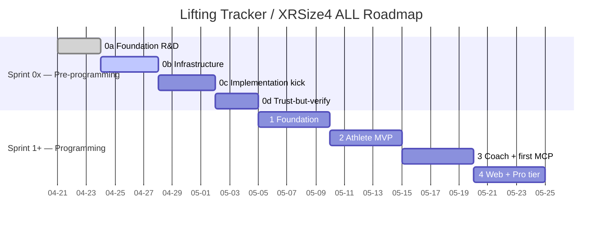

# Lifting Tracker — MVP Roadmap and Sprint Backlog

Working document for sprint planning and progress tracking. Covers the MVP (Phase 1) in detail with sprint-level granularity, and subsequent phases at the epic level.

Reading order: `lift-track-architecture_v0.4.0.md` → `lift-track-user-stories_v0.2.0.md` → `lift-track-themes-epics-features_v0.2.0.md` → this document.

## MVP Sprint Plan

MVP is organized into 8 sprints (2-week sprints). The ordering respects dependencies: infrastructure before features, data model before UI, auth before anything user-facing.

### Sprint 0 — Foundation (Week 1–2)

**Goal:** Infrastructure stands up. No user-facing features. Everything else builds on this.

| Status | Item | Epic | Stories | Size | Dependencies |
|---|---|---|---|---|---|
| Backlog | Supabase project creation + config | E1.1 | — | S | None |
| Backlog | Full schema deployment (all tables from lift-track-architecture_v0.4.0.md D1–D24) | E1.1 | — | L | Supabase project |
| Backlog | Row Level Security policies (athlete sees own data only) | E1.4 | US-311 | M | Schema |
| Backlog | Expo project scaffolding + Supabase SDK | E1.3 | — | M | Supabase project |
| Backlog | Magic-link auth flow | E1.1 | US-001 | M | Expo + Supabase |
| Backlog | Persistent session / secure token storage | E1.1 | US-002, US-003 | S | Auth flow |
| Backlog | Offline storage layer (AsyncStorage + sync queue skeleton) | E1.4 | US-320 | L | Expo project |

### Sprint 1 — Exercise Library + Logging Core (Week 3–4)

**Goal:** An athlete can log a basic workout. Exercise library is seeded and searchable.

| Status | Item | Epic | Stories | Size | Dependencies |
|---|---|---|---|---|---|
| Backlog | Seed canonical exercise library from workout log | E2.2 | US-020 | L | Schema |
| Backlog | Exercise search and filtering | E2.2 | US-022 | M | Seeded library |
| Backlog | Exercise aliases | E2.2 | US-023 | S | Seeded library |
| Backlog | Limb-config-distinct exercise entries | E2.2 | US-024 | M | Seeded library |
| Backlog | Exercise families | E2.2 | US-025 | M | Seeded library |
| Backlog | Per-implement weight interpretation | E2.2 | US-026 | S | Limb config |
| Backlog | Custom user-scoped exercises | E2.2 | US-021 | M | Library UI |
| Backlog | Session entry (date, location, exercises) | E2.1 | US-010 | M | Auth + Library |
| Backlog | Per-set entry (weight, reps, RPE, group, notes) | E2.1 | US-011 | L | Session entry |

### Sprint 2 — Logging Depth + Offline (Week 5–6)

**Goal:** Full logging fidelity — rest defaulting, set grouping, limb-aware volume, offline.

| Status | Item | Epic | Stories | Size | Dependencies |
|---|---|---|---|---|---|
| Backlog | Rest time with three-level defaulting | E2.1 | US-017 | M | Set entry |
| Backlog | Set grouping (supersets, drop sets) | E2.1 | US-018 | M | Set entry |
| Backlog | Limb-config-aware volume math | E2.1 | US-019 | M | Per-implement weight |
| Backlog | Body weight entry | E2.1 | US-016 | S | Auth |
| Backlog | Edit / delete previous workouts | E2.1 | US-015 | M | Session entry |
| Backlog | Offline logging with local persistence | E2.1 | US-013 | L | AsyncStorage layer |
| Backlog | Auto-sync on reconnect | E2.1 | US-014 | L | Offline logging |
| Backlog | Sync conflict resolution (last-write-wins) | E1.4 | US-321 | M | Sync queue |

### Sprint 3 — Data Import (Week 7–8)

**Goal:** Eric's 400+ historical sessions are in the database with full semantic fidelity.

| Status | Item | Epic | Stories | Size | Dependencies |
|---|---|---|---|---|---|
| Backlog | Import parser for combined_workout_log.txt | E2.4 | US-040 | XL | Full schema + library |
| Backlog | Notation-aware import (WxR, WxRxN, parens, rest codes, BF) | E2.4 | US-041 | XL | Parser |
| Backlog | Import fidelity verification | E2.4 | US-312 | M | Import complete |
| Backlog | Ad-hoc session logging (no program/routine required) | E4.1 | US-060 | S | Session entry |
| Backlog | Optional Exercise Type on session | E4.1 | US-061 | S | Session entry |

### Sprint 4 — Analytics and Progress (Week 9–10)

**Goal:** The athlete sees their training data visualized. Analytics is first-class, not afterthought.

| Status | Item | Epic | Stories | Size | Dependencies |
|---|---|---|---|---|---|
| Backlog | Overview dashboard (sessions, volume, streaks) | E2.3 | US-030 | L | Import complete |
| Backlog | History by date | E2.3 | US-031 | M | Sessions in DB |
| Backlog | History by exercise | E2.3 | US-032 | M | Sessions in DB |
| Backlog | Estimated 1RM trends | E2.3 | US-033 | M | Set data |
| Backlog | Volume trends (weekly, monthly, yearly) | E2.3 | US-034 | M | Set data |
| Backlog | Body weight plotted alongside training | E2.3 | US-035 | M | Body weight entries |
| Backlog | Goal progress tracking (legacy, pre-D21) | E5.1 | US-036 | S | Analytics |

### Sprint 5 — Goals + Progress Photos (Week 11–12)

**Goal:** Goals are first-class entities. Progress photos work privately.

| Status | Item | Epic | Stories | Size | Dependencies |
|---|---|---|---|---|---|
| Backlog | Strength goal tied to exercise | E5.1 | US-037 | M | Analytics + Library |
| Backlog | Body weight goal | E5.1 | US-038 | S | Body weight entries |
| Backlog | Auto-computed goal progress | E5.1 | US-039 | M | Goals + set data |
| Backlog | Progress photo upload with date | E5.4 | US-090 | M | Auth + Supabase Storage |
| Backlog | Photo gallery ordered by date | E5.4 | US-091 | M | Photo upload |
| Backlog | Side-by-side photo comparison | E5.4 | US-092 | M | Gallery |
| Backlog | Photo-to-body-weight linkage | E5.4 | US-093 | S | Photo + body weight |
| Backlog | Sensitive data encryption for photos | E1.5 | US-314 | M | Photo storage |

### Sprint 6 — AI + NL Entry (Week 13–14)

**Goal:** Natural-language workout entry, session summaries, anomaly detection.

| Status | Item | Epic | Stories | Size | Dependencies |
|---|---|---|---|---|---|
| Backlog | NL workout entry parsing (draft for review) | E7.1 | US-070 | XL | Exercise library + set entry |
| Backlog | Plain-language session summaries | E7.1 | US-071 | L | Sessions in DB |
| Backlog | Anomaly flagging on entries | E7.1 | US-072 | M | Set history |
| Backlog | Free-text paste from iPhone Notes | E2.1 | US-012 | L | NL parser |
| Backlog | AI transparency and opt-out controls | E1.5 | US-313 | S | AI features |

### Sprint 7 — Instructional Content + Polish (Week 15–16)

**Goal:** Exercise library has form descriptions and video links. Cross-platform access verified.

| Status | Item | Epic | Stories | Size | Dependencies |
|---|---|---|---|---|---|
| Backlog | Written form descriptions per exercise | E6.1 | US-027 | L | Exercise library |
| Backlog | External video link per exercise | E6.1 | US-028 | S | Exercise library |
| Backlog | App load performance (<3s target) | E1.4 | US-300 | M | Full app |
| Backlog | Sync performance (<10s target) | E1.4 | US-301 | M | Sync queue |
| Backlog | Data encryption in transit and at rest | E1.4 | US-310 | M | Supabase config |
| Backlog | Role-based privacy enforcement verification | E1.4 | US-311 | M | RLS policies |
| Backlog | Offline durability verification | E1.4 | US-320 | M | Offline system |

### Sprint 8 — TestFlight + Web Launch (Week 17–18)

**Goal:** MVP is in users' hands. iPhone app on TestFlight, web dashboard live.

| Status | Item | Epic | Stories | Size | Dependencies |
|---|---|---|---|---|---|
| Backlog | Expo EAS Build for iOS | E1.3 | US-050 | L | Full app |
| Backlog | TestFlight distribution to alpha users | E1.3 | US-050 | M | EAS Build |
| Backlog | Web dashboard via Expo Web on Vercel | E1.3 | US-051 | M | Full app |
| Backlog | Invite alpha users via magic-link | E1.1 | US-001 | S | Auth + TestFlight |
| Backlog | End-to-end smoke test (log, sync, view, goal, photo) | — | — | L | Everything |
| Backlog | Bug fixes and UX refinement from testing | — | — | L | Smoke test |

## MVP Summary

| Metric | Value |
|---|---|
| Sprints | 8 (16 weeks) |
| User stories covered | ~55 MVP stories |
| Themes touched | T1, T2, T4 (partial), T5 (partial), T6 (partial), T7 (partial) |
| Epics completed | E1.1, E1.3, E1.4, E2.1, E2.2, E2.3, E2.4, E4.1, E5.1, E5.4, E6.1, E7.1 (12 of 31) |
| Key deliverable | Real iPhone app on TestFlight + web dashboard, offline-first, with 400+ sessions imported |

## Post-MVP Phases (Epic-Level Backlog)

### Phase 2 — Coaching Activation

| Kanban | Epic | Theme | Key capability |
|---|---|---|---|
| Backlog | E3.1 Client Management | T3 | Coach roster, client history view |
| Backlog | E3.2 Workout Assignment | T3 | Templates, assignment, actual-vs-prescribed |
| Backlog | E3.3 Coach as Athlete | T3 | Dual-role on one account |
| Backlog | E4.2 Programs, Routines, Classes | T4 | Full training hierarchy |
| Backlog | E5.2 Goals Expansion | T5 | Multi-category, coach-assigned, milestones |
| Backlog | E5.5 Progress Photos Enhanced | T5 | Guided capture, coach sharing |
| Backlog | E6.2 Coach Instructional Content | T6 | Hosted coach videos |
| Backlog | E6.4 Form Analysis — Capture | T6 | Set video, async coach review |
| Backlog | E7.2 AI-Assisted Coaching | T7 | Client summaries, program generation |
| Backlog | F1.2.2 Coach role activation | T1 | Unlock coach UI |
| Backlog | F1.5.5 Selective video retention | T1 | Privacy controls for video |

### Phase 3 — Advanced AI and Analysis (v3)

| Kanban | Epic | Theme | Key capability |
|---|---|---|---|
| Backlog | E5.3 AI-Assisted Goals | T5 | Vague-to-specific, tension detection |
| Backlog | E5.6 AI Photo Analysis | T5 | Neutral observational summaries |
| Backlog | E6.3 AI Instructional Content | T6 | AI-generated demos, personalization |
| Backlog | E6.5 Form Measurements + Feedback | T6 | Pose estimation, NL feedback |

### Phase 4 — Real-Time (v4)

| Kanban | Epic | Theme | Key capability |
|---|---|---|---|
| Backlog | E6.6 Real-Time Form Feedback | T6 | On-device processing during sets |

### Future — Admin, Gym, Teams, Wearables, Portability

| Kanban | Epic | Theme | Key capability |
|---|---|---|---|
| Backlog | F1.2.3 Gym role | T1 | Gym-level management |
| Backlog | F1.2.4 Super Admin role | T1 | Full system administration |
| Backlog | F1.2.5 Teams | T1 | Cross-coach client visibility |
| Backlog | E1.5 Data Portability (CSV, pg_dump) | T1 | Export and migration |
| Backlog | E8.1 Apple Watch | T8 | Rest timer, quick logging, next exercise |
| Backlog | E8.2 Smart Glasses / Voice | T8 | Hands-free logging |
| Backlog | E8.3 Android / Wear OS | T8 | Cross-platform parity |

## Sprint mapping for 0d → 0e+ (candidate map, v0.4.1 grooming)

**Purpose.** Pre-categorize the 85 MVP + post-MVP backlog items above against the current pre-programming sprint kanbans (0d, 0d1, 0d1.5, 0d2, 0e) so the next sprint-open commit has a candidate map instead of needing fresh categorization mid-sprint. **Eric reviews and decides which items actually land in which sprints; this map does NOT promote items into the kanbans themselves.**

**Calibration note.** Sprints 0d / 0d1 / 0d1.5 / 0d2 / 0e are pre-programming sprints (CM, security baseline, framework rename + reference architecture, hosting stand-up, listener + scheduler + LLM-extraction validation). MVP feature programming begins at "Sprint 1 — Foundation programming" per the Timeline section above. Therefore the **vast majority of backlog items map to post-0e** — not because they're far out in time, but because they require Sprint 1 programming foundation (Expo scaffold, Supabase schema deployment, auth, sync adapter) to begin. The handful of items that have a natural home in 0d / 0d1 / 0d1.5 / 0d2 / 0e are governance / security / hosting / AI-prereq items where the current sprints land the prerequisites, not the build itself.

### Sprint mapping table (all 85 items)

| Source (MVP Sprint / Phase) | Item | Candidate sprint | Rationale |
|---|---|---|---|
| MVP Sprint 0 | Supabase project creation + config | **0d1.5** | Hetzner stand-up sprint (does not yet exist) — Phase 1 hosting per SD-014; Supabase project provisioning rides the hosting decision. Per 0d1 OQ6, currently defaulted to 0e; Eric's call. |
| MVP Sprint 0 | Full schema deployment (D1–D24) | **post-0e** | Requires Supabase project (0d1.5 prereq) + Sprint 1 programming foundation. Schema design cross-references the reference architecture landing in **0d2 CC-2** (P2 Ontology+Data pattern instantiation). |
| MVP Sprint 0 | Row Level Security policies (US-311) | **0d1 (design) + post-0e (build)** | RLS policy DESIGN folds into 0d1 CC-2 D5 RBAC Security Implications block (AC-3 / AC-6 / IA-2(1) / A.5.15 / V4); BUILD is post-0e Sprint 1 once Supabase is provisioned. |
| MVP Sprint 0 | Expo project scaffolding + Supabase SDK | **post-0e** | Sprint 1 programming foundation. No pre-programming sprint touches Expo. |
| MVP Sprint 0 | Magic-link auth flow (US-001) | **post-0e** | Build is Sprint 1; 0d1 CC-2 D6 magic-link auth Security Implications block lands the controls citation (IA-2 / IA-5 / A.5.16 / V2 / V3.6). |
| MVP Sprint 0 | Persistent session / secure token storage (US-002, US-003) | **post-0e** | Sprint 1 build; iOS Keychain / FileVault inheritance noted in 0d1 CC-2 D23 sync/offline block (SC-8 / SC-28). |
| MVP Sprint 0 | Offline storage layer (US-320) | **post-0e** | Sprint 1 build; offline durability VERIFICATION (US-320 in MVP Sprint 7) folds into 0d rollback-readiness scope as a verification gate, see below. |
| MVP Sprint 1 | Seed canonical exercise library (US-020) | **post-0e** | Requires schema + library UI; Sprint 1+ programming. |
| MVP Sprint 1 | Exercise search and filtering (US-022) | **post-0e** | Sprint 1+ programming. |
| MVP Sprint 1 | Exercise aliases (US-023) | **post-0e** | Sprint 1+ programming. |
| MVP Sprint 1 | Limb-config-distinct exercise entries (US-024) | **post-0e** | Sprint 1+ programming. |
| MVP Sprint 1 | Exercise families (US-025) | **post-0e** | Sprint 1+ programming. |
| MVP Sprint 1 | Per-implement weight interpretation (US-026) | **post-0e** | Sprint 1+ programming (D14 already settled in architecture). |
| MVP Sprint 1 | Custom user-scoped exercises (US-021) | **post-0e** | Sprint 1+ programming. |
| MVP Sprint 1 | Session entry (US-010) | **post-0e** | Sprint 1+ programming. |
| MVP Sprint 1 | Per-set entry (US-011) | **post-0e** | Sprint 1+ programming. |
| MVP Sprint 2 | Rest time three-level defaulting (US-017) | **post-0e** | Sprint 1+ programming (D16 already settled). |
| MVP Sprint 2 | Set grouping — supersets / drop sets (US-018) | **post-0e** | Sprint 1+ programming (D17 already settled). |
| MVP Sprint 2 | Limb-config-aware volume math (US-019) | **post-0e** | Sprint 1+ programming. |
| MVP Sprint 2 | Body weight entry (US-016) | **post-0e** | Sprint 1+ programming. |
| MVP Sprint 2 | Edit / delete previous workouts (US-015) | **post-0e** | Sprint 1+ programming. |
| MVP Sprint 2 | Offline logging with local persistence (US-013) | **post-0e** | Sprint 1+ programming (Sprint 2 in MVP plan). |
| MVP Sprint 2 | Auto-sync on reconnect (US-014) | **post-0e** | Sprint 1+ programming. |
| MVP Sprint 2 | Sync conflict resolution (US-321) | **post-0e** | Sprint 1+ programming. |
| MVP Sprint 3 | Import parser for combined_workout_log.txt (US-040) | **post-0e** | Requires schema + library; Sprint 3+ programming. |
| MVP Sprint 3 | Notation-aware import (US-041) | **post-0e** | Sprint 3+ programming. |
| MVP Sprint 3 | Import fidelity verification (US-312) | **post-0e** | Sprint 3+ programming. |
| MVP Sprint 3 | Ad-hoc session logging (US-060) | **post-0e** | Sprint 1+ programming. |
| MVP Sprint 3 | Optional Exercise Type on session (US-061) | **post-0e** | Sprint 1+ programming. |
| MVP Sprint 4 | Overview dashboard (US-030) | **post-0e** | Sprint 4+ programming. |
| MVP Sprint 4 | History by date (US-031) | **post-0e** | Sprint 4+ programming. |
| MVP Sprint 4 | History by exercise (US-032) | **post-0e** | Sprint 4+ programming. |
| MVP Sprint 4 | Estimated 1RM trends (US-033) | **post-0e** | Sprint 4+ programming. |
| MVP Sprint 4 | Volume trends (US-034) | **post-0e** | Sprint 4+ programming. |
| MVP Sprint 4 | Body weight plotted alongside training (US-035) | **post-0e** | Sprint 4+ programming. |
| MVP Sprint 4 | Goal progress tracking — legacy (US-036) | **post-0e** | Sprint 4+ programming. |
| MVP Sprint 5 | Strength goal tied to exercise (US-037) | **post-0e** | Sprint 5+ programming (D21 still pending). |
| MVP Sprint 5 | Body weight goal (US-038) | **post-0e** | Sprint 5+ programming. |
| MVP Sprint 5 | Auto-computed goal progress (US-039) | **post-0e** | Sprint 5+ programming. |
| MVP Sprint 5 | Progress photo upload with date (US-090) | **post-0e** | Sprint 5+ programming (D22 in 0d1 CC-2 scope). |
| MVP Sprint 5 | Photo gallery ordered by date (US-091) | **post-0e** | Sprint 5+ programming. |
| MVP Sprint 5 | Side-by-side photo comparison (US-092) | **post-0e** | Sprint 5+ programming. |
| MVP Sprint 5 | Photo-to-body-weight linkage (US-093) | **post-0e** | Sprint 5+ programming. |
| MVP Sprint 5 | Sensitive data encryption for photos (US-314) | **0d1 (controls) + post-0e (build)** | Encryption controls baseline-resolved in 0d1 CC-2 D22 sensitivity defaults block (PT-7 + A.5.34) + CC-013/14/15/16/17 inheritance; BUILD is Sprint 5+ programming. |
| MVP Sprint 6 | NL workout entry parsing (US-070) | **0e (prereq) + post-0e (build)** | LLM hosting decision finalized in 0e Workstream C (CC-7); BUILD is Sprint 6 programming after Sprint 1+ foundation. |
| MVP Sprint 6 | Plain-language session summaries (US-071) | **0e (prereq) + post-0e (build)** | Same — LLM hosting prereq. |
| MVP Sprint 6 | Anomaly flagging on entries (US-072) | **0e (prereq) + post-0e (build)** | Same — LLM hosting prereq + analytics base. |
| MVP Sprint 6 | Free-text paste from iPhone Notes (US-012) | **0e (prereq) + post-0e (build)** | Same — depends on NL parser, which depends on 0e LLM hosting. |
| MVP Sprint 6 | AI transparency and opt-out controls (US-313) | **0d1 (controls) + 0e (prereq) + post-0e (build)** | LLM Top 10 (LLM06) controls baseline-resolved in 0d1 CC-2 D11 + D19 blocks; 0e LLM hosting decision feeds opt-out scope; BUILD is Sprint 6+ programming. |
| MVP Sprint 7 | Written form descriptions per exercise (US-027) | **post-0e** | Sprint 7+ programming. |
| MVP Sprint 7 | External video link per exercise (US-028) | **post-0e** | Sprint 7+ programming. |
| MVP Sprint 7 | App load performance — <3s target (US-300) | **post-0e** | Sprint 7+ programming (verification gate). |
| MVP Sprint 7 | Sync performance — <10s target (US-301) | **post-0e** | Sprint 7+ programming (verification gate). |
| MVP Sprint 7 | Data encryption in transit and at rest (US-310) | **0d1 (controls) + post-0e (verify)** | Encryption controls baseline-resolved in 0d1 CC-2 D23 sync/offline block (SC-8 / SC-28) + Supabase config; VERIFY at pre-launch QA. |
| MVP Sprint 7 | Role-based privacy enforcement verification (US-311) | **0d1 (controls) + post-0e (verify)** | RLS policy controls in 0d1 CC-2 D5 + production-readiness gate matrix tracker (0d1 CC-4); VERIFY at pre-launch QA. |
| MVP Sprint 7 | Offline durability verification (US-320) | **0d (rollback adjacency) + post-0e (verify)** | Verification touches the same recovery posture 0d operationalizes (PITR + off-account backup + rollback playbooks); VERIFY at pre-launch QA. |
| MVP Sprint 8 | Expo EAS Build for iOS (US-050) | **post-0e** | Sprint 8 programming. |
| MVP Sprint 8 | TestFlight distribution to alpha users (US-050) | **post-0e** | Sprint 8 programming. |
| MVP Sprint 8 | Web dashboard via Expo Web on Vercel (US-051) | **post-0e** | Sprint 8 programming. |
| MVP Sprint 8 | Invite alpha users via magic-link (US-001) | **post-0e** | Sprint 8 programming. |
| MVP Sprint 8 | End-to-end smoke test | **post-0e** | Sprint 8 programming. |
| MVP Sprint 8 | Bug fixes and UX refinement | **post-0e** | Sprint 8 programming. |
| Phase 2 | E3.1 Client Management | **post-0e** | Coach UI; deferred per "Don't build coach/admin UI in MVP." |
| Phase 2 | E3.2 Workout Assignment | **post-0e** | Coach UI; Phase 2. |
| Phase 2 | E3.3 Coach as Athlete | **post-0e** | Coach UI; Phase 2. |
| Phase 2 | E4.2 Programs, Routines, Classes | **post-0e** | Phase 2 hierarchy work. |
| Phase 2 | E5.2 Goals Expansion | **post-0e** | Phase 2 (D21 dependency). |
| Phase 2 | E5.5 Progress Photos Enhanced | **post-0e** | Phase 2. |
| Phase 2 | E6.2 Coach Instructional Content | **post-0e** | Phase 2. |
| Phase 2 | E6.4 Form Analysis — Capture | **post-0e** | Phase 2. |
| Phase 2 | E7.2 AI-Assisted Coaching | **post-0e** | Phase 2; downstream of 0e LLM hosting. |
| Phase 2 | F1.2.2 Coach role activation | **post-0e** | Phase 2 (D5 RBAC controls in 0d1 CC-2). |
| Phase 2 | F1.5.5 Selective video retention | **post-0e** | Phase 2 (privacy controls baseline-resolved in 0d1). |
| Phase 3 | E5.3 AI-Assisted Goals | **post-0e** | Phase 3 (LLM hosting prereq carried from 0e). |
| Phase 3 | E5.6 AI Photo Analysis | **post-0e** | Phase 3 (LLM hosting + photo gallery prereq). |
| Phase 3 | E6.3 AI Instructional Content | **post-0e** | Phase 3 (LLM hosting prereq). |
| Phase 3 | E6.5 Form Measurements + Feedback | **post-0e** | Phase 3 (pose estimation, NL feedback). |
| Phase 4 | E6.6 Real-Time Form Feedback | **post-0e** | Phase 4 (on-device processing). |
| Future | F1.2.3 Gym role | **post-0e** | Future (RBAC controls in 0d1 CC-2 D5). |
| Future | F1.2.4 Super Admin role | **post-0e** | Future. |
| Future | F1.2.5 Teams | **post-0e** | Future. |
| Future | E1.5 Data Portability (CSV, pg_dump) | **post-0e** | Future (CC-013/14/15/16/17 inheritance touches portability — see 0d1 §10.4 promotion triggers). |
| Future | E8.1 Apple Watch | **post-0e** | Future wearable (Phase 4+). |
| Future | E8.2 Smart Glasses / Voice | **post-0e** | Future wearable. |
| Future | E8.3 Android / Wear OS | **post-0e** | Future cross-platform. |

### Categorization summary

| Candidate sprint | Items mapped | Notes |
|---|---|---|
| 0d (rollback readiness) | 1 (US-320 verification adjacency) | Build is post-0e; only the verification gate touches 0d's posture. |
| 0d1 (security controls baseline) | 5 (US-310, US-311, US-313, US-314 + RLS US-311 design) | Controls baseline-resolved in 0d1; build is post-0e. These are the highest-leverage near-term overlaps. |
| 0d1.5 (Hetzner stand-up — sprint does not yet exist) | 1 (Supabase project creation + config) | Per 0d1 OQ6 default, hosting stand-up is currently scoped at 0e; if 0d1.5 is created as a dedicated hosting sprint, this item moves there. |
| 0d2 (framework rename + reference architecture + xrsize4all) | 1 (Schema deployment cross-references reference architecture P2 Ontology+Data) | Design cross-reference only; build is post-0e. |
| 0e (listener + scheduler + LLM-extraction) | 5 (US-070, US-071, US-072, US-012, US-313) | LLM hosting decision is the prereq landed by 0e Workstream C / CC-7; BUILD of these features is post-0e. |
| post-0e (Sprint 1+ programming) | ~78 (essentially all MVP feature items + post-MVP epic-level items) | The bulk of the roadmap. Sprint 1 programming foundation gates everything below it. |

### Items without a clear sprint home (gaps for Eric to address)

Per the calibration note above, "no clear sprint home" is the **expected default** for MVP feature items — they wait for Sprint 1 programming. The actual gaps surfaced by this grooming are:

1. **0d1.5 (Hetzner stand-up) does not yet exist as a kanban.** Per 0d1 OQ6 + 0d2 Q9.7, Phase 1 hosting stand-up (SD-014) currently defaults to 0e. If Eric's intent is a dedicated hosting sprint between 0d2 and 0e, the 0d1.5 kanban needs to be drafted from the SD-014 substrate before any Supabase project provisioning can land. **Decision needed:** stand up 0d1.5 as a discrete sprint, OR fold hosting into 0e CC-9 (would expand 0e scope), OR keep the 0e default and live with hosting + listener + scheduler + LLM all in one sprint.

2. **D21 (Goals) and D22 (Progress Photos) architectural decisions are still pending** per the architecture doc cross-references. MVP Sprint 5 backlog items (US-037, US-038, US-039, US-090–US-093) cannot start build until D21 and D22 land. **Decision needed:** schedule D21 / D22 architecture work — likely as a 0d2 stretch or a separate micro-sprint between 0d2 and 0e.

3. **Verification gates (US-310, US-311, US-320, US-300, US-301)** are listed in MVP Sprint 7 as build-time work but are actually **acceptance gates** that fire at pre-launch QA, not buildable items. The 0d1 production-readiness gate matrix tracker (CC-4) is the natural home for the controls side; the performance gates (US-300, US-301) have no corresponding pre-programming sprint home and are pure post-0e Sprint 7 verification. **No action needed; just flagging the structural mismatch.**

4. **MVP Sprint 6 AI items (US-070, US-071, US-072, US-012)** are blocked on 0e Workstream C / CC-7 LLM hosting decision. If 0e LLM-extraction validation slips beyond the 60-day Lambda Labs window, MVP Sprint 6 build slips correspondingly. **Decision needed at 0e close:** confirm LLM hosting decision is solid enough to feed Sprint 6 build, OR document the slip risk in MVP Sprint 6 entry conditions.

5. **Phase 2 coach UI (E3.1, E3.2, E3.3, F1.2.2) is fully gated by D5 RBAC controls** which baseline in 0d1 CC-2 — but the schema is already designed and the UI gate is purely a "don't expose in MVP" decision. **No structural gap; intentional MVP scoping.**

### Top 3-5 most-load-bearing items for next-sprint inclusion consideration

1. **Supabase project creation + config (MVP Sprint 0)** — gates EVERYTHING downstream (schema deployment, RLS policies, auth, sync, every feature). Per 0d1 OQ6 default, this is currently scoped at 0e; Eric's call on whether to pull into 0d1.5 (if created) or accept the 0e bundle. **Highest-leverage decision in this grooming.**
2. **Full schema deployment (MVP Sprint 0)** — second-order downstream of Supabase project; once provisioned, schema deployment is a 1-day action that unblocks Sprint 1 programming. Aligns with 0d2 CC-2 reference architecture P2 Ontology+Data pattern landing.
3. **Magic-link auth flow (US-001) + persistent session (US-002, US-003)** — auth is the critical path for ANY user-facing feature; D6 magic-link auth controls baseline-resolved in 0d1 CC-2; Sprint 1 programming should treat these as day-1 items.
4. **Offline storage layer (US-320)** — the offline-first commitment is load-bearing for the gym-connectivity scenario (per CLAUDE.md "Don't skip offline support"); architecture is designed but no code exists. Sprint 1 programming should sequence this early.
5. **NL workout entry parsing (US-070) + free-text paste (US-012)** — Eric's actual logging workflow is iPhone Notes paste (per memory `user_logging_workflow.md`), so US-012 is the load-bearing UX entry point for Eric's own use of the app. Gated on 0e LLM hosting; if LLM hosting decision lands cleanly in 0e, MVP Sprint 6 should treat US-012 + US-070 as the headline pair.

## Sprint Tracking Template

Use this for each sprint during execution. Copy and fill in:

```
### Sprint [N] — [Name] (Week [X]–[Y])

**Goal:** [One sentence]

**Committed:**
- [ ] [Item] — [Story IDs] — [Owner] — [Status: To Do / In Progress / Done]

**Velocity:** [Points or story count completed]
**Blockers:** [Any]
**Carry-over:** [Stories not completed, moved to next sprint]
**Retrospective notes:** [What worked, what didn't]
```

## Change log

- 2026-04-19: Initial version (v0.4.0). 8 MVP sprints covering ~55 stories across 12 epics. Post-MVP phases at epic level. Sprint tracking template included.
- 2026-04-30: PATCH grooming (v0.4.1). Backlog grooming pass — added "Sprint mapping for 0d → 0e+" candidate-map section categorizing all 85 backlog items against current pre-programming sprint kanbans (0d, 0d1, 0d1.5, 0d2, 0e). No new content; pure categorization aid for future sprint-open commits. Surfaces 5 gaps for Eric to address (Hetzner stand-up sprint absence, D21/D22 architecture pending, verification-gate structural mismatch, 0e LLM-hosting slip risk on MVP Sprint 6, intentional Phase 2 coach-UI gating). Top 5 load-bearing items flagged for next-sprint inclusion consideration.

## Timeline

> **Sprint numbering note.** Per `docs/kanban-sprint-<id>.md` convention, "Sprint 0x" (0a, 0b, 0c, …) covers pre-programming phases (research, infrastructure standup, tooling). Programming sprints start at "Sprint 1". The MVP Sprint Plan above was authored before this convention was adopted — its "Sprint 0 — Foundation" maps to **Sprint 1 — Foundation programming** in the timeline below, and downstream sprint numbers shift by +1 accordingly. The MVP Sprint Plan tables remain authoritative for scope; the timeline below is authoritative for naming and dates.

| Sprint | Scope | Window | Status |
|---|---|---|---|
| 0a | Foundation Research & CM Design | 2026-04-21 → 2026-04-23 (3 days) | CLOSED |
| 0b | Infrastructure standup (Reach4All + document-cm + DoDAF views) | 2026-04-24 → ongoing (target 3-4 days) | ACTIVE |
| 0c | Implementation kickoff (Supabase on Railway + Lifting Tracker scaffold + HyperDX + MCP servers) | TBD, expected within 2-4 days after 0b closes (target 3-5 days) | PLANNED |
| 0d (potential) | Concept-agent trust-but-verify instrumentation + business-model phase 1 prep | TBD (target 2-3 days; may merge into 0c or 1) | OPTIONAL |
| 1 | Foundation programming — Expo scaffold, Supabase schema, auth, sync adapter | TBD, after 0c (target 4-6 days) | PLANNED |
| 2 | Athlete MVP — workout logging, progress views, NL workout parsing per D19 | TBD, after 1 (target 4-6 days) | PLANNED |
| 3 | Coach view + first MCP server (`lifting-tracker-domain-mcp`) | TBD, after 2 (target 4-6 days) | PLANNED |
| 4 | Web dashboard + business model Phase 2 (Pro tier paywall) | TBD, after 3 (target 4-6 days) | PLANNED |
| 5+ | Goals (D21), progress photos (D22), wearable integration prep, additional sub-systems | TBD | BACKLOG |

Sprint cadence is **days, not weeks** — solo + AI velocity. Estimates above are conservative ranges; actual closes are tracked in `docs/kanban-sprint-<id>.md` and retrospected in `docs/retrospectives/`.

### Visual timeline



Durations are conservative initial estimates. Update as actuals come in; the gantt is regenerated, not a contract.

### Cross-references

- `docs/kanban-sprint-<id>.md` — live work tracker for the active sprint (single source of truth for in-flight items)
- `docs/retrospectives/` — sprint-close retros (one per sprint, indexed at folder root)
- `docs/lift-track-risks_v0.1.0.md` — risks and mitigations affecting sprint timing
- `docs/lift-track-architecture_v0.4.0.md` D27 — multi-agent interop (Phase 5+ concern; informs MCP server design from Sprint 3 onward)
- `reach4all://docs/research/lifting-tracker-business-model-research.md` — business-model phase markers (Phase 1 in 0c/0d, Phase 2 paywall in Sprint 4)

### Timing assumptions worth flagging

- Sprint 0c duration assumes Supabase-on-Railway + HyperDX + MCP scaffold are net-new but well-scoped; if MCP transport choice or Railway/Supabase config opens design debate, expect overrun.
- Sprint 1 bundles Expo scaffold + Supabase schema deployment + offline sync adapter + RLS policy verification. The sync adapter and RLS verification are the historical risk hot-spots (per E1.4); 4-6 days assumes no rework.
- Sprint 3 inserts first-MCP-server work that wasn't in the original 8-sprint MVP plan. Original Sprint 2 (logging depth + offline) is folded into the new Sprint 1+2 envelope.
- Sprints after 4 are intentionally unscoped — Goals (D21), photos (D22), wearables (E8.x) priority will be re-decided once Pro-tier signal exists.
- "TBD" windows compound — slippage in 0b cascades through 0c and downstream. The gantt's `after` chain is intentional: rebaseline the whole tail when any upstream sprint closes.

---

© 2026 Eric Riutort. All rights reserved.
