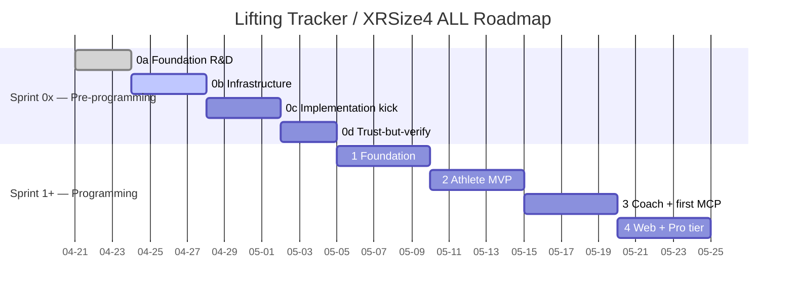

# Lifting Tracker — MVP Roadmap and Sprint Backlog

Working document for sprint planning and progress tracking. Covers the MVP (Phase 1) in detail with sprint-level granularity, and subsequent phases at the epic level.

Reading order: `lift-track-architecture_v0.4.0.md` → `lift-track-user-stories_v0.2.0.md` → `lift-track-themes-epics-features_v0.2.0.md` → this document.

## MVP Sprint Plan

MVP is organized into 8 sprints (2-week sprints). The ordering respects dependencies: infrastructure before features, data model before UI, auth before anything user-facing.

### Sprint 0 — Foundation (Week 1–2)

**Goal:** Infrastructure stands up. No user-facing features. Everything else builds on this.

| Status | Item | Epic | Stories | Size | Dependencies |
|---|---|---|---|---|---|
| Backlog | Supabase project creation + config | E1.1 | — | S | None |
| Backlog | Full schema deployment (all tables from lift-track-architecture_v0.4.0.md D1–D24) | E1.1 | — | L | Supabase project |
| Backlog | Row Level Security policies (athlete sees own data only) | E1.4 | US-311 | M | Schema |
| Backlog | Expo project scaffolding + Supabase SDK | E1.3 | — | M | Supabase project |
| Backlog | Magic-link auth flow | E1.1 | US-001 | M | Expo + Supabase |
| Backlog | Persistent session / secure token storage | E1.1 | US-002, US-003 | S | Auth flow |
| Backlog | Offline storage layer (AsyncStorage + sync queue skeleton) | E1.4 | US-320 | L | Expo project |

### Sprint 1 — Exercise Library + Logging Core (Week 3–4)

**Goal:** An athlete can log a basic workout. Exercise library is seeded and searchable.

| Status | Item | Epic | Stories | Size | Dependencies |
|---|---|---|---|---|---|
| Backlog | Seed canonical exercise library from workout log | E2.2 | US-020 | L | Schema |
| Backlog | Exercise search and filtering | E2.2 | US-022 | M | Seeded library |
| Backlog | Exercise aliases | E2.2 | US-023 | S | Seeded library |
| Backlog | Limb-config-distinct exercise entries | E2.2 | US-024 | M | Seeded library |
| Backlog | Exercise families | E2.2 | US-025 | M | Seeded library |
| Backlog | Per-implement weight interpretation | E2.2 | US-026 | S | Limb config |
| Backlog | Custom user-scoped exercises | E2.2 | US-021 | M | Library UI |
| Backlog | Session entry (date, location, exercises) | E2.1 | US-010 | M | Auth + Library |
| Backlog | Per-set entry (weight, reps, RPE, group, notes) | E2.1 | US-011 | L | Session entry |

### Sprint 2 — Logging Depth + Offline (Week 5–6)

**Goal:** Full logging fidelity — rest defaulting, set grouping, limb-aware volume, offline.

| Status | Item | Epic | Stories | Size | Dependencies |
|---|---|---|---|---|---|
| Backlog | Rest time with three-level defaulting | E2.1 | US-017 | M | Set entry |
| Backlog | Set grouping (supersets, drop sets) | E2.1 | US-018 | M | Set entry |
| Backlog | Limb-config-aware volume math | E2.1 | US-019 | M | Per-implement weight |
| Backlog | Body weight entry | E2.1 | US-016 | S | Auth |
| Backlog | Edit / delete previous workouts | E2.1 | US-015 | M | Session entry |
| Backlog | Offline logging with local persistence | E2.1 | US-013 | L | AsyncStorage layer |
| Backlog | Auto-sync on reconnect | E2.1 | US-014 | L | Offline logging |
| Backlog | Sync conflict resolution (last-write-wins) | E1.4 | US-321 | M | Sync queue |

### Sprint 3 — Data Import (Week 7–8)

**Goal:** Eric's 400+ historical sessions are in the database with full semantic fidelity.

| Status | Item | Epic | Stories | Size | Dependencies |
|---|---|---|---|---|---|
| Backlog | Import parser for combined_workout_log.txt | E2.4 | US-040 | XL | Full schema + library |
| Backlog | Notation-aware import (WxR, WxRxN, parens, rest codes, BF) | E2.4 | US-041 | XL | Parser |
| Backlog | Import fidelity verification | E2.4 | US-312 | M | Import complete |
| Backlog | Ad-hoc session logging (no program/routine required) | E4.1 | US-060 | S | Session entry |
| Backlog | Optional Exercise Type on session | E4.1 | US-061 | S | Session entry |

### Sprint 4 — Analytics and Progress (Week 9–10)

**Goal:** The athlete sees their training data visualized. Analytics is first-class, not afterthought.

| Status | Item | Epic | Stories | Size | Dependencies |
|---|---|---|---|---|---|
| Backlog | Overview dashboard (sessions, volume, streaks) | E2.3 | US-030 | L | Import complete |
| Backlog | History by date | E2.3 | US-031 | M | Sessions in DB |
| Backlog | History by exercise | E2.3 | US-032 | M | Sessions in DB |
| Backlog | Estimated 1RM trends | E2.3 | US-033 | M | Set data |
| Backlog | Volume trends (weekly, monthly, yearly) | E2.3 | US-034 | M | Set data |
| Backlog | Body weight plotted alongside training | E2.3 | US-035 | M | Body weight entries |
| Backlog | Goal progress tracking (legacy, pre-D21) | E5.1 | US-036 | S | Analytics |

### Sprint 5 — Goals + Progress Photos (Week 11–12)

**Goal:** Goals are first-class entities. Progress photos work privately.

| Status | Item | Epic | Stories | Size | Dependencies |
|---|---|---|---|---|---|
| Backlog | Strength goal tied to exercise | E5.1 | US-037 | M | Analytics + Library |
| Backlog | Body weight goal | E5.1 | US-038 | S | Body weight entries |
| Backlog | Auto-computed goal progress | E5.1 | US-039 | M | Goals + set data |
| Backlog | Progress photo upload with date | E5.4 | US-090 | M | Auth + Supabase Storage |
| Backlog | Photo gallery ordered by date | E5.4 | US-091 | M | Photo upload |
| Backlog | Side-by-side photo comparison | E5.4 | US-092 | M | Gallery |
| Backlog | Photo-to-body-weight linkage | E5.4 | US-093 | S | Photo + body weight |
| Backlog | Sensitive data encryption for photos | E1.5 | US-314 | M | Photo storage |

### Sprint 6 — AI + NL Entry (Week 13–14)

**Goal:** Natural-language workout entry, session summaries, anomaly detection.

| Status | Item | Epic | Stories | Size | Dependencies |
|---|---|---|---|---|---|
| Backlog | NL workout entry parsing (draft for review) | E7.1 | US-070 | XL | Exercise library + set entry |
| Backlog | Plain-language session summaries | E7.1 | US-071 | L | Sessions in DB |
| Backlog | Anomaly flagging on entries | E7.1 | US-072 | M | Set history |
| Backlog | Free-text paste from iPhone Notes | E2.1 | US-012 | L | NL parser |
| Backlog | AI transparency and opt-out controls | E1.5 | US-313 | S | AI features |

### Sprint 7 — Instructional Content + Polish (Week 15–16)

**Goal:** Exercise library has form descriptions and video links. Cross-platform access verified.

| Status | Item | Epic | Stories | Size | Dependencies |
|---|---|---|---|---|---|
| Backlog | Written form descriptions per exercise | E6.1 | US-027 | L | Exercise library |
| Backlog | External video link per exercise | E6.1 | US-028 | S | Exercise library |
| Backlog | App load performance (<3s target) | E1.4 | US-300 | M | Full app |
| Backlog | Sync performance (<10s target) | E1.4 | US-301 | M | Sync queue |
| Backlog | Data encryption in transit and at rest | E1.4 | US-310 | M | Supabase config |
| Backlog | Role-based privacy enforcement verification | E1.4 | US-311 | M | RLS policies |
| Backlog | Offline durability verification | E1.4 | US-320 | M | Offline system |

### Sprint 8 — TestFlight + Web Launch (Week 17–18)

**Goal:** MVP is in users' hands. iPhone app on TestFlight, web dashboard live.

| Status | Item | Epic | Stories | Size | Dependencies |
|---|---|---|---|---|---|
| Backlog | Expo EAS Build for iOS | E1.3 | US-050 | L | Full app |
| Backlog | TestFlight distribution to alpha users | E1.3 | US-050 | M | EAS Build |
| Backlog | Web dashboard via Expo Web on Vercel | E1.3 | US-051 | M | Full app |
| Backlog | Invite alpha users via magic-link | E1.1 | US-001 | S | Auth + TestFlight |
| Backlog | End-to-end smoke test (log, sync, view, goal, photo) | — | — | L | Everything |
| Backlog | Bug fixes and UX refinement from testing | — | — | L | Smoke test |

## MVP Summary

| Metric | Value |
|---|---|
| Sprints | 8 (16 weeks) |
| User stories covered | ~55 MVP stories |
| Themes touched | T1, T2, T4 (partial), T5 (partial), T6 (partial), T7 (partial) |
| Epics completed | E1.1, E1.3, E1.4, E2.1, E2.2, E2.3, E2.4, E4.1, E5.1, E5.4, E6.1, E7.1 (12 of 31) |
| Key deliverable | Real iPhone app on TestFlight + web dashboard, offline-first, with 400+ sessions imported |

## Post-MVP Phases (Epic-Level Backlog)

### Phase 2 — Coaching Activation

| Kanban | Epic | Theme | Key capability |
|---|---|---|---|
| Backlog | E3.1 Client Management | T3 | Coach roster, client history view |
| Backlog | E3.2 Workout Assignment | T3 | Templates, assignment, actual-vs-prescribed |
| Backlog | E3.3 Coach as Athlete | T3 | Dual-role on one account |
| Backlog | E4.2 Programs, Routines, Classes | T4 | Full training hierarchy |
| Backlog | E5.2 Goals Expansion | T5 | Multi-category, coach-assigned, milestones |
| Backlog | E5.5 Progress Photos Enhanced | T5 | Guided capture, coach sharing |
| Backlog | E6.2 Coach Instructional Content | T6 | Hosted coach videos |
| Backlog | E6.4 Form Analysis — Capture | T6 | Set video, async coach review |
| Backlog | E7.2 AI-Assisted Coaching | T7 | Client summaries, program generation |
| Backlog | F1.2.2 Coach role activation | T1 | Unlock coach UI |
| Backlog | F1.5.5 Selective video retention | T1 | Privacy controls for video |

### Phase 3 — Advanced AI and Analysis (v3)

| Kanban | Epic | Theme | Key capability |
|---|---|---|---|
| Backlog | E5.3 AI-Assisted Goals | T5 | Vague-to-specific, tension detection |
| Backlog | E5.6 AI Photo Analysis | T5 | Neutral observational summaries |
| Backlog | E6.3 AI Instructional Content | T6 | AI-generated demos, personalization |
| Backlog | E6.5 Form Measurements + Feedback | T6 | Pose estimation, NL feedback |

### Phase 4 — Real-Time (v4)

| Kanban | Epic | Theme | Key capability |
|---|---|---|---|
| Backlog | E6.6 Real-Time Form Feedback | T6 | On-device processing during sets |

### Future — Admin, Gym, Teams, Wearables, Portability

| Kanban | Epic | Theme | Key capability |
|---|---|---|---|
| Backlog | F1.2.3 Gym role | T1 | Gym-level management |
| Backlog | F1.2.4 Super Admin role | T1 | Full system administration |
| Backlog | F1.2.5 Teams | T1 | Cross-coach client visibility |
| Backlog | E1.5 Data Portability (CSV, pg_dump) | T1 | Export and migration |
| Backlog | E8.1 Apple Watch | T8 | Rest timer, quick logging, next exercise |
| Backlog | E8.2 Smart Glasses / Voice | T8 | Hands-free logging |
| Backlog | E8.3 Android / Wear OS | T8 | Cross-platform parity |

## Sprint Tracking Template

Use this for each sprint during execution. Copy and fill in:

```
### Sprint [N] — [Name] (Week [X]–[Y])

**Goal:** [One sentence]

**Committed:**
- [ ] [Item] — [Story IDs] — [Owner] — [Status: To Do / In Progress / Done]

**Velocity:** [Points or story count completed]
**Blockers:** [Any]
**Carry-over:** [Stories not completed, moved to next sprint]
**Retrospective notes:** [What worked, what didn't]
```

## Change log

- 2026-04-19: Initial version. 8 MVP sprints covering ~55 stories across 12 epics. Post-MVP phases at epic level. Sprint tracking template included.

## Timeline

> **Sprint numbering note.** Per `docs/kanban-sprint-<id>.md` convention, "Sprint 0x" (0a, 0b, 0c, …) covers pre-programming phases (research, infrastructure standup, tooling). Programming sprints start at "Sprint 1". The MVP Sprint Plan above was authored before this convention was adopted — its "Sprint 0 — Foundation" maps to **Sprint 1 — Foundation programming** in the timeline below, and downstream sprint numbers shift by +1 accordingly. The MVP Sprint Plan tables remain authoritative for scope; the timeline below is authoritative for naming and dates.

| Sprint | Scope | Window | Status |
|---|---|---|---|
| 0a | Foundation Research & CM Design | 2026-04-21 → 2026-04-23 (3 days) | CLOSED |
| 0b | Infrastructure standup (Reach4All + document-cm + DoDAF views) | 2026-04-24 → ongoing (target 3-4 days) | ACTIVE |
| 0c | Implementation kickoff (Supabase on Railway + Lifting Tracker scaffold + HyperDX + MCP servers) | TBD, expected within 2-4 days after 0b closes (target 3-5 days) | PLANNED |
| 0d (potential) | Concept-agent trust-but-verify instrumentation + business-model phase 1 prep | TBD (target 2-3 days; may merge into 0c or 1) | OPTIONAL |
| 1 | Foundation programming — Expo scaffold, Supabase schema, auth, sync adapter | TBD, after 0c (target 4-6 days) | PLANNED |
| 2 | Athlete MVP — workout logging, progress views, NL workout parsing per D19 | TBD, after 1 (target 4-6 days) | PLANNED |
| 3 | Coach view + first MCP server (`lifting-tracker-domain-mcp`) | TBD, after 2 (target 4-6 days) | PLANNED |
| 4 | Web dashboard + business model Phase 2 (Pro tier paywall) | TBD, after 3 (target 4-6 days) | PLANNED |
| 5+ | Goals (D21), progress photos (D22), wearable integration prep, additional sub-systems | TBD | BACKLOG |

Sprint cadence is **days, not weeks** — solo + AI velocity. Estimates above are conservative ranges; actual closes are tracked in `docs/kanban-sprint-<id>.md` and retrospected in `docs/retrospectives/`.

### Visual timeline



Durations are conservative initial estimates. Update as actuals come in; the gantt is regenerated, not a contract.

### Cross-references

- `docs/kanban-sprint-<id>.md` — live work tracker for the active sprint (single source of truth for in-flight items)
- `docs/retrospectives/` — sprint-close retros (one per sprint, indexed at folder root)
- `docs/lift-track-risks_v0.1.0.md` — risks and mitigations affecting sprint timing
- `docs/lift-track-architecture_v0.4.0.md` D27 — multi-agent interop (Phase 5+ concern; informs MCP server design from Sprint 3 onward)
- `reach4all://docs/research/lifting-tracker-business-model-research.md` — business-model phase markers (Phase 1 in 0c/0d, Phase 2 paywall in Sprint 4)

### Timing assumptions worth flagging

- Sprint 0c duration assumes Supabase-on-Railway + HyperDX + MCP scaffold are net-new but well-scoped; if MCP transport choice or Railway/Supabase config opens design debate, expect overrun.
- Sprint 1 bundles Expo scaffold + Supabase schema deployment + offline sync adapter + RLS policy verification. The sync adapter and RLS verification are the historical risk hot-spots (per E1.4); 4-6 days assumes no rework.
- Sprint 3 inserts first-MCP-server work that wasn't in the original 8-sprint MVP plan. Original Sprint 2 (logging depth + offline) is folded into the new Sprint 1+2 envelope.
- Sprints after 4 are intentionally unscoped — Goals (D21), photos (D22), wearables (E8.x) priority will be re-decided once Pro-tier signal exists.
- "TBD" windows compound — slippage in 0b cascades through 0c and downstream. The gantt's `after` chain is intentional: rebaseline the whole tail when any upstream sprint closes.

---

© 2026 Eric Riutort. All rights reserved.
