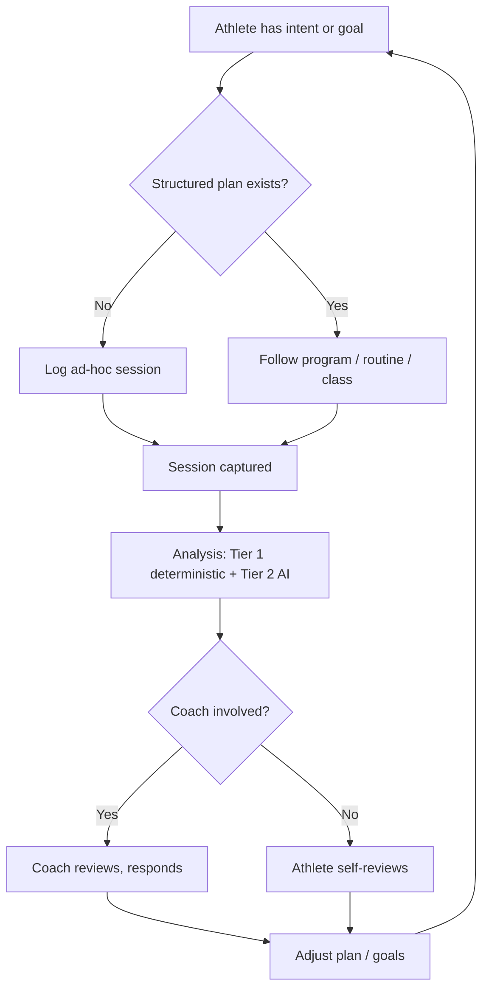
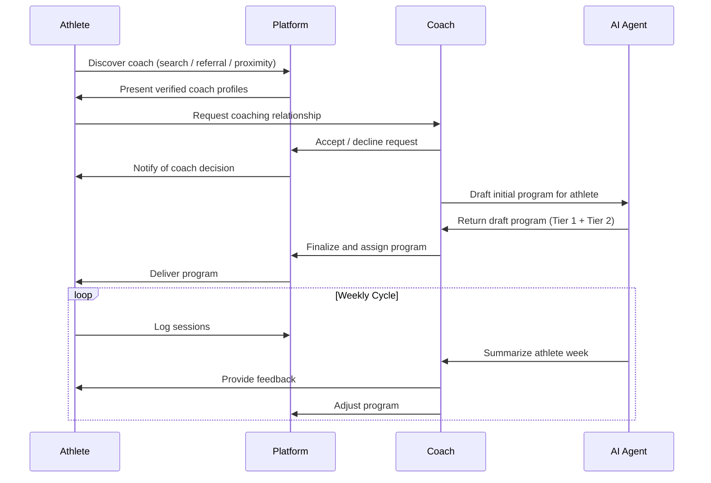
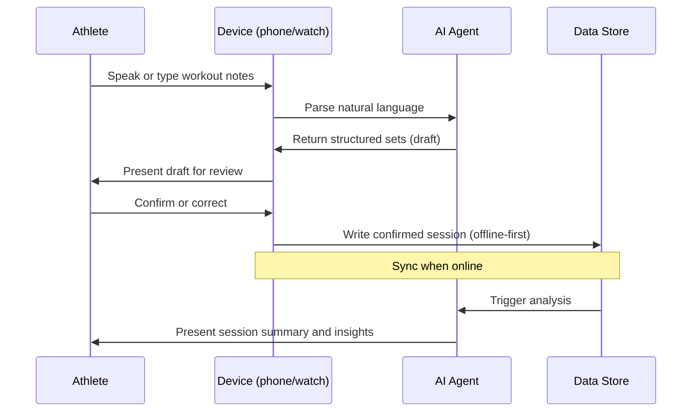
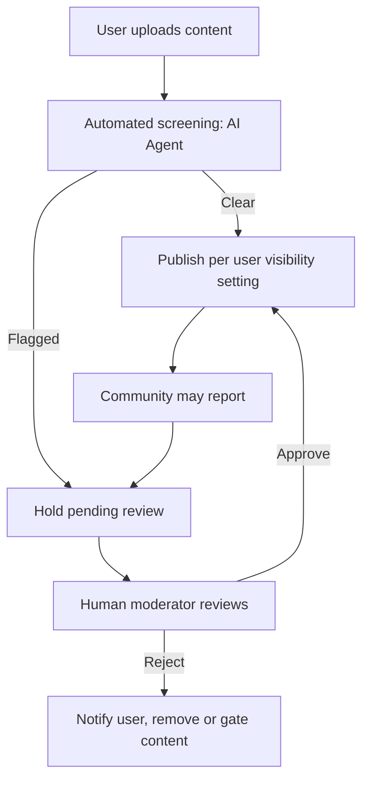
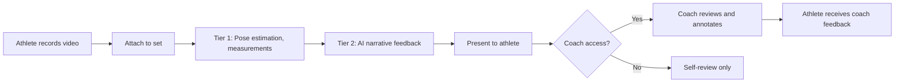

# XRSize4 ALL — Concept Document

## What XRSize4 ALL Is

XRSize4 ALL is a system of systems for fitness, training, coaching, and community. It spans people, process, and technology. It is not a single app or a single platform — it is an ecosystem in which many participants, many processes, and many technologies cooperate to help people train, teach, learn, and connect.

**The name:**

- **XR** — extended reality; the system integrates with wearables, glasses, cameras, and sensors beyond the phone screen.
- **Size** — physical training, body, strength, endurance, form — the substrate of fitness.
- **4 ALL** — inclusive by design; athletes of every discipline, every level, every background.

XRSize4 ALL is a brand under a company. It is commercial in orientation. Individual capabilities and sub-systems may evolve into distinct products over time.

XRSize4 ALL is a pathfinder. The decisions made here — about ontology, reasoning, governance, and the interplay of human and AI roles — inform broader architectural work downstream. That alignment is deferred. This document describes XRSize4 ALL on its own terms.

## The Three Dimensions

Every capability within XRSize4 ALL exists along three dimensions. A capability that is missing any one of these is incomplete.

### People

People are participants in the system, not users of it. Each role has responsibilities, relationships to other roles, and its own view of the system.

**Recognized roles:**

- **Athlete** — any individual who trains. The foundational role. Every other role (except Super Admin and AI Agent) inherits or relates to Athlete.
- **Coach / Instructor** — provides guidance, assigns programming, reviews performance. Operates in a trust relationship with one or more Athletes.
- **Class Instructor** — leads group sessions at fixed venues and times. Distinct from Coach in that the relationship is typically many-to-one (many athletes to one instructor) and session-based rather than programmatic.
- **Client** — an Athlete in a paid relationship with a Coach. Distinct because payment introduces obligations, expectations, and commercial dynamics.
- **Training Partner** — an Athlete who trains alongside another Athlete. No commercial relationship. Relationships may be long-standing or transient (e.g., matched by proximity for a single session).
- **Gym / Gym Owner** — an organization or individual operating a training facility. May host Coaches, Class Instructors, and Members.
- **Gym Member** — an Athlete affiliated with a specific Gym.
- **Content Creator / Influencer** — produces instructional, motivational, or commercial content for distribution to an audience. May also be a Coach or an Athlete.
- **Community Moderator** — maintains the norms and safety of social spaces (groups, discussions, comments). Trusted role with platform-conferred authority.
- **Super Admin** — platform operator. Full visibility, full control, responsible for the system as a whole.
- **AI Agent** — a first-class participant in the system. Performs reasoning, summarization, analysis, generation, and certain decisions within defined authority. Subject to governance, accountability, and constraints. Discussed further under Process.

These roles are not mutually exclusive. A single person may be an Athlete and a Coach and a Content Creator simultaneously. A single person may be a Client of one Coach and a Training Partner to another Athlete. The system accommodates multiple simultaneous role-holdings per person.

### Process

Processes connect people (and AI Agents) to each other and to the technology. Processes are explicit, documented, and — where possible — both human-readable and machine-readable.

XRSize4 ALL uses **Mermaid notation** for process diagrams. Mermaid is expressible in plain text (fits a markdown-first documentation model), renders visually in any compatible viewer, and is machine-parseable for tooling and automation.

**Categories of process:**

- **Training processes** — how an Athlete goes from intent (a goal) through planning (a program, a routine), execution (a session), review (analysis, form feedback), and iteration.
- **Coaching processes** — how a Coach takes on a Client, designs programming, reviews performance, provides feedback, and delivers value.
- **Instruction processes** — how a Class Instructor runs classes, how attendees engage, how progress is tracked across sessions.
- **Content processes** — how Creators produce, publish, moderate, and monetize content.
- **Community processes** — how groups form, how discussions happen, how moderation occurs, how trust is built or broken.
- **Commerce processes** — how payments flow, how subscriptions are managed, how disputes are handled, how taxes are tracked.
- **Safety processes** — how concerns are raised, how harm is prevented, how incidents are investigated and resolved.
- **Governance processes** — how system-level decisions are made, how roles are assigned and revoked, how policies evolve.
- **AI processes** — how AI Agents interact with humans, what authority they hold, when their outputs require human review, how they are audited.

A foundational process diagram is shown below. Others are enumerated per sub-system and developed as each sub-system is designed in detail.

### Technology

Technology enables people and processes. It is subordinate to them, not the other way around. When the technology changes, people and processes may need to adapt, but the human purposes the system serves remain primary.

**Categories of technology within XRSize4 ALL:**

- **Applications** — mobile apps (iOS, later Android), web apps, wearable apps (Apple Watch, later Wear OS), glasses and AR devices (deferred).
- **Services** — identity, data storage, AI reasoning, content delivery, payment processing, notifications, messaging.
- **Data** — the ontological model underlying all sub-systems: Sessions, Exercises, Sets, Programs, Routines, Classes, Goals, Biometrics, Content, Relationships, Payments, Interactions.
- **Integrations** — third-party systems the platform consumes or exposes: HealthKit, Health Connect, Garmin, Whoop, Oura, Stripe, Square, wearable SDKs, vision and language models.
- **Intelligence** — AI Agents operating at various points in the system, governed by the AI process rules.

Technology is discussed per sub-system below, not enumerated exhaustively here.

## The Sub-Systems

XRSize4 ALL is composed of sub-systems. Each sub-system is itself a system of people, process, and technology. Sub-systems may share services, share data, and interact through well-defined interfaces.

This is the current enumeration. Additional sub-systems will be added as the platform evolves. Not all sub-systems are in scope for the first release.

### Training Sub-Systems (Discipline-Specific)

Each discipline has its own training sub-system, tailored to its conventions, measurements, and coaching practices. The sub-systems share the common ontology (Program → Exercise Type → Routine / Class → Session → Exercise → Set) but specialize in the conventions of their discipline.

- **Lifting Tracker** — weightlifting, strength training, bodybuilding. First sub-system. Alpha in progress. See `architecture.md` for detailed architecture.
- **Running** — distance, pace, routes, interval training. Future.
- **Martial Arts** — technique practice, sparring, belt progression, class attendance. Future.
- **Yoga** — practice sessions, flow sequences, instruction attendance. Future.
- **Cycling** — rides, routes, power, cadence. Future.
- **Swimming** — distances, splits, stroke types. Future.
- **Climbing** — routes, grades, send logs. Future.
- **Group Fitness** — CrossFit, HIIT, bootcamp-style classes. Future.

The specific list and order of discipline sub-systems is driven by user demand and platform capacity. The architecture ensures that adding a new discipline is a well-defined operation — the ontology and shared services do not need to be rewritten for each new sub-system.

### Cross-Cutting Sub-Systems (Shared Services)

These sub-systems serve all training sub-systems. They are not tied to any specific discipline.

- **Identity and Trust** — authentication, authorization, role assignment, verification, reputation. Shared by every other sub-system.
- **Ontology and Data** — the canonical model and its persistence. Shared entities (users, goals, biometrics, content) live here.
- **Goals** — goal setting, tracking, progress computation, milestone management. Links to all training sub-systems.
- **Biometrics** — integration with wearables, health stores, and third-party devices; storage and analysis of sensor data.
- **Intelligence (AI Reasoning)** — the AI Agent capability layer. Operates across every other sub-system, governed by the AI process rules.
- **Content** — hosting, publishing, moderation, and delivery of videos, images, text, and audio. Used by training sub-systems (instructional content), coaching (form feedback videos), social (posts), and creators (public content).
- **Social and Community** — groups, follows, comments, messaging, challenges.
- **Coaching** — the coach-client relationship, assignment and review workflows, roster management. Used across training sub-systems.
- **Commerce** — subscriptions, payments, payouts, marketplace mechanics. Connects Coaches, Creators, Gyms, and Athletes commercially.
- **Proximity and Discovery** — location-aware matching and venue-based affinity. Heavily deferred.
- **Wearable Integration** — Apple Watch, Wear OS, glasses, AirPods, sensors. Distinct from biometrics data because it concerns the app running on the device, not just data flowing from it.
- **Instruction and Form Analysis** — two paired capabilities: showing how an exercise should be done (instructional content) and evaluating how it was done (form analysis).

## Cross-Cutting Concerns

Concerns that span the entire system and every sub-system. These are not features — they are properties the system must have.

### Safety and Wellbeing

The system serves human beings pursuing physical activity. Decisions about feature design, AI behavior, content moderation, and social dynamics are made with user wellbeing in mind.

- Fitness content intersects with body image and eating disorders. The system does not optimize for engagement at the cost of user health.
- AI Agents providing health-adjacent advice operate within explicit constraints. They do not diagnose, they do not prescribe treatment, they indicate uncertainty when it exists.
- Social features have moderation and reporting from day one, not as an afterthought.
- Progress photo and body-composition features use neutral language and do not surface aesthetic judgments.
- Proximity and matching features treat user safety as non-negotiable, with privacy defaults favoring users over platform growth.

### Privacy and Consent

Users own their data. The system is transparent about what it collects, why, and who sees it.

- Explicit consent for sensitive data classes (location, health, biometrics, imagery).
- Granular sharing controls between Athletes, Coaches, Gyms, and the public.
- Data export and deletion are first-class, not hidden.
- Third-party data sharing is disclosed before it happens.

### Trust and Verification

The system depends on trust between participants. That trust is supported by the system, not assumed.

- Coaches may be verified (credentials, identity) and that verification is visible to Athletes considering them.
- Content may be labeled by source (human coach, platform-curated, AI-generated).
- AI Agent outputs are identifiable as such, not disguised as human.
- Gyms may be verified as legitimate venues.

### Governance

How decisions about the system get made, and who makes them.

- Role-based governance for most operational decisions (Coaches govern their own clients; Moderators govern their groups; Super Admins govern the platform).
- Community guidelines and terms of service define acceptable conduct and consequences.
- Disputes between participants have defined resolution paths.
- AI Agent authority is bounded — agents do not make governance decisions, they inform decisions that humans make.

### Accessibility

The system is usable by people across a range of abilities and contexts.

- Screen reader support, captions, alternative interaction modalities.
- Visual content has text alternatives where possible.
- Audio content has transcripts or captions.
- Low-bandwidth and offline contexts are supported where the underlying capabilities allow.

### Internationalization

The system is designed for global use, even if initial release is geographically limited.

- Units (weight, distance, temperature) are user-configurable.
- Dates, times, currencies respect locale.
- Content localization is a tracked concern, though full translation is deferred.

## AI Agent as Participant

The AI Agent is treated as a first-class participant in the system, not merely as code running behind the scenes. This framing has concrete implications.

### Authority

AI Agents have bounded authority:

- They may **observe** — read data to produce analysis, summaries, suggestions.
- They may **suggest** — generate recommendations for humans to review and act on.
- They may **automate routine actions** — within narrow, pre-approved scopes (e.g., parsing natural-language workout entries into structured sets, subject to user confirmation).
- They may **not decide consequential matters** — goal changes, program commitments, payment actions, moderation outcomes, and safety interventions involve a human decision-maker.

This authority boundary is the **Authority Rule**: deterministic reasoning over structured data governs decisions; AI reasoning explains, narrates, and suggests but does not override.

### Accountability

Every AI Agent interaction is logged. Users can see what the AI did, what data it used, and what it recommended. Users can provide feedback that is retained and used to improve the system.

### Identifiability

AI Agent outputs are identifiable as such. AI-generated content is labeled. AI-drafted messages are marked as drafts pending human approval. Users always know when they are interacting with an AI versus a human.

### Deference

When the AI Agent and a human participant disagree, the human wins by default. Exceptions exist for safety interventions (e.g., the AI flags a dangerously high weight entry and requires confirmation) but these are narrow and predefined.

## Roadmap

The roadmap describes the order in which sub-systems come online. It is a plan, not a commitment. The actual trajectory depends on user demand, engineering capacity, and commercial viability.

### Phase 1 — Lifting Tracker Module (Alpha)

- Lifting Tracker sub-system, MVP scope
- Identity and Trust sub-system, basic
- Ontology and Data sub-system, complete schema for the ontology regardless of UI exposure
- Goals sub-system, basic strength and body-weight goals
- Intelligence sub-system, minimal AI (natural-language workout parsing, basic summaries, alias matching)
- Closed alpha: Eric, Ethan, Ethan's clients, a small number of independent athletes

### Phase 2 — Coaching Activation

- Coaching sub-system, full workflow
- Training sub-systems: Lifting Tracker remains; additional sub-systems pending
- Intelligence sub-system, expanded (coach-facing insights, draft assistance)
- Biometrics sub-system, HealthKit integration on iOS
- Goals sub-system, multi-category and coach-assigned
- Content sub-system, basic (instructional content attached to exercises)

### Phase 3 — Commerce and Content

- Commerce sub-system, Stripe Connect or Square for Platforms for coach-to-client billing
- Content sub-system, expanded (coach-produced demonstrations, hosted video)
- Wearable Integration sub-system, Apple Watch first
- Instruction and Form Analysis sub-system, Layer 1 (video capture and async coach review)

### Phase 4 — Community and Discovery

- Social and Community sub-system, private coaching groups first
- Instruction and Form Analysis sub-system, Layer 2 (pose estimation, measurements)
- Additional training sub-systems as demand dictates
- Proximity and Discovery sub-system, venue-based affinity only (no real-time location)

### Phase 5 — Extended Reality and Advanced AI

- Wearable Integration sub-system, glasses and AR devices
- Instruction and Form Analysis sub-system, Layer 3 (AI-generated narrative feedback)
- Intelligence sub-system, advanced (AI-generated instructional content, goal synthesis, tension detection)
- Broader social, broader proximity, broader cross-sub-system intelligence

### Beyond

Real-time form feedback, multi-discipline coaching, cross-sub-system goals, sophisticated AI coaching, full creator economy, international expansion, broader wearable ecosystem support.

## Process Diagrams

A set of high-level process diagrams illustrating core flows. These are starting points, not complete specifications. Each sub-system develops its own detailed process diagrams as it is built.

### Coaching Relationship Lifecycle

### Session Logging with AI Assistance

### Content Moderation

### Form Analysis Workflow

## Document Map

XRSize4 ALL is documented across several artifacts:

- `xrsize4all_concept.md` — this document; platform-level concept, dimensions, sub-systems, roadmap, cross-cutting concerns.
- `architecture.md` — architecture of the Lifting Tracker sub-system (first module of XRSize4 ALL).
- `user-stories.md` — user stories for the Lifting Tracker sub-system.
- Future: additional sub-system architecture documents as each sub-system is designed in detail.

## Change Log

- 2026-04-17: Initial version. Establishes XRSize4 ALL as a system of systems with people, process, and technology. Names eleven participant roles including AI Agent as first-class. Adopts Mermaid for process notation. Enumerates discipline-specific and cross-cutting sub-systems. Lays out cross-cutting concerns (safety, privacy, trust, governance, accessibility, internationalization). Specifies AI Agent authority and accountability. Provides five-phase roadmap from Lifting Tracker alpha through extended reality and advanced AI. Includes starter process diagrams for coaching lifecycle, session logging, content moderation, and form analysis. Positions XRSize4 ALL as a pathfinder for broader architectural work, with alignment to that broader work deferred.

---

© 2026 Eric Riutort. All rights reserved.
